# JakPrzyjade 🎟️ (Software System Design)

<strong>JakPrzyjade</strong> is a microservice-based public transit ticketing app designed and implemented as part of the Software System Design course at the Wrocław University of Science and Technology. It consists of a set of services that handle various aspects of public transport ticketing, such as user accounts, ticket purchases, and payment processing. The project's aim and scope were defined, followed by the specification of functional and non-functional requirements, as well as business rules. The graphical user interface of the system was designed, after which the system architecture was developed, incorporating various architectural mechanisms, design patterns, and technologies. The system was implemented in Java and TypeScript, and subsequently deployed to the AWS cloud.

<table align="center">
  <thead>
    <tr>
      <th colspan="4">JakPrzyjade Team</th>
    </tr>
  </thead>
  <tbody>
    <tr>
      <td rowspan="3" align="center">

      </td>
      <td>**Przemysław Barcicki**</td>
      <td rowspan="3" align="center">

      </td>
      <td>**Tomasz Chojnacki**</td>
    </tr>
    <tr>
      <td>[@mlodybercik](https://github.com/mlodybercik)</td>
      <td>[@tchojnacki](https://github.com/tchojnacki)</td>
    </tr>
    <tr>
      <td>Logistics, DevOps</td>
      <td>Accounts</td>
    </tr>
    <tr>
      <td rowspan="3" align="center">

      </td>
      <td>**Piotr Kot**</td>
      <td rowspan="3" align="center">

      </td>
      <td>**Jakub Zehner**</td>
    </tr>
    <tr>
      <td>[@piterek130](https://github.com/piterek130)</td>
      <td>[@jakubzehner](https://github.com/jakubzehner)</td>
    </tr>
    <tr>
      <td>Payment, Gateway</td>
      <td>Tickets</td>
    </tr>
  </tbody>
</table>

## Repository 🗃️

- [`/.github/workflows`](./.github/workflows/) - contains GitHub Actions workflows for CI/CD
- [`/documentation`](./documentation/) - contains all documentation related to the project
  - [`/adrs`](./documentation/adrs/) - contains architectural decision records (ADRs)
  - [`/course`](./documentation/course/) - documentation required by the course curriculum (in Polish)
  - [`/contracts.md`](./documentation/contracts.md) - contains contracts respected by all microservices
  - [`/system-parts.md`](./documentation/system-parts.md) - contains the responsibility breakdown of the system
- [`/implementation`](./implementation/) - contains subfolders with the implementation of different microservices
- [`/infrastructure`](./infrastructure/) - contains infrastructure-related files, such as Terraform scripts

## Tools 🛠️

<table align="center">
  <tbody>
    <tr>
      <th>Documentation</th>
      <td>Figma, UML, OpenAPI, Markdown, draw.io, Mermaid, ATAM</td>
    </tr>
    <tr>
      <th>Implementation</th>
      <td>Java, Spring Boot, Lombok, MapStruct, TypeScript, Hono, NestJS, RxJS, MikroORM, Deno, Node.js, PostgreSQL, SQL, REST, JWT</td>
    </tr>
    <tr>
      <th>Testing</th>
      <td>Jest, JUnit, Cypress, Testcontainers, Grafana k6, OWASP ZAP</td>
    </tr>
    <tr>
      <th>Deployment</th>
      <td>AWS (EKS, ECR, RDS, SQS, SES, VPC, Lambda), Kubernetes, Docker, Terraform, GitHub Actions</td>
    </tr>
    <tr>
      <th>Other</th>
      <td>Git, Agile (Scrum), GitHub, VSCode</td>
    </tr>
  </tbody>
</table>

## Stages 🚦

### E1: Business modeling, specification, and requirements analysis

- **Full documentation (in Polish)**: [Wyniki etapu I: Modelowanie biznesowe, specyfikacja i analiza wymagań](./documentation/course/e1/)

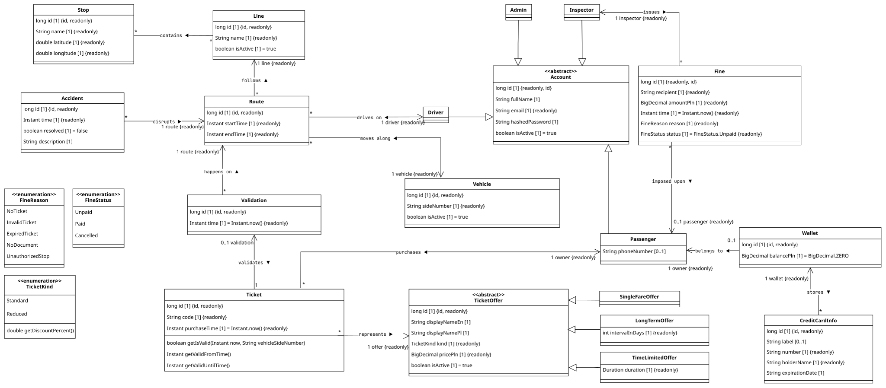
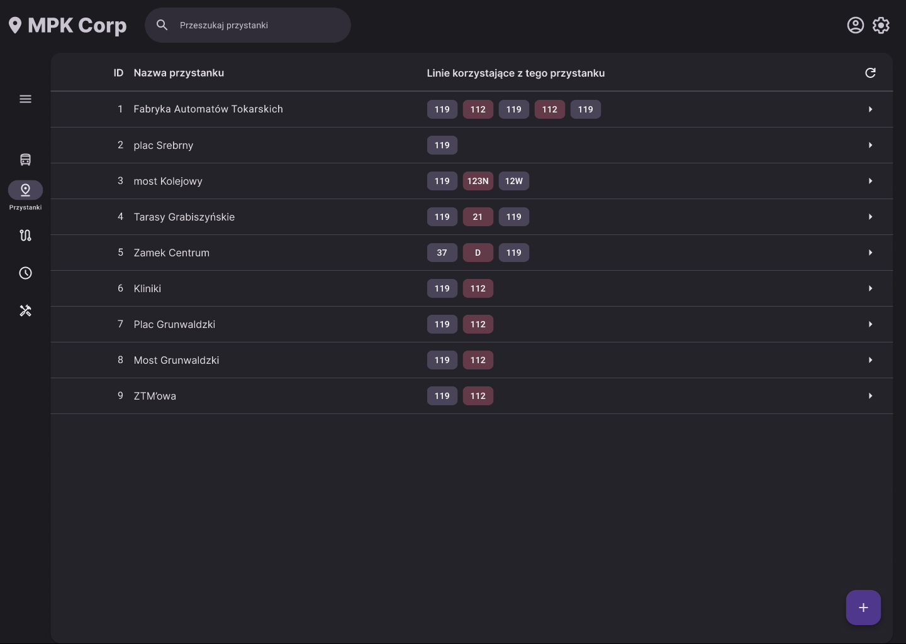
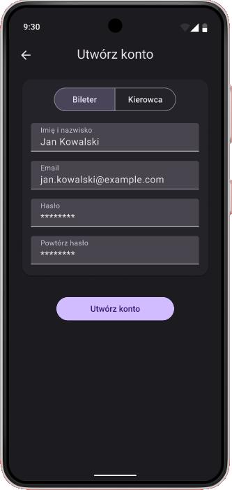

### E2: System architecture definition

- **Full documentation (in Polish)**: [Wyniki etapu II: Definicja architektury systemu](./documentation/course/e2/)

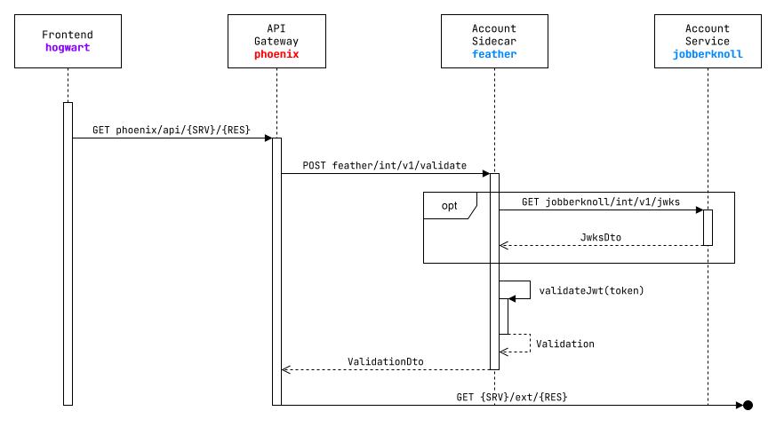
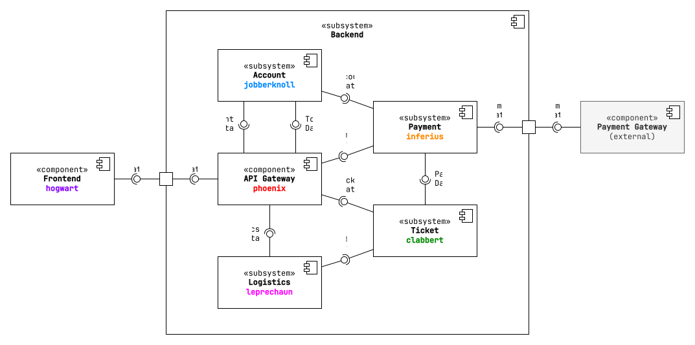
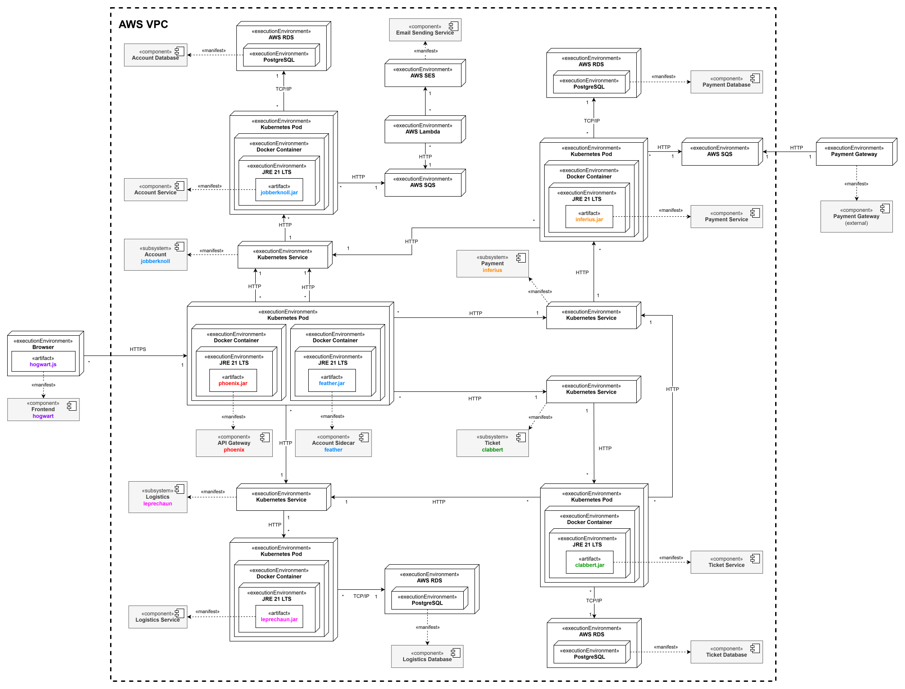
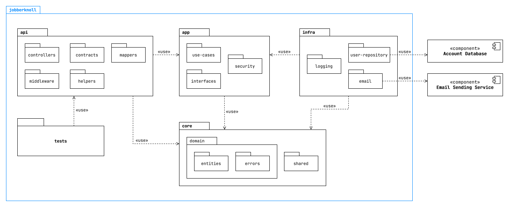

### E3: Implementation

- **Full documentation (in Polish)**: [Wyniki etapu III: Implementacja](./documentation/course/e3/)

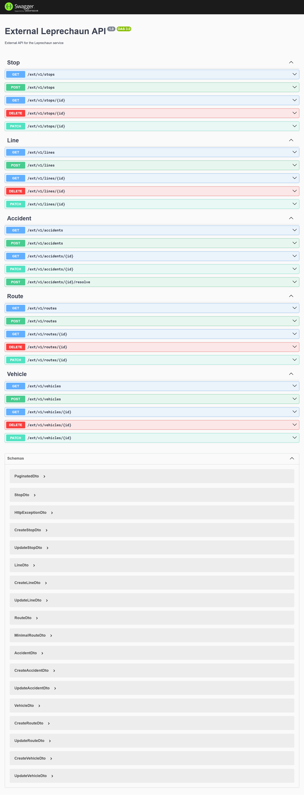
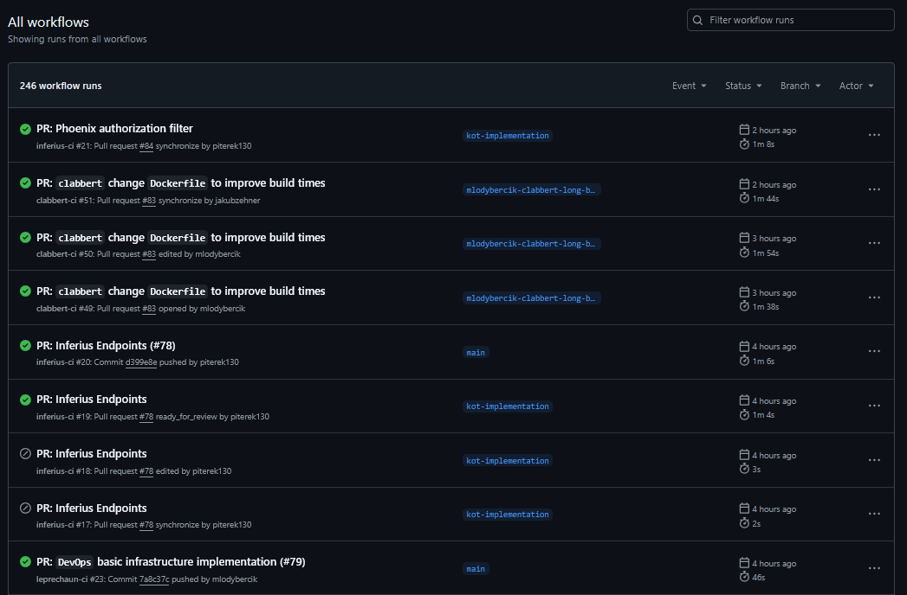
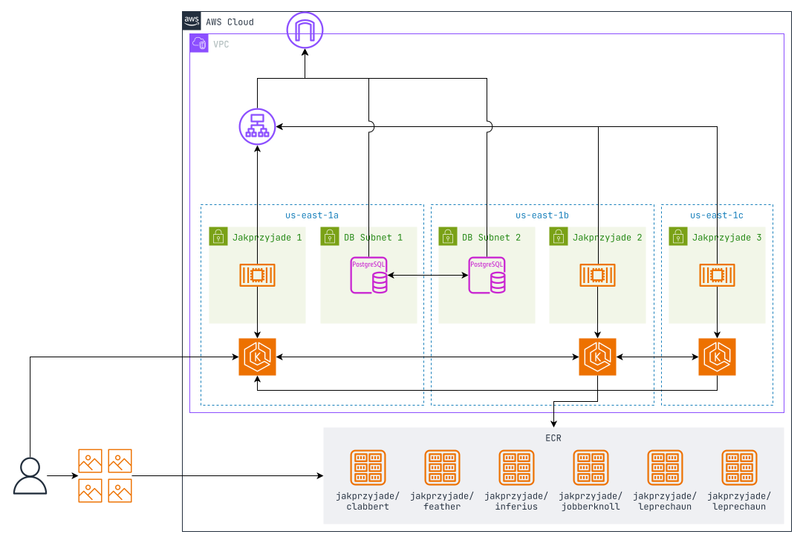
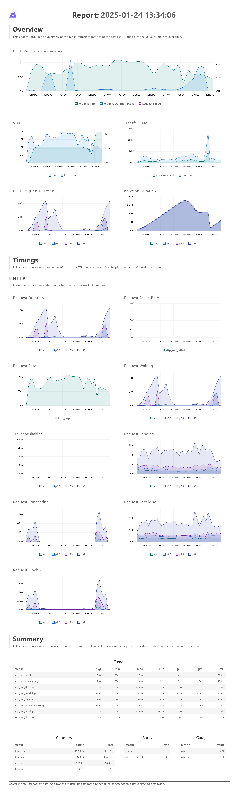
