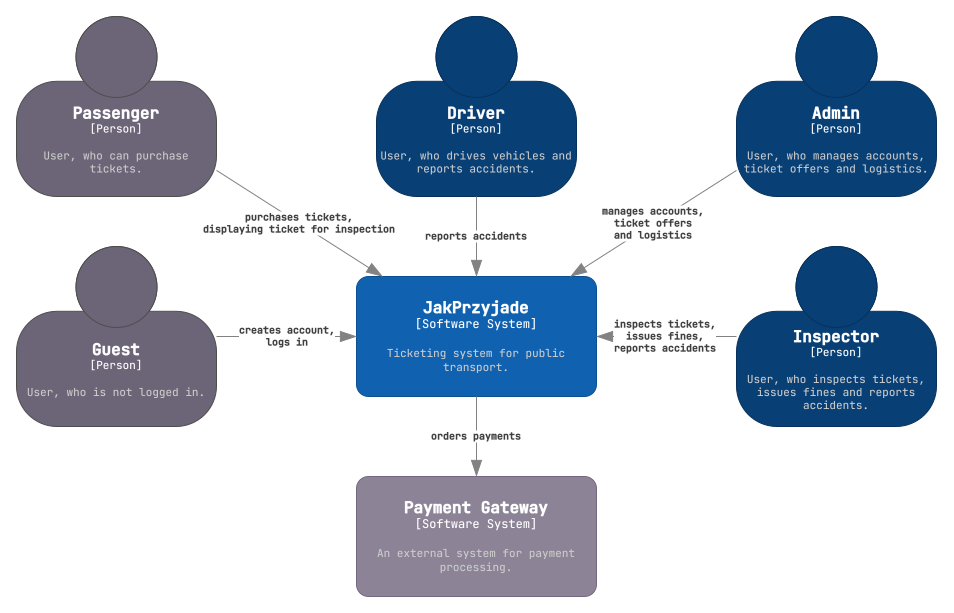

# JakPrzyjade 🎟️ (Software System Design)

<strong>JakPrzyjade</strong> is a microservice-based public transit ticketing app designed and implemented as part of the Software System Design course at the Wrocław University of Science and Technology. It consists of a set of services that handle various aspects of public transport ticketing, such as user accounts, ticket purchases, and payment processing. The project's aim and scope were defined, followed by the specification of functional and non-functional requirements, as well as business rules. The graphical user interface of the system was designed, after which the system architecture was developed, incorporating various architectural mechanisms, design patterns, and technologies. The system was implemented in Java and TypeScript, and subsequently deployed to the AWS cloud.

<table align="center">
  <thead>
    <tr>
      <th colspan="4">JakPrzyjade Team</th>
    </tr>
  </thead>
  <tbody>
    <tr>
      <td rowspan="3" align="center">

      </td>
      <td>**Przemysław Barcicki**</td>
      <td rowspan="3" align="center">

      </td>
      <td>**Tomasz Chojnacki**</td>
    </tr>
    <tr>
      <td>[@mlodybercik](https://github.com/mlodybercik)</td>
      <td>[@tchojnacki](https://github.com/tchojnacki)</td>
    </tr>
    <tr>
      <td>Logistics, DevOps</td>
      <td>Accounts</td>
    </tr>
    <tr>
      <td rowspan="3" align="center">

      </td>
      <td>**Piotr Kot**</td>
      <td rowspan="3" align="center">

      </td>
      <td>**Jakub Zehner**</td>
    </tr>
    <tr>
      <td>[@piterek130](https://github.com/piterek130)</td>
      <td>[@jakubzehner](https://github.com/jakubzehner)</td>
    </tr>
    <tr>
      <td>Payment, Gateway</td>
      <td>Tickets</td>
    </tr>
  </tbody>
</table>

## Repository structure

- [`/documentation`](./documentation/) - contains all documentation related to the project
  - [`/course`](./documentation/course/) - documentation required by the course curriculum (in Polish)
- [`/implementation`](./implementation/) - contains subfolders with the implementation of different microservices
