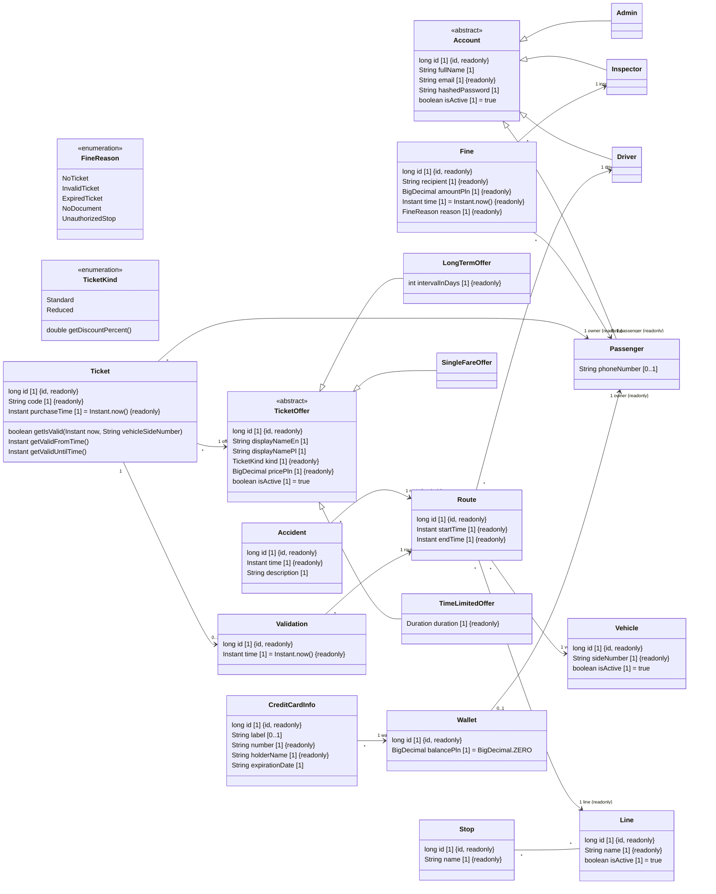

<b>Wyniki etapu I: Modelowanie biznesowe,   specyfikacja i analiza wymagań</b>

 

<b>System biletowy dla komunikacji miejskiej</b>

 

<b>Projektowanie systemów informatycznych</b>

Prowadzący: dr inż. Marcin Kawalerowicz

Skład zespołu:
<ul>
  <li>Przemysław Barcicki (260324)</li>
  <li>Tomasz Chojnacki (260365)</li>
  <li>Piotr Kot (259560)</li>
  <li>Jakub Zehner (260285)</li>
</ul>

# Model biznesowy

## Lista symboli, oznaczeń i akronimów

- **MPK** - Miejskie Przedsiębiorstwo Komunikacyjne

## Cel i zakres projektu

### Cel projektu

Celem projektu jest stworzenie systemu informatycznego wspomagającego komunikację miejską. System ma ułatwić pasażerom korzystanie z komunikacji miejskiej poprzez możliwość zakupu biletów online, przeglądanie rozkładu jazdy oraz dostęp do informacji o awariach. System ma również ułatwić pracę kierowcom i bileterom poprzez możliwość kontroli ważności biletów oraz zgłaszania awarii.

Osiągnięcie celu oceniane będzie przez:

- Analizę efektywności systemu w zakresie obsługi pasażerów.
- Ankiety zadowolenia losowych użytkowników systemu.
- Porównanie z dotychczasowym systemem obsługi komunikacji miejskiej.

### Zakres projektu

W zakres projektu wchodzi:

- obsługa kont (logowanie, rejestracja, ustawienia konta)
- obsługa biletów (oferta biletowa, kasowanie, sprawdzanie ważności)
- obsługa płatności (dodawanie środków do portfela, zarządzanie metodami płatności, sprzedaż biletów, mandaty)
- obsługa logistyki MPK (pojazdy, linie, przystanki, rozkłady jazdy, awarie)

## Słownik pojęć

| Termin                          | Synonimy              | Definicja terminu                                                                                                                |
| ------------------------------- | --------------------- | -------------------------------------------------------------------------------------------------------------------------------- |
| **Administrator**               | _admin_               | Typ _konta_, użytkownik należący do organizacji, który zarządza _kontami_, _ofertami biletów_ i _logistyką_.                     |
| **Awaria**                      | _accident_            | Nieprzewidziane zdarzenie, które powoduje przerwanie kursu _pojazdu_ z _rozkładu jazdy_ i jest zgłaszane przez pracownika.       |
| **Bilet**                       | _ticket_              | Wirtualne potwierdzenie prawa _pasażera_ do podróży _pojazdem_ transportu publicznego, _zakupione_ za pomocą systemu.            |
| **Bilet czasowy**               | _time-limited ticket_ | _Bilet_, który jest _ważny_, jeśli jego _czas ważności_, liczony od _skasowania_, nie minął.                                     |
| **Bilet jednorazowy**           | _single-fare ticket_  | _Bilet_, który jest _ważny_, jeśli został _skasowany_ w tym samym _pojeździe_ co _sprawdzony_.                                   |
| **Bilet normalny**              | _standard ticket_     | _Bilet_, który może być używany przez każdego.                                                                                   |
| **Bilet okresowy**              | _long-term ticket_    | _Bilet_, który jest _ważny_, jeśli jest używany w swoim _okresie ważności_.                                                      |
| **Bilet ulgowy**                | _reduced ticket_      | _Bilet_, który może być używany przez osoby uprawnione (studentów, seniorów, itp.).                                              |
| **Bileter**                     | _inspector_           | Typ _konta_, użytkownik należący do organizacji, który może _sprawdzać ważność biletu_, wystawiać _mandaty_ i zgłaszać _awarie_. |
| **Czas ważności**               | _duration_            | Czas od _skasowania_, przez który _bilet czasowy_ jest _ważny_.                                                                  |
| **Gość**                        | _guest_               | Osoba, która nie jest zalogowana do systemu.                                                                                     |
| **Kasownik**                    | _validator_           | Fizyczne urządzenie w _pojeździe_, które pozwala _pasażerowi_ _skasować_ _bilet_.                                                |
| **Kierowca**                    | _driver_              | Typ _konta_, użytkownik należący do organizacji, który prowadzi _pojazd_ i zgłasza _awarie_.                                     |
| **Kod biletu**                  | _code_                | Unikalny identyfikator zakupionego _biletu_.                                                                                     |
| **Konto**                       | _account_             | Uogólnienie _pasażera_, _biletera_ i _kierowcy_.                                                                                 |
| **Kurs**                        | _route_               | Trasa, którą pokonuje _pojazd_ na danej _linii_                                                                                  |
| **Linia**                       | _line_                | Trasa identyfikowana cyframi lub literami, zawierająca _przystanki_, którą pokonują _pojazdy_ podczas jazdy.                     |
| **Logistyka**                   | _logistics_           | Część systemu odpowiedzialna za _pojazdy_, _przystanki_, _rozkłady jazdy_ i _awarie_.                                            |
| **Mandat**                      | _fine_                | Kara pieniężna, którą _bileter_ może nałożyć na _pasażera_ za nieważny _bilet_.                                                  |
| **Oferta biletu**               | _ticket offer_        | Kombinacja _zakresu biletu_ i _typu biletu_.                                                                                     |
| **Okres ważności**              | _interval_            | Daty, w których _bilet okresowy_ jest _ważny_.                                                                                   |
| **Osoba zalogowana**            | _member_              | Osoba zalogowana do systemu jako _administrator_, _bileter_, _kierowca_ albo _pasażer_.                                          |
| **Pasażer**                     | _passenger_           | Typ _konta_, użytkownik zewnętrzny dla organizacji, który może _zakupywać_ _bilety_.                                             |
| **Płatność**                    | _payment_             | Proces dokonywania opłaty za _bilet_.                                                                                            |
| **Pojazd**                      | _vehicle_             | Autobus lub tramwaj, identyfikowany unikalnym numerem bocznym, na który _pasażer_ kupuje _bilety_ i w którym są _kasowniki_.     |
| **Portfel**                     | _wallet_              | Stan wirtualnego konta _pasażera_, z którego pobierane są opłaty za _bilety_.                                                    |
| **Przystanek**                  | _stop_                | Miejsce, w którym _pasażer_ może wsiąść lub wysiąść z _pojazdu_.                                                                 |
| **Rozkład jazdy**               | _timetable_           | Plan, w którym są zapisane godziny odjazdów _pojazdów_ danej _linii_ z _przystanków_.                                            |
| **Skasowanie**                  | _validation_          | Proces, w którym _pasażer_ wykorzystuje _kasownik_ aby _bilet jednorazowy_ lub _bilet czasowy_ stał się _ważny_.                 |
| **Sprawdzenie ważności biletu** | _inspection_          | Proces, w którym _bileter_ sprawdza, czy _bilet_ _pasażera_ jest _ważny_.                                                        |
| **Typ biletu**                  | _ticket kind_         | Rodzaj zniżki _biletu_, czyli _normalny_ lub _ulgowy_.                                                                           |
| **Ważność**                     | _validity_            | Stan _biletu_, ważny (_valid_) albo nieważny (_invalid_), tylko ważny _bilet_ daje prawo do podróży.                             |
| **Zakres biletu**               | _ticket scope_        | Rodzaj określenia ważności _biletu_, czyli _jednorazowy_, _czasowy_ lub _okresowy_.                                              |
| **Zakup**                       | _purchase_            | Proces nabywania _biletu_ przez _pasażera_, potwierdzony przez _płatność_.                                                       |

# Specyfikacja i analiza wymagań

## Definicja wymagań funkcjonalnych

### Konto (Tomasz Chojnacki)

- `ACC/01` - Jako _gość_ chcę mieć możliwość rejestracji _konta_ _pasażera_.
- `ACC/02` - Jako _gość_ chcę mieć możliwość zalogowania się do _konta_ (_administratora_, _biletera_, _kierowcy_, _pasażera_).
- `ACC/03` - Jako _osoba zalogowana_ chcę mieć możliwość wylogowania się ze swojego _konta_.
- `ACC/04` - Jako _osoba zalogowana_ chcę mieć możliwość wyświetlenia informacji o swoim _koncie_.
- `ACC/05` - Jako _osoba zalogowana_ chcę mieć możliwość zmiany imienia i nazwiska przypisanego do swojego _konta_.
- `ACC/06` - Jako _osoba zalogowana_ chcę mieć możliwość zmiany hasła przypisanego do swojego _konta_.
- `ACC/07` - Jako _osoba zalogowana_ chcę mieć możliwość wyświetlenia swoich preferencji (motywu kolorystycznego, języka aplikacji).
- `ACC/08` - Jako _osoba zalogowana_ chcę mieć możliwość zmiany motywu kolorystycznego.
- `ACC/09` - Jako _osoba zalogowana_ chcę mieć możliwość zmiany języka aplikacji.
- `ACC/10` - Jako _osoba zalogowana_ chcę mieć możliwość dezaktywacji swojego _konta_.
- `ACC/11` - Jako _administrator_ chcę mieć możliwość tworzenia _konta_ _biletera_.
- `ACC/12` - Jako _administrator_ chcę mieć możliwość tworzenia _konta_ _kierowcy_.
- `ACC/13` - Jako _administrator_ chcę mieć możliwość przeglądania listy wszystkich _kont_ (_administratorów_, _bileterów_, _kierowców_, _pasażerów_).
- `ACC/14` - Jako _administrator_ chcę mieć możliwość wyświetlenia informacji o cudzym _koncie_ (_administratora_, _biletera_, _kierowcy_, _pasażera_).
- `ACC/15` - Jako _administrator_ chcę mieć możliwość dezaktywacji cudzych _kont_ niebędących _administratorami_ (_biletera_, _kierowcy_, _pasażera_).
- `ACC/16` - Jako _pasażer_ chcę mieć możliwość zmiany numeru telefonu przypisanego do swojego _konta_.
- `ACC/17` - Jako _pasażer_ chcę mieć możliwość usunięcia numeru telefonu przypisanego do swojego _konta_.
- `ACC/18` - Jako _pasażer_ chcę mieć możliwość sprawdzenia i zmiany domyślnego _typu biletu_ (po otworzeniu aplikacji pokazane będą _oferty biletów_ tego typu).

### Bilet (Jakub Zehner)

- `TIC/01` - TODO@jakubzehner - historyjki użytkownika

### Płatność (Piotr Kot)

- `PAY/01` - TODO@piterek130 - historyjki użytkownika

### Logistyka (Przemysław Barcicki)

- `LOG/01` - TODO@mlodybercik - historyjki użytkownika

## Wymagania niefunkcjonalne

Wyrażenia: musi, powinien, może, nie powinien, nie może są używane zgodnie z definicją ich anglojęzycznych odpowiedników zawartych w RFC 2119.

Wymagania niefunkcjonalne zostały podzielone zgodnie z metodyką FURPS+ (Functionality, Usability, Reliability, Performance, Supportability).

### Wymagania systemowe

1. Strona internetowa powinna być możliwa do wyświetlenia na przeglądarkach internetowych Google Chrome (wersja 120+), Microsoft Edge (wersja 120+), Safari (wersja 17+), Mozilla Firefox (wersja 120+), Opera (wersja 100+).
2. System umożliwia obsługę z użyciem myszki i klawiatury lub ekranu dotykowego.

### Użyteczność

1. System powinien być zaprojektowany tak, aby 90% użytkowników mogło wykonać podstawowe czynności, takie jak zakup biletu czy sprawdzenie rozkładu jazdy, bez konieczności korzystania z instrukcji lub pomocy technicznej.
2. System powinien być zoptymalizowany zarówno dla urządzeń desktopowych, jak i mobilnych, oferując pełną funkcjonalność na ekranach o rozdzielczościach od 320x480 pikseli.
3. System powinien być dostępny w języku polskim i angielskim.
4. System powinien oferować dwa motywy kolorystyczne: jasny i ciemny.
5. System musi być zgodny z wytycznymi WCAG 2.1 poziom AA, umożliwiając dostęp osobom z niepełnosprawnościami, np. poprzez kontrast tekstu, możliwość korzystania z klawiatury, oraz wsparcie czytników ekranu.
6. Kluczowe operacje, takie jak zakup biletu, powinny być możliwe do wykonania w maksymalnie 5 kliknięciach.

### Niezawodność

1. Klasa niezawodności systemu powinna wynosić co najmniej 99,9%.
2. W przypadku awarii nieobejmującej sprzętu system powinien mieć możliwość powrotu do stanu sprzed awarii w czasie poniżej 1 godziny.
3. System powinien wykonywać codzienną kopię zapasową danych.
4. Dostęp do systemu powinien być możliwy tylko w sposób autoryzowany.
5. Części systemów powinny komunikować się ze sobą w sposób uniemożliwiający ingerecję osób trzecich.
6. System musi być zabezpieczony przed utratą zasilania oraz połączenia internetowego.
7. System powinien respektować zasady RODO.

### Wydajność

1. System powinien obsługiwać zapytania użytkowników, zakładając brak problemów sieciowych:
   1. dotyczące biletów w czasie poniżej 1 sekundy dla co najmniej 90% przypadków.
   2. dotyczące kont w czasie poniżej 2 sekundy dla co najmniej 90% przypadków.
   3. dotyczące płatności w czasie poniżej 10 sekundy dla co najmniej 90% przypadków.
   4. dotyczące logistyki w czasie poniżej 1 sekundy dla co najmniej 90% przypadków.
2. System powinien działać bez zarzutu przy jednoczesnym korzystaniu przez 100000 użytkowników.
3. System musi być zdolny do przechowywania rosnącej ilości danych, minimalizując pogorszenie wydajności (przyrost danych o 1TB rocznie nie powinien spowodować spadku wydajności o więcej niż 10%).

### Wsparcie

1. Zapewniona jest pełna dokumentacja systemu:
   1. Dokumentacja powinna być dostępna w języku polskim i angielskim.
   2. Dokumentacja powinna być dostępna w formie pliku PDF.
   3. Dokumentacja powinna zawierać instrukcję obsługi dla użytkowników oraz instrukcję konfiguracji dla administratorów.
   4. Dokumentacja powinna obejmować najczęściej zadawane pytania (FAQ).
2. Powinno być dostępne wsparcie techniczne w godzinach 8:00-16:00 czasu lokalnego w dni robocze.
3. System powinien w przejrzysty sposób informować użytkownika o błędach.

## Model informacyjny

## Reguły biznesowe i ograniczenia systemowe

Reguły zostały podzielone według encji, których dotyczą oraz są uporządkowane alfabetycznie zgodnie z angielskimi tłumaczeniami nazw encji.

### Awaria (`Accident`)

- `REG/01/01` - Może istnieć wiele awarii.
- `REG/01/02` - Awaria musi mieć unikalny identyfikator.
- `REG/01/03` - Awaria musi zawierać czas zgłoszenia.
- `REG/01/04` - Czas zgłoszenia nie może być w przyszłości.
- `REG/01/05` - Awaria musi zawierać opis.
- `REG/01/06` - Opis nie może być pusty.
- `REG/01/07` - Opis nie może przekraczać 255 znaków.
- `REG/01/08` - Awaria musi wystąpić na dokładnie jednej trasie.

### Konto (`Account`)

- `REG/02/01` - Może istnieć wiele kont.
- `REG/02/02` - Konto musi mieć unikalny identyfikator.
- `REG/02/03` - Konto musi zawierać pełne imię i nazwisko.
- `REG/02/04` - Imię i nazwisko nie mogą być puste.
- `REG/02/05` - Imię i nazwisko nie mogą przekraczać 255 znaków.
- `REG/02/06` - Konto musi zawierać adres e-mail.
- `REG/02/07` - Adres e-mail musi być poprawnym i unikalnym adresem.
- `REG/02/08` - Konto musi zawierać zahaszowane hasło.
- `REG/02/09` - Konto musi zawierać status aktywności.
- `REG/02/10` - Status aktywności jest domyślnie aktywny.

### Administrator (`Admin`)

- `REG/03/01` - Może istnieć wiele administratorów.
- `REG/03/02` - Administrator musi być kontem.

### Dane karty kredytowej (`CreditCardInfo`)

- `REG/04/01` - Może istnieć wiele danych kart kredytowych.
- `REG/04/02` - Dane karty kredytowej muszą mieć unikalny identyfikator.
- `REG/04/03` - Dane karty kredytowej muszą zawierać numer karty.
- `REG/04/04` - Numer karty musi być poprawny (algorytm Luhna).
- `REG/04/05` - Dane karty kredytowej muszą zawierać imię i nazwisko posiadacza.
- `REG/04/06` - Imię i nazwisko posiadacza nie mogą być puste.
- `REG/04/07` - Imię i nazwisko posiadacza nie mogą przekraczać 255 znaków.
- `REG/04/08` - Dane karty kredytowej muszą zawierać datę ważności.
- `REG/04/09` - Dane karty kredytowej mogą zawierać etykietę.
- `REG/04/10` - Etykieta nie może przekraczać 255 znaków.
- `REG/04/11` - Dane karty kredytowej muszą być zawarte w dokładnie jednym portfelu.

### Kierowca (`Driver`)

- `REG/05/01` - Może istnieć wiele kierowców.
- `REG/05/02` - Kierowca musi być kontem.
- `REG/05/03` - Kierowca może jeździć na wielu trasach.

### Mandat (`Fine`)

- `REG/06/01` - Może istnieć wiele mandatów.
- `REG/06/02` - Mandat musi mieć unikalny identyfikator.
- `REG/06/03` - Mandat musi zawierać odbiorcę.
- `REG/06/04` - Odbiorca nie może być pusty.
- `REG/06/05` - Odbiorca nie może przekraczać 255 znaków.
- `REG/06/06` - Mandat musi zawierać kwotę do zapłaty.
- `REG/06/07` - Kwota do zapłaty musi być większa od zera.
- `REG/06/08` - Mandat musi zawierać czas nałożenia.
- `REG/06/09` - Czas nałożenia nie może być w przyszłości.
- `REG/06/10` - Czas nałożenia jest domyślnie równy czasowi utworzenia mandatu.
- `REG/06/11` - Mandat musi zawierać powód.
- `REG/06/12` - Mandat musi być wystawiony przez dokładnie jednego biletera.
- `REG/06/13` - Mandat może karać dokładnie jednego pasażera.

### Powód mandatu (`FineReason`)

- `REG/07/01` - Istnieje pięć powodów mandatu: brak biletu, nieważny bilet, wygasły bilet, brak dokumentu, nieuprawnione zatrzymanie pojazdu.

### Bileter (`Inspector`)

- `REG/08/01` - Może istnieć wiele bileterów.
- `REG/08/02` - Bileter musi być kontem.
- `REG/08/03` - Bileter może nałożyć wiele mandatów.

### Linia (`Line`)

- `REG/09/01` - Może istnieć wiele linii.
- `REG/09/02` - Linia musi mieć unikalny identyfikator.
- `REG/09/03` - Linia musi zawierać nazwę.
- `REG/09/04` - Nazwa nie może być pusta.
- `REG/09/05` - Nazwa nie może przekraczać 4 znaków.
- `REG/09/06` - Linia może być przypisana do wielu tras.
- `REG/09/07` - Linia może odwiedzać wiele przystanków.
- `REG/09/08` - Linia musi zawierać status aktywności.
- `REG/09/09` - Status aktywności jest domyślnie aktywny.

### Oferta biletu okresowego (`LongTermOffer`)

- `REG/10/01` - Może istnieć wiele ofert biletów okresowych.
- `REG/10/02` - Oferta biletu okresowego musi być ofertą biletu.
- `REG/10/03` - Oferta biletu okresowego musi zawierać okres ważności w dniach.
- `REG/10/04` - Okres ważności w dniach musi być większy od zera.

### Pasażer (`Passenger`)

- `REG/11/01` - Może istnieć wiele pasażerów.
- `REG/11/02` - Pasażer musi być kontem.
- `REG/11/03` - Pasażer może mieć numer telefonu.
- `REG/11/04` - Numer telefonu pasażera musi być poprawnym i unikalnym numerem.
- `REG/11/05` - Pasażer może mieć zakupione wiele biletów.
- `REG/11/06` - Pasażer może być ukarany wieloma mandatami.
- `REG/11/07` - Pasażer może zarządzać jednym portfelem.

### Trasa (`Route`)

- `REG/12/01` - Może istnieć wiele tras.
- `REG/12/02` - Trasa musi mieć unikalny identyfikator.
- `REG/12/03` - Trasa musi zawierać czas rozpoczęcia.
- `REG/12/04` - Trasa musi zawierać czas zakończenia.
- `REG/12/05` - Czas zakończenia musi być późniejszy niż czas rozpoczęcia.
- `REG/12/06` - Trasa musi być przypisana do dokładnie jednej linii.
- `REG/12/07` - Trasą musi jeździć dokładnie jeden pojazd.
- `REG/12/08` - Trasa musi być przypisana do dokładnie jednego kierowcy.
- `REG/12/09` - Trasa może zawierać wiele awarii.
- `REG/12/10` - Trasa może zawierać wiele skasowań.

### Oferta biletu jednorazowego (`SingleFareOffer`)

- `REG/13/01` - Może istnieć wiele ofert biletów jednorazowych.
- `REG/13/02` - Oferta biletu jednorazowego musi być ofertą biletu.

### Przystanek (`Stop`)

- `REG/14/01` - Może istnieć wiele przystanków.
- `REG/14/02` - Przystanek musi mieć unikalny identyfikator.
- `REG/14/03` - Przystanek musi zawierać nazwę.
- `REG/14/04` - Nazwa nie może być pusta.
- `REG/14/05` - Nazwa nie może przekraczać 255 znaków.
- `REG/14/06` - Przystanek może być odwiedzany przez wiele linii.

### Bilet (`Ticket`)

- `REG/15/01` - Może istnieć wiele biletów.
- `REG/15/02` - Bilet musi mieć unikalny identyfikator.
- `REG/15/03` - Bilet musi zawierać unikalny alfanumeryczny kod.
- `REG/15/04` - Bilet musi zawierać czas zakupu.
- `REG/15/05` - Czas zakupu nie może być w przyszłości.
- `REG/15/06` - Czas zakupu jest domyślnie równy czasowi utworzenia biletu.
- `REG/15/07` - Bilet musi wykorzystywać dokładnie jedną ofertę biletu.
- `REG/15/08` - Bilet musi być zakupiony przez dokładnie jednego pasażera.
- `REG/15/09` - Bilet może być skasowany dokładnie jednym skasowaniem.

### Typ biletu (`TicketKind`)

- `REG/16/01` - Istnieją dwa typy biletów: normalny i ulgowy.
- `REG/16/02` - Zniżka biletu zależy od jego typu (normalny: 0%, ulgowy: 50%).

### Oferta biletu czasowego (`TimeLimitedOffer`)

- `REG/17/01` - Może istnieć wiele ofert biletów czasowych.
- `REG/17/02` - Oferta biletu czasowego musi być ofertą biletu.
- `REG/17/03` - Oferta biletu czasowego musi zawierać czas ważności.
- `REG/17/04` - Czas ważności musi być dłuższy od zera.

### Oferta biletu (`TicketOffer`)

- `REG/18/01` - Może istnieć wiele ofert biletów.
- `REG/18/02` - Oferta biletu musi mieć unikalny identyfikator.
- `REG/18/03` - Oferta biletu musi zawierać nazwę w języku angielskim.
- `REG/18/04` - Nazwa w języku angielskim nie może być pusta.
- `REG/18/05` - Nazwa w języku angielskim nie może przekraczać 255 znaków.
- `REG/18/06` - Oferta biletu musi zawierać nazwę w języku polskim.
- `REG/18/07` - Nazwa w języku polskim nie może być pusta.
- `REG/18/08` - Nazwa w języku polskim nie może przekraczać 255 znaków.
- `REG/18/09` - Oferta biletu musi zawierać typ biletu.
- `REG/18/10` - Oferta biletu musi zawierać cenę w PLN.
- `REG/18/11` - Cena w PLN musi być większa od zera.
- `REG/18/12` - Oferta biletu może być wykorzystana w wielu biletach.
- `REG/18/13` - Oferta biletu musi mieć status aktywności.
- `REG/18/14` - Status aktywności jest domyślnie aktywny.

### Skasowanie (`Validation`)

- `REG/19/01` - Może istnieć wiele skasowań.
- `REG/19/02` - Skasowanie musi mieć unikalny identyfikator.
- `REG/19/03` - Skasowanie musi zawierać czas skasowania.
- `REG/19/04` - Czas skasowania nie może być w przyszłości.
- `REG/19/05` - Czas skasowania jest domyślnie równy czasowi utworzenia skasowania.
- `REG/19/06` - Skasowanie musi być wykonane na dokładnie jednej trasie.
- `REG/19/07` - Skasowanie musi kasować dokładnie jeden bilet.

### Pojazd (`Vehicle`)

- `REG/20/01` - Może istnieć wiele pojazdów.
- `REG/20/02` - Pojazd musi mieć unikalny identyfikator.
- `REG/20/03` - Pojazd musi zawierać numer boczny.
- `REG/20/04` - Numer boczny musi być unikalny.
- `REG/20/05` - Numer boczny nie może być pusty.
- `REG/20/06` - Numer boczny nie może przekraczać 16 znaków.
- `REG/20/07` - Pojazd może jeździć na wielu trasach.
- `REG/20/08` - Pojazd musi zawierać status aktywności.
- `REG/20/09` - Status aktywności jest domyślnie aktywny.

### Portfel (`Wallet`)

- `REG/21/01` - Może istnieć wiele portfeli.
- `REG/21/02` - Portfel musi mieć unikalny identyfikator.
- `REG/21/03` - Portfel musi zawierać saldo w PLN.
- `REG/21/04` - Saldo w PLN nie może być mniejsze od zera.
- `REG/21/05` - Portfel musi być zarządzany przez dokładnie jednego pasażera.
- `REG/21/06` - Portfel może zawierać wiele danych kart kredytowych.

## Prototypy interfejsu

<!-- [For crucial functional requirements in each domain (at least 2). It is recommended, the prototypes be a part of user-story specification] -->

### Wymaganie 1

TODO@tchojnacki

#### Mapa nawigacyjna

#### Prototypy ekranów

### Wymaganie 2

TODO@tchojnacki

#### Mapa nawigacyjna

#### Prototypy ekranów

### Wymaganie 3

TODO@jakubzehner

#### Mapa nawigacyjna

#### Prototypy ekranów

### Wymaganie 4

TODO@jakubzehner

#### Mapa nawigacyjna

#### Prototypy ekranów

### Wymaganie 5

TODO@piterek130

#### Mapa nawigacyjna

#### Prototypy ekranów

### Wymaganie 6

TODO@piterek130

#### Mapa nawigacyjna

#### Prototypy ekranów

### Wymaganie 7

TODO@mlodybercik

#### Mapa nawigacyjna

#### Prototypy ekranów

### Wymaganie 8

TODO@mlodybercik

#### Mapa nawigacyjna

#### Prototypy ekranów
