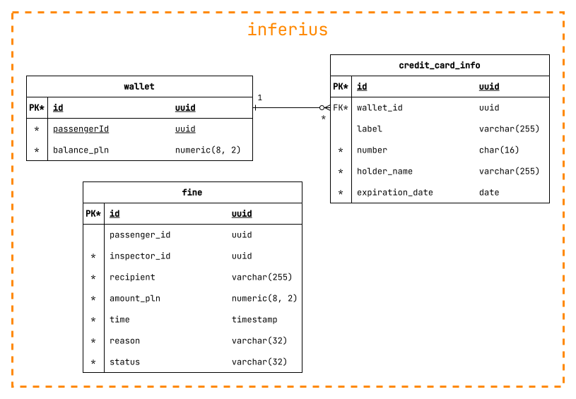

<b>Wyniki etapu II:   Definicja architektury systemu</b>

 

<b>System biletowy dla komunikacji miejskiej</b>

 

<b>Projektowanie systemów informatycznych</b>

Prowadzący: dr inż. Marcin Kawalerowicz

Skład zespołu:
<ul>
  <li>Przemysław Barcicki (260324)</li>
  <li>Tomasz Chojnacki (260365)</li>
  <li>Piotr Kot (259560)</li>
  <li>Jakub Zehner (260285)</li>
</ul>

# Cel

Dokument przedstawia kluczowe decyzje projektowe oraz ich uzasadnienie w kontekście systemu informatycznego wspomagającego miejską komunikację publiczną. Jego celem jest szczegółowe opisanie architektury technicznej, w tym komponentów systemu, ich funkcji oraz interakcji, które umożliwiają realizację założeń określonych w [specyfikacji wymagań](../e1/README.md).

System jest projektowany z myślą o ułatwieniu zakupu biletów, przeglądania rozkładów jazdy oraz uzyskiwania informacji o awariach przez pasażerów. Jednocześnie ma wspierać pracę kierowców i bileterów, umożliwiając sprawdzanie ważności biletów oraz zgłaszanie problemów.

Kluczowe ograniczenia i decyzje projektowe zawarte w dokumencie wynikają z potrzeb optymalizacji czasu operacji systemu oraz zapewnienia wysokiej dostępności i niezawodności.

# Cele i ograniczenia architektoniczne

Wyróżnione zostały wśród wymagań z etapu 1 następujące cele, mające wpływ na architekturę systemu:

**Wymagania funkcjonalne:**

- `ACC/01` - Jako _gość_ chcę mieć możliwość rejestracji _konta_ _pasażera_.
- `ACC/02` - Jako _gość_ chcę mieć możliwość zalogowania się do _konta_ (_administratora_, _biletera_, _kierowcy_, _pasażera_).
- `ACC/03` - Jako _osoba zalogowana_ chcę mieć możliwość wylogowania się ze swojego _konta_.
- `TIC/09` - Jako _pasażer_ chcę mieć możliwość okazania _biletu_ do _sprawdzenia ważności biletu_.
- `TIC/12` - Jako _bileter_ chcę mieć możliwość _sprawdzenia ważności_ _biletu_ _pasażera_.
- `PAY/11` - Jako _pasażer_ chcę mieć możliwość zapłaty za _bilet_ za pomocą _BLIK_.
- `PAY/12` - Jako _pasażer_ chcę mieć możliwość zapłaty za _bilet_ za pomocą karty kredytowej.
- `PAY/14` - Jako _pasażer_ chcę mieć możliwość zapłaty za wystawiony _mandat_ za pomocą _BLIK_.
- `PAY/16` - Jako _pasażer_ chcę mieć możliwość zapłaty za wystawiony _mandat_ za pomocą _portfela_.

**Wymagania niefunkcjonalne:**

- `NF/SYS/01` - Strona internetowa powinna być możliwa do wyświetlenia na przeglądarkach internetowych "Evergreen Browser".
- `NF/SYS/02` - System umożliwia obsługę z użyciem ekranu dotykowego dla funkcjonalności _pasażera_, _kierowcy_, _biletera_.
- `NF/SYS/03` - System umożliwia obsługę z użyciem myszki i klawiatury dla funkcjonalności _administratora_.
- `NF/REL/01` - Klasa niezawodności systemu powinna wynosić co najmniej 99,9%.
- `NF/REL/02` - W przypadku awarii nieobejmującej sprzętu system powinien mieć możliwość powrotu do stanu sprzed awarii w czasie poniżej 1 godziny.
- `NF/REL/03` - System powinien wykonywać codzienną kopię zapasową danych.
- `NF/REL/04` - Dostęp do funkcjonalności pasażerów, bileterów, kierowców i administratorów powinien być możliwy tylko w sposób autoryzowany.
- `NF/REL/06` - Części systemów powinny komunikować się ze sobą w sposób uniemożliwiający ingerecję osób trzecich.
- `NF/REL/07` - System musi być zabezpieczony przed utratą zasilania oraz połączenia internetowego.
- `NF/REL/09` - System powinien przetworzyć wszystkie płatności i emaile niezależnie od dostępności usługi w momencie ich zlecenia.
- `NF/PRF/01` - System powinien obsługiwać zapytania użytkowników, zakładając brak problemów sieciowych:
  1. dotyczące biletów w czasie poniżej 1 sekundy dla co najmniej 90% przypadków.
  2. dotyczące kont w czasie poniżej 2 sekundy dla co najmniej 90% przypadków.
  3. dotyczące płatności w czasie poniżej 10 sekundy dla co najmniej 90% przypadków.
  4. dotyczące logistyki w czasie poniżej 1 sekundy dla co najmniej 90% przypadków.
- `NF/PRF/02` - System powinien działać bez zarzutu przy jednoczesnym korzystaniu przez 5000 użytkowników (zgodnie z poprzednimi [wyliczeniami](../e1/README.md#wydajność)).

# Decyzje i ich uzasadnienie

| **Cele (wymagania + poprzednie decyzje)**                  | **Mechanizmy (taktyki)**                                                              |
| ---------------------------------------------------------- | ------------------------------------------------------------------------------------- |
| `NF/REL/01`, `NF/PRF/01`, `NF/PRF/02`                      | [`M/01`: Architektura mikroserwisów](#m01-architektura-mikroserwisów)                 |
| `NF/REL/01`, `NF/REL/07`, `NF/PRF/01`, `NF/PRF/02`         | [`M/02`: Load balancing usług](#m02-load-balancing-usług)                             |
| `NF/REL/01`, `NF/REL/02`, `NF/REL/07`, `M/01`              | [`M/03`: Healthchecki dla serwisów](#m03-healthchecki-dla-serwisów)                   |
| `NF/REL/01`, `NF/REL/03`, `NF/REL/07`, `M/01`              | [`M/04`: Wdrożenie w chmurze AWS](#m04-wdrożenie-w-chmurze-aws)                       |
| `NF/REL/02`, `NF/REL/07`, `NF/REL/09`, `M/04`              | [`M/05`: Kolejki SQS dla płatności i emaili](#m05-kolejki-sqs-dla-płatności-i-emaili) |
| `NF/REL/04`, `NF/REL/06`, `M/01`, `M/04`                   | [`M/06`: Izolacja siecią wewnętrzną VPC](#m06-izolacja-siecią-wewnętrzną-vpc)         |
| `NF/REL/04`, `M/01`, `M/06`                                | [`M/07`: Wzorzec API Gateway](#m07-wzorzec-api-gateway)                               |
| `PAY/11`, `PAY/12`, `PAY/14`, `PAY/16`, `NF/REL/09`        | [`M/08`: Zewnętrzna bramka płatności](#m08-zewnętrzna-bramka-płatności)               |
| `NF/REL/01`, `NF/REL/07`, `M/01`                           | [`M/09`: Oddzielne bazy dla mikroserwisów](#m09-oddzielne-bazy-dla-mikroserwisów)     |
| `NF/REL/01`, `NF/REL/02`, `NF/REL/03`, `NF/REL/07`, `M/04` | [`M/10`: Relacyjne bazy danych ACID na RDS](#m10-relacyjne-bazy-danych-acid-na-rds)   |
| `ACC/01`, `ACC/02`, `ACC/03`, `NF/REL/04`                  | [`M/11`: Autoryzacja z użyciem JWT](#m11-autoryzacja-z-użyciem-jwt)                   |
| `NF/PRF/01`, `NF/PRF/02`, `M/11`                           | [`M/12`: Wzorzec sidecar dla autoryzacji](#m12-wzorzec-sidecar-dla-autoryzacji)       |
| `NF/SYS/01`, `NF/SYS/02`, `NF/SYS/03`                      | [`M/13`: Responsywna aplikacja webowa SPA](#m13-responsywna-aplikacja-webowa-spa)     |
| `TIC/09`, `TIC/12`, `M/13`                                 | [`M/14`: Kod QR dla biletów](#m14-kod-qr-dla-biletów)                                 |

# Mechanizmy architektoniczne

## `M/01`: Architektura mikroserwisów

**Problem:** Różne części systemu mają różne wymagania co do czasu odpowiedzi (`NF/PRF/01`), będą też miały różne obciążenia (częściej sprawdzamy rozkład niż kupujemy bilet, częściej kupujemy bilet niż zmieniamy ustawienia konta). Ponadto wymagana jest wysoka niezawodność (`NF/REL/01`), a także możliwość obsługi wielu użytkowników jednocześnie (`NF/PRF/02`). Różne części systemu będą też budowane przez różne zespoły, które mogą mieć swoje wymagania co do technologii, narzędzi i procesów.

**Rozwiązania:**

<table>
  <tr>
    <td></td>
    <th>Zalety</th>
    <th>Wady</th>
  </tr>
  <tr>
    <th>Monolit</th>
    <td>
      <ul>
        <li>Łatwość wdrożenia</li>
        <li>Jedna wspólna baza kodu</li>
        <li>Wydajność komunikacji między modułami</li>
        <li>Serwisy mogą być stanowe</li>
      </ul>
    </td>
    <td>
      <ul>
        <li>Niska skalowalność poszczególnych modułów</li>
        <li>Trudności w rozbudowie i utrzymaniu</li>
        <li>Pojedynczy punkt awarii</li>
      </ul>
    </td>
  </tr>
  <tr>
    <th>Architektura modułowa, heksagonalna, czysta</th>
    <td>
      <ul>
        <li>Łatwość wdrożenia</li>
        <li>Modułowość, możliwość podziału pracy</li>
        <li>Wydajność komunikacji między modułami</li>
        <li>Serwisy mogą być stanowe</li>
      </ul>
    </td>
    <td>
      <ul>
        <li>Niska skalowalność poszczególnych modułów</li>
        <li>Pojedynczy punkt awarii</li>
      </ul>
    </td>
  </tr>
  <tr>
    <th>Mikroserwisy</th>
    <td>
      <ul>
        <li>Modułowość, możliwość podziału pracy</li>
        <li>Łatwość skalowania poszczególnych modułów</li>
        <li>Awaria modułu nie wyłącza całego systemu</li>
        <li>Możliwość wyboru różnych technologii dla różnych modułów</li>
      </ul>
    </td>
    <td>
      <ul>
        <li>Potrzeba bezstanowości serwisów</li>
        <li>Opóźnienia w komunikacji między serwisami</li>
        <li>Trudniejsze wdrożenie</li>
        <li>Brak wspólnej bazy kodu</li>
      </ul>
    </td>
  </tr>
</table>

**Decyzja:** Z uwagi na wymienione wymagania, jako architekturę systemu wybrano **mikroserwisy**.

**Opis:** Architektura mikroserwisów pozwoli na łatwe skalowanie poszczególnych modułów, a także na podział pracy między zespołami. Każdy zespół może skupić się na swojej części dziedziny problemu. Może podejmować decyzje o wykorzystywanych w środku technologiach, co jest korzystne, gdy różne cześci systemu mają różne potrzeby. Istotne z perspektywy zespołu jest utrzymanie spójnych interfejsów dla innych serwisów, mogą one dowolnie edytować wnętrze serwisu tak długo, jak nie zmienia to jego publicznego API. Lokalność awarii pozwoli na utrzymanie wyższej niezawodności systemu niż w przypadku monolitu. Możliwe będzie też skalowanie poszczególnych modułów niezależnie, przenosząc siłę obliczeniową tam, gdzie jest ona najbardziej potrzebna. Wadą takiego rozwiązania jest konieczność bezstanowości serwisów oraz opóźnienia w komunikacji między nimi, jako że różne serwisy mogą być uruchamiane na różnych maszynach.

Wybór architektury mikroserwisów wpłynie znacząco na dalsze decyzje architektoniczne.

**Źródła:**

- [microservices.io - Microservices Architecture](https://microservices.io/patterns/microservices.html)
- [microservices.io - Monolithic Architecture](https://microservices.io/patterns/monolithic.html)
- Wykład 4: Style architektoniczne

## `M/02`: Load balancing usług

**Problem:**
Ze względu na wymogi `NF/REL/01`, `NF/REL/07`, `NF/PRF/01` i `NF/PRF/02` system powinien charakteryzować się wysoką dostępnością i niezawodnością. W związku z tym, konieczne jest zastosowanie pewnego podejścia, które to zagwarantuje. Rozwiązanie to powinno pozwalać na minimalizowanie czasu przestoju systemu w przypadku awarii lub niedostępności któregokolwiek z serwisów. Musi ono również umożliwiać obsługę dużej liczby użytkowników jednocześnie bez utraty wydajności.

**Rozwiązania:**

<table>
  <tr>
    <td></td>
    <th>Zalety</th>
    <th>Wady</th>
  </tr>
  <tr>
    <th>Jedno urządzenie na wszystkie usługi</th>
    <td>
      <ul>
        <li>Proste w implementacji</li>
        <li>Brak konieczności zmian w kodzie aplikacji</li>
        <li>Brak konieczności zastosowania dodatkowych narzędzi</li>
      </ul>
    </td>
    <td>
      <ul>
        <li>Brak skalowalności</li>
        <li>Brak niezawodności</li>
        <li>Wydajność zależna od mocy obliczeniowej jednej maszyny</li>
      </ul>
    </td>
  </tr>
  <tr>
    <th>Jedno urządzenie na każdą usługę</th>
    <td>
      <ul>
        <li>Minimalna niezawodność</li>
        <li>Minimalna dostępność</li>
        <li>Wydajność jednej usługi nie wpływa na inne</li>
      </ul>
    </td>
    <td>
      <ul>
        <li>Potrzeba tylu maszyn ile usług</li>
        <li>Wymaga zastosowania dodatkowych narzędzi</li>
      </ul>
    </td>
  </tr>
  <tr>
    <th><i>Load balancing</i> na wielu maszynach</th>
    <td>
      <ul>
        <li>Wysoka niezawodność</li>
        <li>Wysoka skalowalność</li>
        <li>Wysoka wydajność</li>
        <li>Możliwość minimalizowania kosztów</li>
        <li>Brak minimalnej i maksymalnej liczby maszyn</li>
      </ul>
    </td>
    <td>
      <ul>
        <li>Wymaga zastosowania dodatkowych narzędzi</li>
        <li>Wymaga dużych zmian w kodzie aplikacji</li>
      </ul>
    </td>
  </tr>
</table>

**Decyzja:** W związku z wymaganiami dotyczącymi niezawodności, dostępności i wydajności systemu, zdecydowano się na zastosowanie **Load balancing**.

**Opis:** Skalowanie horyzontalne polega na zwiększaniu liczby instancji serwisów, zamiast zwiększania mocy obliczeniowej pojedynczej maszyny. Pozwoli to na zwiększenie niezawodności systemu, a także umożliwi obsługę dużej liczby użytkowników jednocześnie. W przypadku awarii jednego z serwisów, inne instancje będą w stanie przejąć jego obowiązki, co pozwoli na minimalizację czasu przestoju systemu. Skalowanie horyzontalne w odpowiednich warunkach pozwoli również na minimalizowanie kosztów, ponieważ pozwoli na chwilowe zwiększenie wydajności systemu bez konieczności inwestowania w droższe maszyny. Dodatkowym atutem jest możliwość zastosowania różnych narzędzi do zarządzania obciążeniem takich jak _load balancer_ czy _auto acaling_.

_Load balancer_ to oprogramowanie (kiedyś urządzenie) odpowiedzialne za równomierne rozłożenie obciążenia na dostępne serwery. Jest ono odpowiedzialne za przekierowywanie ruchu do serwerów, które są w stanie obsłużyć kolejne otrzymane zapytanie. Istnieje wiele różnych algorytmów, które pozwalają na wybór odpowiedniego serwera, takich jak _round robin_ (algorytm karuzelowy), _least connections_ (najmniejsza liczba połączeń) czy _IP nash_ (decyzja na podstawie funkcji skrótu), które pozwalają rozłożyć obciążenie w sposób optymalny.

_Auto Scaling_ to narzędzie, które pozwala na automatyczne skalowanie liczby instancji serwisów w zależności od obciążenia. Pozwala to na minimalizowanie kosztów, ponieważ pozwala na zwiększenie wydajności systemu w momencie, gdy jest to konieczne, a także na zmniejszenie jej w momencie, gdy nie jest ona potrzebna.

**Źródła:**

- [Wikipedia - High availability](https://en.wikipedia.org/wiki/High_availability)
- [Wikipedia - Load Balancing](<https://en.wikipedia.org/wiki/Load_balancing_(computing)>)
- [AWS - Load Balancing](https://aws.amazon.com/what-is/load-balancing/)
- [Understanding High Availability and Scalability](https://newsletter.simpleaws.dev/p/understanding-aws-high-availability-scalability)
- [Wikipedia - Scalability](https://en.wikipedia.org/wiki/Scalability)

## `M/03`: Healthchecki dla serwisów

**Problem:** Zgodnie z wymaganiem `NF/REL/01` system powinien charakteryzować się wysoką niezawodnością. W związku z tym, konieczne jest zastosowanie mechanizmu, który pozwoli na monitorowanie stanu serwisów i szybkie reagowanie w przypadku ich awarii. Rozwiązanie to powinno pozwalać na szybkie wykrycie problemów, co pozwoli na ich szybkie rozwiązanie i minimalizację czasu przestoju systemu.

**Rozwiązania:**

<table>
  <tr>
    <td></td>
    <th>Zalety</th>
    <th>Wady</th>
  </tr>
  <tr>
    <th>Health Check API</th>
    <td>
      <ul>
        <li>Proste w implementacji</li>
        <li>Uniwersalne rozwiązanie niezależne od technologii</li>
        <li>Niski narzut na system</li>
        <li>Powszechnie wspierany standard</li> 
      </ul>
    </td>
    <td>
      <ul>
        <li>Ograniczone możliwości wykrywania złożonych problemów</li>
        <li>Serwis może być uznany za zdrowy, mimo że pomiędzy sprawdzeniami stanu wystąpiły problemy</li>
      </ul>
    </td>
  </tr>
  <tr>
    <th>Application-Level Observability</th>
    <td>
      <ul>
        <li>Daje pełny obraz działania aplikacji</li>
        <li>Można konfigurować progi ostrzegawcze dla różnych wskaźników</li>
      </ul>
    </td>
    <td>
      <ul>
        <li>Duża złożoność konfiguracji</li>
        <li>Wysoki narzut na system</li>
        <li>Wymaga zastosowania dodatkowych narzędzi</li>
      </ul>
    </td>
  </tr>
</table>

**Decyzja:** W związku z wymaganiami dotyczącymi niezawodności, dostępności i wydajności systemu, zdecydowano się na zastosowanie **Health Check API**.

**Opis:** Health Check API to jeden z najprostszych i najczęściej używanych mechanizmów do monitorowania stanu aplikacji w środowiskach produkcyjnych. Jego głównym celem jest umożliwienie szybkiego i zautomatyzowanego sprawdzania, czy aplikacja działa poprawnie oraz czy jej kluczowe komponenty są dostępne i funkcjonują zgodnie z oczekiwaniami. Jest to szczególnie istotne w środowiskach opartych na mikrousługach, gdzie każda usługa może mieć swoje zależności, takie jak bazy danych, systemy cache, kolejki zadań czy zewnętrzne API.

Health Check API pozwala monitorować aplikację w sposób aktywny, co oznacza, że systemy zewnętrzne, takie jak load balancery czy narzędzia do monitoringu, wysyłają żądania do specjalnego endpointu w aplikacji, aby uzyskać odpowiedź wskazującą na jej stan. W najprostszej formie endpoint ten zwraca kod statusu HTTP 200, co oznacza, że aplikacja działa poprawnie, lub 503, co sygnalizuje problem. W bardziej zaawansowanych scenariuszach Health Check API może dostarczać szczegółowe dane o stanie różnych komponentów aplikacji, takich jak status połączenia z bazą danych czy dostępność usług zewnętrznych.

Kluczowym aspektem Health Check API jest jego rola w zautomatyzowanych środowiskach wdrożeniowych, takich jak Kubernetes. Tutaj jest wykorzystywany do liveness i readiness probes, które decydują o tym, czy kontener powinien być zrestartowany lub czy aplikacja jest gotowa do przyjmowania ruchu. Działa to na zasadzie ciągłego monitorowania stanu aplikacji i jej komponentów, co pozwala na szybką reakcję w przypadku problemów, np. przekierowanie ruchu do zdrowych instancji lub automatyczny restart wadliwej usługi.

**Źródła:**

- [microservices.io - Health Check API](https://microservices.io/patterns/observability/health-check-api.html)
- [kubernetes.io - Configure Liveness, Readiness and Startup Probes](https://kubernetes.io/docs/tasks/configure-pod-container/configure-liveness-readiness-startup-probes/)
- [logz.io - Application Observability in 2024](https://logz.io/learn/application-observability-guide/#application-observable)
- [fastly.com - What is application observability?](https://www.fastly.com/learning/what-is-application-observability)

## `M/04`: Wdrożenie w chmurze AWS

**Problem:** Przy projektowaniu systemu bardzo ważnym aspektem jest wybór odpowiedniej infrastruktury wdrożeniowej. Zmiana infrastruktury w późniejszym etapie rozwoju systemu może być bardzo kosztowna i czasochłonna. W związku z tym, konieczne jest dokonanie odpowiedniego wyboru już na etapie projektowania systemu. Wraz z rozważaniami dotyczącymi wyboru infrastruktury, należy wziąć pod uwagę takie aspekty jak niezawodność, skalowalność, bezpieczeństwo, koszty oraz dostępność usług.

**Rozwiązania:**

<table>
  <tr>
    <td></td>
    <th>Zalety</th>
    <th>Wady</th>
  </tr>
  <tr>
    <th><i>on-premise</i></th>
    <td>
      <ul>
        <li>Pełna kontrola nad danymi</li>
        <li>Brak zależności od dostawcy usług</li>
        <li>Niski koszt przy wysokim obciążeniu</li>
        <li>Niskie opóźnienia</li>
        <li>Brak ukrytych kosztów</li>
      </ul>
    </td>
    <td>
      <ul>
        <li>Wysoki koszt początkowy</li>
        <li>Wysoki koszt utrzymania</li>
        <li>Brak możliwości skalowania w dół</li>
        <li>Brak możliwości szybkiej modernizacji</li>
        <li>Płacenie za utrzymanie całej infrastruktury nawet gdy korzystamy z jej części</li>
      </ul>
    </td>
  </tr>
  <tr>
    <th>Chmura</th>
    <td>
      <ul>
        <li>Brak konieczności inwestowania w sprzęt</li>
        <li>Możliwość szybkiego skalowania</li>
        <li>Wysoka niezawodność</li>
        <li>Bezpieczeństwo danych</li>
        <li>Wysoka dostępność usług</li>
        <li>Możliwość szybkiej modernizacji</li>
        <li>Możliwość dostosowania infrastruktury do indywidualnych potrzeb</li>
        <li>Płacisz tylko za to co używasz</li>
        <li>Duży wybór dostawców usług chmurowych</li>
      </ul>
    </td>
    <td>
      <ul>
        <li>Brak pełnej kontroli nad danymi</li>
        <li>Zależność od dostawcy usług</li>
        <li>Stosunkowo wysoki koszt przy wysokim obciążeniu</li>
        <li>Stosunkowo wysokie opóźnienia</li>
        <li>Ukryte koszta</li>
      </ul>
    </td>
  </tr>
</table>

<table>
  <tr>
    <td></td>
    <th>Zalety</th>
    <th>Wady</th>
  </tr>
  <tr>
    <th>Amazon Web Services</th>
    <td>
      <ul>
        <li>Renoma i dopracowany ekosystem</li>
        <li>Bardzo duża liczba punktów dostępowych</li>
        <li>Duża liczba usług</li>
        <li>Największa liczba centrów danych</li>
        <li>Najniższa cena</li> 
      </ul>
    </td>
    <td>
      <ul>
        <li>Brak rozwiązań hybrydowych</li>
      </ul>
    </td>
  </tr>
  <tr>
    <th>Google Cloud Platform</th>
    <td>
      <ul>
        <li>Dużo rozwiązań związanych z uczeniem maszynowym</li>
        <li>Bardzo dobre narzędzia do analizy danych</li>
        <li>100% energii z odnawialnych źródeł</li>
        <li>Doskonałe wsparcie dla Kubernetes</li>
      </ul>
    </td>
    <td>
      <ul>
        <li>Limitowana liczba usług typu enterprise</li>
      </ul>
    </td>
  </tr>
    <tr>
    <th>Microsoft Azure</th>
    <td>
      <ul>
        <li>Interoperacyjność z innymi produktami Microsoftu</li>
        <li>Wsparcie dla hybrydowego podejścia z <i>on-premise</i></li>
      </ul>
    </td>
    <td>
      <ul>
        <li>Najmłodsza z trójki platform</li>
        <li>Najmniejsza liczba usług</li>
      </ul>
    </td>
  </tr>
</table>

**Decyzja:** W związku z wymaganiami dotyczącymi niezawodności, dostępności i wydajności systemu, zdecydowano się na zastosowanie **infrastruktury chmurowej**, a zważając na dużą liczbę usług, dużą liczbę centrów danych oraz najniższą cenę, zdecydowano się na skorzystanie z usług chmurowych **Amazon Web Services**.

**Opis:** W praktyce przy pracach wdrożeniowych stosuje się dwa podejścia. Infrastruktura _on-premise_ oraz chmurowa. Oba podejścia mają swoje zalety i wady zależne od kontekstu użycia. Infrastruktura chmurowa to podejście, które polega na korzystaniu z istniejącej infrastruktury dostawcy usług chmurowych. Zamiast sprzętu trzymanego w pewnej lokalizacji zarządzanej przez firmę, korzysta się ze sprzętu i oprogramowania dzierżawionego od dostawcy usług chmurowych. W zależności od typu dostawcy usług, może on dostarczać różnych funkcjonalności na różnych warstwach abstrakcji. Ograniczając się do najpopularniejszych modeli może to być infrastruktura jako usługa (IaaS), platforma jako usługa (PaaS) lub oprogramowanie jako usługa (SaaS). Porzucając funkcjonalności z pewnych warstw tej piramidy jesteśmy w stanie ograniczyć koszta. Jest to bardzo dobre rozwiązanie dla firm, które nie wiedzą jakie będą ich potrzeby w przyszłości, ponieważ pozwala na elastyczne dostosowanie infrastruktury do indywidualnych potrzeb.

Jednym z najpopularniejszych dostawców tego typu usług jest Amazon Web Services (AWS), oferujący szeroki wachlarz narzędzi wspierających tworzenie, wdrażanie oraz zarządzanie aplikacjami internetowymi. AWS powstało w 2006 roku udostępniając swoją pierwszą i najpopularniejszą usługę Elastic Compute Cloud (EC2). Od tego czasu zdobyło dużą popularność i renomę na rynku. Amazon Web Services posiada bardzo dużą liczbę usług, które pozwalają na bardzo dokładne dostosowanie infrastruktury do indywidualnych potrzeb. Posiada również bardzo dużą liczbę centrów danych, co pozwala na minimalizowanie odległości między klientami a centrami danych co skutkuje mniejszymi opóźnieniami i większym zadowoleniem klientów. Przez swoją popularność i dużą liczbę użytkowników, Amazon Web Services jest w stanie oferować swoje usługi w bardzo atrakcyjnych cenach.

**Źródła:**

- [AWS - _on-premise_ vs cloud](https://aws.amazon.com/compare/the-difference-between-saas-and-on-premises/)
- [Coursera - AWS vs GCP vs Azure](https://www.coursera.org/articles/aws-vs-azure-vs-google-cloud)
- [Digitial Ocean - AWS vs GCP vs Azure](https://www.digitalocean.com/resources/articles/comparing-aws-azure-gcp)

## `M/05`: Kolejki SQS dla płatności i emaili

**Problem:** Ze względu na wymóg `NF/REL/09` należy w dokładny sposób rozważyć operacje związane z płatnościami i wysyłaniem emaili. Konieczne jest zastosowanie odpowiedniego podejścia, które pozwoli na zapewnienie niezawodności i wydajności tych operacji. W związku z tym, konieczne jest przeanalizowanie różnych rozwiązań, które pozwolą na zminimalizowanie ryzyka utraty danych oraz zapewnienie ich dostarczenia w odpowiednim czasie.

**Rozwiązania:**

<table>
  <tr>
    <td></td>
    <th>Zalety</th>
    <th>Wady</th>
  </tr>
  <tr>
    <th>RPC</th>
    <td>
      <ul>
        <li>Proste w implementacji</li>
        <li>Synchroniczność</li>
        <li>Synchroniczna odpowiedź</li>
        <li>Brak konieczności zastosowania dodatkowych narzędzi</li>
      </ul>
    </td>
    <td>
      <ul>
        <li>Brak niezawodności</li>
      </ul>
    </td>
  </tr>
  <tr>
    <th>Kolejka</th>
    <td>
      <ul>
        <li>Wysoka niezawodność</li>
        <li>Asynchroniczność</li>
      </ul>
    </td>
    <td>
      <ul>
        <li>Przekazanie odpowiedzi musi być zaimplementowane osobno</li>
        <li>Wymaga zastosowania dodatkowych narzędzi</li>
      </ul>
    </td>
  </tr>
</table>

**Decyzja:** Dla krytycznych operacji związanych z płatnościami i wysyłaniem emaili, zdecydowano się na zastosowanie **kolejki**.

**Opis:** Kolejka to mechanizm, który pozwala na umieszczenie operacji w kolejce, z której zostaną one pobrane. Priorytetyzowane jest wykonanie operacji nad wydajnością wykonywania tej opracji. Pozwala to na zminimalizowanie ryzyka utraty danych oraz zapewnienie ich dostarczenia w odpowiednim czasie. W przypadku awarii jednej z instancji serwisów, operacja w kolejce nie zniknie, co sprawi, że inne instancje będą w stanie przejąć jej obowiązki. Pozwoli to na minimalizację czasu przestoju systemu i sprawi, że konkretne operacje na pewno zostaną wykonane.

Usługą dostępną w chmurze AWS, która pozwala na zastosowanie tego rozwiązania jest _Simple Queue Service_ (SQS). Pozwala ona na utworzenie wielu różnego typu kolejek, które prioritetyzują prędkość wykonania operacji nad wydajnością lub odwrotnie. Wykorzystanie do tego AWS sprawia, że developerzy nie muszą martwić się o skalowanie, dostępność czy bezpieczeństwo danych, ponieważ jest to zapewnione przez dostawcę usług.

**Źródła:**

- [microservices.io - Remote Procedure Invocation](https://microservices.io/patterns/communication-style/rpi.html)
- [microservices.io - Messaging](https://microservices.io/patterns/communication-style/messaging.html)

## `M/06`: Izolacja siecią wewnętrzną VPC

**Problem:** System powinien być zabezpieczony przed dostępem osób trzecich. W związku z tym, konieczne jest zastosowanie odpowiedniego podejścia, które pozwoli na zminimalizowanie ryzyka nieautoryzowanego dostępu do systemu. Rozwiązanie to powinno pozwalać na izolację poszczególnych serwisów, a także na kontrolę dostępu do nich.

**Rozwiązania:**

<table>
  <tr>
    <td></td>
    <th>Zalety</th>
    <th>Wady</th>
  </tr>
  <tr>
    <th>Security through obscurity</th>
    <td>
      <ul>
        <li>Minimum bezpieczeństwa</li>
      </ul>
    </td>
    <td>
      <ul>
        <li>Bardzo krytykowane podejście</li>
        <li>Brak gwarancji bezpieczeństwa</li>
        <li>Brak kontroli dostępu</li>
      </ul>
    </td>
  </tr>
    <tr>
    <th>Każda maszyna na adresie publicznym</th>
    <td>
      <ul>
        <li>Proste w implementacji</li>
      </ul>
    </td>
    <td>
      <ul>
        <li>Komunikacja między usługami może wymagać autoryzacji</li>
        <li>Niska wydajność</li>
      </ul>
    </td>
  </tr>
    </tr>
    <tr>
    <th><i>Virtual Private Cloud</i></th>
    <td>
      <ul>
        <li>Wysoka niezawodność</li>
        <li>Bezpieczeństwo gwarantowane przez dostawcę usług</li>
        <li>Kontrola dostępu</li>
        <li>Ziarnistość konfiguracji</li>
      </ul>
    </td>
    <td>
      <ul>
        <li>Trudne w implementacji</li>
      </ul>
    </td>
  </tr>
</table>

**Decyzja:** W związku z wymaganiami `NF/REL/04` i `NF/REL/06`, zdecydowano się na zastosowanie **Virtual Private Cloud**. Pozwoli to na wysoką niezawodność i bezpieczeństwo gwarantowane przez dostawcę usług, a także na kontrolę dostępu do poszczególnych serwisów.

**Opis:** Amazon Virtual Private Cloud (AWS VPC) to usługa chmurowa oferowana przez Amazon Web Services, która umożliwia tworzenie izolowanych sieci wirtualnych w obrębie chmury AWS. Dzięki VPC użytkownicy mogą definiować własne środowisko sieciowe, w tym wybierać zakresy adresów IP, konfigurować podsieci, definiować tabele routingu oraz stosować mechanizmy kontroli dostępu, takie jak listy kontroli dostępu (ACL) czy grupy zabezpieczeń (Security Groups). AWS VPC zapewnia pełną kontrolę nad przepływem ruchu sieciowego oraz umożliwia integrację z innymi usługami AWS, takimi jak EC2, RDS czy Lambda. Dodatkowo można łączyć VPC z lokalnymi centrami danych za pomocą VPN lub AWS Direct Connect, co pozwala na stworzenie hybrydowego środowiska chmurowego. Usługa VPC jest kluczowym elementem dla budowy skalowalnych, bezpiecznych i wysokowydajnych aplikacji w chmurze.

**Źródła:**

- [Security through obscurity](https://pl.wikipedia.org/wiki/Security_through_obscurity)
- [AWS - VPC](https://docs.aws.amazon.com/vpc/latest/userguide/what-is-amazon-vpc.html)

## `M/07`: Wzorzec API Gateway

**Problem:** W systemie opartym na architekturze mikroserwisów, komunikacja między klientami a serwisami backendowymi staje się złożona. Bezpośrednie wywoływanie każdego mikroserwisu przez klienta prowadzi do trudności związanych z:

- złożoną obsługą adresów wielu serwisów,
- brakiem centralizacji zarządzania autoryzacją, uwierzytelnianiem i kontrolą przepływu ruchu,
- niezbędnym dostosowaniem odpowiedzi do różnych klientów.

**Rozwiązania:**

<table>
  <tr>
    <td></td>
    <th>Zalety</th>
    <th>Wady</th>
  </tr>
  <tr>
    <th>Wzorzec API Gateway</th>
    <td>
      <ul>
        <li>Centralizacja autoryzacji i uwierzytelniania</li>
        <li>Większe bezpieczeństwo aplikacji</li>
        <li>Ułatwiony routing żądań</li>
        <li>Wysoka elastyczność</li>
      </ul>
    </td>
    <td>
      <ul>
        <li>Dodatkowa warstwa do wdrożenia i utrzymania</li>
        <li>Dodatkowy pojedynczy punkt awarii (<i>single point of failure</i>)</li>
      </ul>
    </td>
  </tr>
  <tr>
    <th>Bez API Gateway</th>
    <td>
      <ul>
        <li>Prostsza implementacja w początkowej fazie projektu</li>
        <li>Brak dodatkowej warstwy pośredniej</li>
      </ul>
    </td>
    <td>
      <ul>
        <li>Wysoka złożoność dla frontendu</li>
        <li>Problemy z zabezpieczeniami</li>
        <li>Klient musi znać adresy każdego serwisu</li>
      </ul>
    </td>
  </tr>
</table>

**Decyzja:** Zdecydowano się na zastosowanie **API Gateway** jako centralnego punktu wejściowego do systemu. **API Gateway** pełni funkcję pośrednika między klientami a mikroserwisami backendowymi, który przetwarza i kieruje żądania do odpowiednich usług. Rozwiązanie to zwiększa bezpieczeństwo systemu, eliminując potrzebę bezpośredniej komunikacji klientów z wieloma mikroserwisami. **API Gateway** umożliwia także buforowanie odpowiedzi, ograniczanie liczby żądań i optymalizowanie komunikacji między klientami, a mikroserwisami co pozwala na uzyskanie lepszej wydajności systemu.

**Opis:** API Gateway pełni rolę jednego punktu wejścia do systemu, umożliwiając przekierowywanie ruchu do odpowiednich mikroserwisów, dopasowanie odpowiedzi do rodzaju klienta i implementację autoryzacji z użyciem JWT. Dzięki API Gateway ruch do mikroserwisów jest izolowany, a klienci korzystają z jednego spójnego interfejsu.

**Źródła:**

- [microservices.io - API Gateway](https://microservices.io/patterns/apigateway.html)
- [Wzorzec bramy interfejsu API a bezpośrednia komunikacja między mikrousługami](https://learn.microsoft.com/pl-pl/dotnet/architecture/microservices/architect-microservice-container-applications/direct-client-to-microservice-communication-versus-the-api-gateway-pattern)
- [Advantages and disadvantages of using API gateway](https://www.designgurus.io/course-play/grokking-system-design-fundamentals/doc/advantages-and-disadvantages-of-using-api-gateway)

## `M/08`: Zewnętrzna bramka płatności

**Problem:** System musi obsługiwać płatności związane z zakupem biletów i opłacaniem mandatów. Wymaga to integracji z bramką płatności, która będzie niezawodna, bezpieczna i szybka. Istnieją dwa podejścia: zewnętrzna bramka płatności oraz wewnętrzna, samodzielnie rozwijana bramka.

**Rozwiązania:**

<table>
  <tr>
    <td></td>
    <th>Zalety</th>
    <th>Wady</th>
  </tr>
  <tr>
    <th>Zewnętrzna bramka płatności</th>
    <td>
      <ul>
        <li>Szybkie wdrożenie dzięki gotowym API</li>
        <li>Wysoki poziom bezpieczeństwa</li>
        <li>Wsparcie dla wielu metod płatności</li>
        <li>Zminimalizowanie ryzyka błędów po stronie systemu</li>
      </ul>
    </td>
    <td>
      <ul>
        <li>Koszty transakcyjne</li>
        <li>Ograniczona kontrola nad procesem płatności</li>
      </ul>
    </td>
  </tr>
  <tr>
    <th>Wewnętrzna bramka płatności</th>
    <td>
      <ul>
        <li>Pełna kontrola nad procesem płatności</li>
        <li>Brak kosztów transakcyjnych</li>
        <li>Możliwość dostosowania do specyficznych wymagań systemu</li>
      </ul>
    </td>
    <td>
      <ul>
        <li>Wysokie koszty wdrożenia i utrzymania</li>
        <li>Odpowiedzialność za bezpieczeństwo i zgodność z przepisami</li>
        <li>Wysokie ryzyko związane z zarządzaniem danymi wrażliwymi klientów</li>
        <li>Wymaga większej siły roboczej niż rozwiązanie gotowe do użycia</li>
      </ul>
    </td>
  </tr>
</table>

**Decyzja:** Zdecydowano się na **zewnętrzną bramkę płatności** z uwagi na jej gotowość do wdrożenia, bezpieczeństwo oraz minimalizację ryzyka operacyjnego. Wybór ten pozwala uniknąć wysokich kosztów związanych z certyfikacją PCI-DSS i ciągłym utrzymaniem bramki płatniczej.

**Opis:** Zewnętrzna bramka płatności działa jako pośrednik między systemem a bankiem lub innym operatorem płatności. Proces obejmuje przekazanie danych płatniczych przez API w sposób bezpieczny i zgodny z regulacjami PCI-DSS. W praktyce oznacza to, że cały ciężar zgodności z przepisami prawnymi przenoszony jest na dostawcę usługi płatniczej.

**Źródła:**

- [What is a payment gateway?](https://gocardless.com/guides/posts/how-to-create-a-payment-gateway/)
- [Advantages and Disadvantages of Gateway Payment](https://www.revolv3.com/resources/pros-and-cons-of-gateway-payment-processing-for-enterprises)

## `M/09`: Oddzielne bazy dla mikroserwisów

**Problem:** W architekturze mikroserwisów ([`M/01`](#m01-architektura-mikroserwisów)) konieczne jest podjęcie decyzji dotyczącej sposobu przechowywania danych, tak aby zapewnić niezawodność, skalowalność, wydajność i bezpieczeństwo systemu.

**Rozwiązania:**

<table>
  <tr>
    <td></td>
    <th>Zalety</th>
    <th>Wady</th>
  </tr>
  <tr>
    <th>Wspólna baza danych dla mikroserwisów</th>
    <td>
      <ul>
        <li>Prostsze zarządzanie danymi</li>
        <li>Łatwe współdzielenie danych</li>
        <li>Mniejsza złożoność systemu</li>
      </ul>
    </td>
    <td>
      <ul>
        <li>Słabe oddzielenie odpowiedzialności</li>
        <li>Trudniejsze skalowanie</li>
        <li>Ryzyko wystąpienia wąskiego gardła</li>
      </ul>
    </td>
  </tr>
  <tr>
    <th>Oddzielne bazy dla mikroserwisów</th>
    <td>
      <ul>
        <li>Silne oddzielenie odpowiedzialności</li>
        <li>Łatwiejsze skalowanie</li>
        <li>Lepsza niezawodność</li>
      </ul>
    </td>
    <td>
      <ul>
        <li>Złożona infrastruktura</li>
        <li>Trudniejszy dostęp do danych między serwisami</li>
        <li>Brak możliwości użycia operacji JOIN pomiędzy baza danych</li>
      </ul>
    </td>
  </tr>
</table>

**Decyzja:** Ze względu na wymagania dotyczące niezawodności, skalowalności i bezpieczeństwa systemu, zdecydowano się na zastosowanie **oddzielnych baz danych dla mikroserwisów**.

**Opis:** W architekturze mikroserwisów zastosowanie oddzielnych baz danych oznacza, że każdy mikroserwis posiada swoją własną bazę danych, którą zarządza i do której ma wyłączny dostęp. Podejście to zapewnia silne oddzielenie odpowiedzialności pomiędzy serwisami, ponieważ każdy z nich jest autonomiczny w kwestii przechowywania danych i nie zależy bezpośrednio od innych mikroserwisów. Dzięki temu możliwa jest niezależna ewolucja każdego z serwisów – zmiany w schemacie bazy jednego serwisu nie wpływają na inne.

Oddzielne bazy danych zwiększają również bezpieczeństwo systemu, ponieważ serwisy mają dostęp wyłącznie do swoich danych, co ogranicza ryzyko nieautoryzowanego dostępu do wrażliwych informacji. Architektura taka ułatwia skalowanie systemu, ponieważ zarówno mikroserwisy, jak i ich bazy danych można skalować indywidualnie, w zależności od potrzeb. Dodatkowo, podejście to pozwala na elastyczność w wyborze technologii – każdy serwis może korzystać z innego typu bazy danych (np. relacyjnej, dokumentowej czy grafowej), dopasowanego do specyficznych wymagań.

Jednak rozwiązanie to wiąże się z pewnymi wyzwaniami. Zarządzanie wieloma bazami danych wymaga bardziej złożonej infrastruktury, co może generować wyższe koszty utrzymania, szczególnie w początkowej fazie projektu. Ponadto z powodu zastosowania tego rozwiązania komunikacja między serwisami jest często konieczna, gdy dane przechowywane w różnych bazach muszą być używane w jednym procesie, co zwiększa złożoność implementacji.

**Źródła:**

- [microservices.io - Database per Service](https://microservices.io/patterns/data/database-per-service.html)
- [microservices.io - Shared Database](https://microservices.io/patterns/data/shared-database.html)

## `M/10`: Relacyjne bazy danych ACID na RDS

**Problem:** Aby zapewnić integralność i bezpieczeństwo danych, konieczny jest wybór odpowiedniego systemu zarządzania bazą danych. W związku z tym, konieczne jest wybór baz danych pomiędzy relacyjnymi bazami danych ACID (SQL) a bazami danych BASE (NoSQL).

**Rozwiązania:**

<table>
  <tr>
    <td></td>
    <th>Zalety</th>
    <th>Wady</th>
  </tr>
  <tr>
    <th>Bazy danych ACID</th>
    <td>
      <ul>
        <li>Zapewnia synchronizację danych</li>
        <li>Niezawodność</li>
        <li>Bezpieczeństwo operacji</li>
      </ul>
    </td>
    <td>
      <ul>
        <li>Nie skaluje się dobrze poziomo</li>
        <li>Wydajność spada przy przetwarzaniu dużych wolumenów danych</li>
        <li>Przetwarzanie transakcji wymaga blokowania określonych rekordów</li>
      </ul>
    </td>
  </tr>
  <tr>
    <th>Bazy danych BASE</th>
    <td>
      <ul>
        <li>Skaluje się poziomo</li>
        <li>Pozwala na równoczesne aktualizowanie tych samych rekordów</li>
        <li>Wysoka wydajność przy dużych zbiorach danych</li>
      </ul>
    </td>
    <td>
      <ul>
        <li>Brak synchronizacji danych na poziomie bazy</li>
        <li>Brak gwarancji spójności natychmiastowej</li>
      </ul>
    </td>
  </tr>
</table>

<table>
  <tr>
    <td></td>
    <th>Zalety</th>
    <th>Wady</th>
  </tr>
  <tr>
    <th>Baza danych na maszynie AWS EC2</th>
    <td>
      <ul>
        <li>Pełna kontrola</li>
        <li>Elastyczność technologiczna</li>
        <li>Bez limitów usługi</li>
      </ul>
    </td>
    <td>
      <ul>
        <li>Konieczność zarządzania serwerem</li>
        <li>Brak automatyzacji</li>
        <li>Większe ryzyko błędów</li>
        <li>Trudności w skalowaniu</li>
      </ul>
    </td>
  </tr>
  <tr>
    <th>AWS RDS</th>
    <td>
      <ul>
        <li>Łatwość zarządzania</li>
        <li>Wysoka dostępność</li>
        <li>Automatyczne skalowanie</li>
        <li>Bezpieczeństwo</li>
        <li>Szybkie wdrożenie</li>
        <li>Automatyczne kopie zapasowe</li>
      </ul>
    </td>
    <td>
      <ul>
        <li>Mniejsza kontrola</li>
        <li>Limitacje usługi</li>
      </ul>
    </td>
  </tr>
</table>

**Decyzja:** Ze względu na wymagania dotyczące integralności, niezawodności i bezpieczeństwa danych, zdecydowano się na zastosowanie **relacyjnych baz danych ACID** na **Amazon Relational Database Service (RDS)**.

**Opis:** Zastosowanie baz danych zgodnych z modelem ACID (Atomicity, Consistency, Isolation, Durability) na platformie AWS RDS (Relational Database Service) jest rozwiązaniem przeznaczonym dla systemów wymagających spójności i niezawodności danych w krytycznych operacjach. Bazy ACID, takie jak MySQL, PostgreSQL, Oracle czy SQL Server, zapewniają gwarancję, że każda transakcja zostanie przetworzona w sposób kompletny i spójny, nawet w przypadku awarii.

Wybierając RDS jako platformę dla baz ACID, zyskuje się zautomatyzowane zarządzanie infrastrukturą, obejmujące tworzenie kopii zapasowych, aktualizacje systemu i konfigurację replikacji. AWS RDS obsługuje także funkcję Multi-AZ (Multi-Availability Zone), która zapewnia wysoką dostępność i odporność na awarie. W przypadku awarii instancji głównej, RDS automatycznie przełącza ruch na zapasowy węzeł w innej strefie dostępności, minimalizując przestoje. Dodatkowo, usługa pozwala na łatwe skalowanie zarówno w pionie (zwiększenie zasobów instancji), jak i poziomie (dodanie replik odczytu), co sprawia, że baza danych może być dostosowana do zmieniających się potrzeb aplikacji.

AWS RDS eliminuje konieczność ręcznego zarządzania serwerem, pozwalając skupić się na projektowaniu bazy danych i optymalizacji zapytań. Dzięki natywnemu wsparciu dla ACID, zapewnia gwarancje transakcyjne i spójność danych, co czyni je odpowiednim wyborem dla aplikacji wymagających niezawodności oraz bezpieczeństwa. Rozwiązanie to łączy stabilność i wydajność baz transakcyjnych z wygodą korzystania z usług zarządzanych w chmurze, jednocześnie redukując ryzyko błędów administracyjnych oraz koszty związane z utrzymaniem infrastruktury.

Zdecydowano się zastosować to rozwiązanie dla każdego z mikroserwisów, aby zapewnić spójność, łatwość zarządzania oraz ujednolicenie infrastruktury w całym systemie. Taka decyzja pozwala uniknąć komplikacji związanych z koniecznością obsługi różnych typów baz danych, co mogłoby prowadzić do dodatkowych nakładów pracy na integrację i utrzymanie. Pomimo że jeden z mikroserwisów - Leprechaun - mógłby prawdopodobnie korzystać z bazy NoSQL z większymi korzyściami, wybrano bazę ACID w celu zachowania jednolitego podejścia do zarządzania danymi i zapewnienia wysokiej niezawodności całego systemu. Dzięki temu ograniczono ryzyko związane z różnicami w modelach danych, a także uproszczono proces monitorowania i skalowania infrastruktury w dłuższej perspektywie.

**Źródła:**

- [aws.amazon.com - What’s the Difference Between an ACID and a BASE Database?](https://aws.amazon.com/compare/the-difference-between-acid-and-base-database/)

## `M/11`: Autoryzacja z użyciem JWT

**Problem:** Użytkownicy muszą mieć dostęp do różnych części systemu w zależności od swojej roli. Istotne jest też, aby użytkownicy widzieli tylko swoje dane poufne. Wymagana jest również możliwość unieważnienia sesji użytkownika, np. w przypadku kradzieży tokena lub zmiany uprawnień. Autoryzacja musi być wydajna, aby nie wpływała na czas odpowiedzi systemu i musi działać dobrze w architekturze mikroserwisów.

**Rozwiązania:**

<table>
  <tr>
    <td></td>
    <th>Zalety</th>
    <th>Wady</th>
  </tr>
  <tr>
    <th>Ciasteczka sesji</th>
    <td>
      <ul>
        <li>Prostota i niezawodność</li>
        <li>Możliwość unieważnienia sesji</li>
        <li>Modyfikacja danych sesji bez konieczności zmiany tokena</li>
      </ul>
    </td>
    <td>
      <ul>
        <li>Stanowość systemu, potrzeba synchronizacji</li>
        <li>Opóźnienia wynikające z dostępu do bazy danych</li>
        <li>Zużywanie zasobów przez niepotrzebne sesje</li>
      </ul>
    </td>
  </tr>
  <tr>
    <th>JWT</th>
    <td>
      <ul>
        <li>Brak stanu trzymanego na serwerze (skalowalność)</li>
        <li>Możliwość weryfikacji tokenów bez bazy danych jak i na innych serwerach</li>
        <li>Możliwość przekazania dodatkowych informacji (np. rola użytkownika)</li>
        <li>Wbudowany mechanizm czasu ważności tokenów</li>
      </ul>
    </td>
    <td>
      <ul>
        <li>Bardziej skomplikowana implementacja</li>
        <li>Brak możliwości unieważnienia tokenu</li>
        <li>Możliwość podejrzenia danych w tokenie</li>
      </ul>
    </td>
  </tr>
</table>

**Decyzja:** Z uwagi na wymagania systemu, jako mechanizm autoryzacji wybrano **JWT**.

**Opis:** JWT będzie lepszym rozwiązaniem z uwagi na lepsze przystosowanie do architektury mikroserwisowej. Nie potrzebują one stanu i mogą być weryfikowane bez dostępu do bazy danych, a nawet na innym serwerze niż wystawione. W przypadku zastosowania sesji, potrzebna byłaby synchronizacja stanu między serwisami. Główną, a w zasadzie jedyną na potrzeby projektowanego systemu wadą JWT jest brak możliwości unieważnienia tokenu, bez zastosowania dodatkowych mechanizmów (np. blacklista tokenów).

Współczesne rozwiązania autoryzacji opierające się na JWT wykorzystują dwa tokeny:

- `access_token` - token o krótkim czasie ważności, służący do autoryzacji użytkownika przy każdym zapytaniu
- `refresh_token` - token o długim czasie ważności, służący do odświeżenia `access_token` po jego wygaśnięciu

Oba tokeny są uzyskiwane przez frontend przy zalogowaniu użytkownika. Token dostępu jest przesyłany w nagłówku przy każdym zapytaniu do serwera. Dowolny serwer mający klucz publiczny może zweryfikować token bez odpytywania bazy danych. W przypadku wygaśnięcia `access_token`, frontend może użyć `refresh_token` do uzyskania nowej pary (`access_token`, `refresh_token`) bez konieczności ponownego logowania. Dany token dostępu można wykorzystać przez cały okres ważności i nie można go unieważnić. Z racji na to zaleca się stosowanie krótkiego czasu ważności (5-15 minut) w połączeniu z długim czasem ważności tokenu odświeżającego (np. 7 dni). Tokeny odświeżające można unieważniać, np. poprzez przechowywanie ich czarnej listy w bazie danych. W przypadku systemu zdecydowano się na prostsze rozwiązanie, przechowujące datę ostatniego unieważnienia dla danego konta użytkownika. Przy zmianie hasła lub innych danych związanych z bezpieczeństwem konta, data zostaje zaktualizowana. Dochodzi do tego również przy jawnym wciśnięciu przycisku unieważnienia wszystkich sesji przez użytkownika. Wadą tego rozwiązania jest brak możliwości granularnego unieważnienia tokenów, przykładowo częste będzie wylogowywanie użytkownika z innych urządzeń, co jest jednak akceptowalne w kontekście systemu, ponieważ w zamyśle użytkownik będzie posługiwał się w większości przypadków pojedynczym smartfonem.

Często uwierzytelnianie i autoryzacja są delegowane do zewnętrznego dostawcy, np. Auth0, AWS Cognito, Firebase Auth. Pozwala to na uniknięcie implementacji, w której łatwo popełnić błąd związany z bezpieczeństwem. Jednakże ogranicza kontrolę naszego systemu nad danymi i procesem oraz bywa często kosztowne. Wiele przypadków użycia jest ściśle związanych z mechanizmami autoryzacji i może wymagać własnej logiki wybiegającej poza możliwości dostawcy. Ponadto, z uwagi na RODO, nałożone są ograniczenia dotyczące lokalizacji składowania danych. Podobnie, poprzednie modele uwzględniały przechowywanie danych lokalnie. Z uwagi na powyższe ograniczenia, zdecydowano się na własną implementację autoryzacji, jednakże jedynie z wykorzystaniem popularnych i sprawdzonych bibliotek do kluczowych operacji.

> [!NOTE]
> Wybór ten wynika też w dużym stopniu z potrzeb kursu, gdzie wykorzystanie zewnętrznego dostawcy zbytnio uprościłoby fazę implementacji. W rzeczywistym systemie należałoby dokładniej rozważyć możliwość wdrożenia rozwiązania zewnętrznego z uwagi na duże konsekwencje przy popełnieniu błędu w implementacji.

**Źródła:**

- [microservices.io - Access Token](https://microservices.io/patterns/security/access-token.html)
- [jwt.io - JSON Web Tokens](https://jwt.io)
- [Auth0 - What Are Refresh Tokens](https://auth0.com/blog/refresh-tokens-what-are-they-and-when-to-use-them/)

## `M/12`: Wzorzec sidecar dla autoryzacji

**Problem:** Odpytywanie serwisu kont przez API Gateway przy każdym zapytaniu obciąża ten serwis i spowalnia odpowiedź systemu. Jednocześnie wymagana jest autoryzacja użytkowników przy każdym zabezpieczonym zapytaniu. Przeniesienie odpowiedzialności za autoryzację do API Gateway narusza zasadę SRP (single responsibility principle) oraz dodatkowo obciąża i zwiększa złożoność tego komponentu.

**Rozwiązania:**

<table>
  <tr>
    <td></td>
    <th>Zalety</th>
    <th>Wady</th>
  </tr>
  <tr>
    <th>Autoryzacja na każdym z serwisów z API Gateway jako reverse-proxy</th>
    <td>
      <ul>
        <li>Zachowanie SRP</li>
        <li>Brak dociążenia API Gateway</li>
        <li>Możliwość zastosowania prostego <i>reverse-proxy</i></li>
      </ul>
    </td>
    <td>
      <ul>
        <li>Duże opóźnienie na zapytaniu</li>
        <li>Dociążenie Account Service</li>
        <li>Duże opóźnienie przy pobieraniu kluczy publicznych</li>
        <li>Powtarzalność kodu sprawdzania dostępu</li>
      </ul>
    </td>
  </tr>
  <tr>
    <th>Komunikacja API Gateway → Account Service przy każdym zapytaniu</th>
    <td>
      <ul>
        <li>Zachowanie SRP</li>
        <li>Brak dociążenia API Gateway</li>
        <li>Brak potrzeby dzielenia kluczy publicznych</li>
      </ul>
    </td>
    <td>
      <ul>
        <li>Duże opóźnienie na zapytaniu</li>
        <li>Dociążenie Account Service</li>
      </ul>
    </td>
  </tr>
  <tr>
    <th>Dodanie do API Gateway odpowiedzialności za sprawdzanie tokenów</th>
    <td>
      <ul>
        <li>Minimalne opóźnienie na zapytaniu</li>
        <li>Brak dociążenia Account Service</li>
      </ul>
    </td>
    <td>
      <ul>
        <li>Złamanie SRP</li>
        <li>Duże opóźnienie przy pobieraniu kluczy publicznych</li>
        <li>Dociążenie API Gateway</li>
      </ul>
    </td>
  </tr>
  <tr>
    <th>Utworzenie komponentu autoryzacji jako sidecar przy API Gateway</th>
    <td>
      <ul>
        <li>Zachowanie SRP</li>
        <li>Małe opóźnienie na zapytaniu</li>
        <li>Brak dociążenia API Gateway</li>
        <li>Brak dociążenia Account Service</li>
      </ul>
    </td>
    <td>
      <ul>
        <li>Duże opóźnienie przy pobieraniu kluczy publicznych</li>
        <li>Potrzeba budowy i utrzymania dodatkowego komponentu</li>
      </ul>
    </td>
  </tr>
</table>

**Decyzja:** Z uwagi na wymagania systemu, jako wybrano **wzorzec sidecar dla autoryzacji**.

**Opis:** Przy analizie zalet i wad zaproponowanych rozwiązań od razu odrzucono wariant oddzielnej autoryzacji każdego serwisu oraz wariant sprawdzania tokenów w API Gateway z uwagi na znaczną przewagę dwóch pozostałych rozwiązań. Przy wyborze między delegacją każdego zapytania do Account Service a implementacją dodatkowego komponentu jako sidecar container zdecydowano się na to drugie rozwiązanie, ponieważ wady pierwszego okazały się zbyt duże. Główną wadą wybranego rozwiązania jest potrzeba pobierania kluczy publicznych z głównego serwera autoryzacji, co jednak można załagodzić poprzez caching i rate limiting. Odpowiedzialność za nowy komponent przejmie zespół zajmujący się kontami.

Wzorzec sidecar (_bocznik_, _przyczepa_) stosowany jest głównie w architekturze mikrousług i jest to osobny proces lub kontener, uruchamiany jednak fizycznie blisko innego modułu, z którym współpracuje, aby ograniczyć opóźnienia w komunikacji. W przypadku proponowanej architektury, sidecar będzie uruchomiony jako drugi kontener, w tym samym podzie co API Gateway. Pozwoli to na usunięcie opóźnienia, które powstałoby przy każdorazowym odpytywaniu Account Service (komunikacja z drugim kontenerem na tej samej maszynie jest szybsza niż komunikacja przez sieć). Jednocześnie, w przeciwieństwie do dodania odpowiedzialności za autoryzację do API Gateway, zachowany zostaje podział komponentów według ich odpowiedzialności jak i podział kompetencji zespołów.

Zgodnie z mechanizmem [`M/11`](#m11-autoryzacja-z-użyciem-jwt), token JWT może walidować każda usługa, która ma dostęp do klucza publicznego z pary kluczy, którą podpisano token. W związku z tym, odpowiedzialność może przejąć sidecar, tak długo, jak będzie miał dostęp do kluczy publicznych z głównego serwera autoryzacji. Jako, że z powodów bezpieczeństwa klucze do podpisu JWT powinny być rotowane, jak i z powodu możliwości zastosowania różnych kluczy dla różnych instancji serwerów, powstaje potrzeba dzielenia się kluczami publicznymi. Popularnym mechanizmem rozwiązującym ten problem jest zastosowanie JWKS (JSON Web Key Sets), które jest standardem specyfikującym endpoint wystawiany przez serwer autoryzacji, z którego można pobrać listę wszystkich ważnych kluczy publicznych. Do ładunku JWT dodana jest informacja o ID klucza, którym podpisano token (`kid`), co pozwala na wybór odpowiedniego klucza do weryfikacji (musi to być oczywiście klucz wystawiony przez serwer autoryzacji). W związku z tym, zapytanie do głównego serwera autoryzacji odbywa się jednie przy pierwszym zapytaniu po uruchomieniu sidecar, a następnie klucze są cachowane lokalnie. W przypadku napotkania nieznanego `kid`, sidecar ponownie odpytuje serwer autoryzacji, z zastosowaniem rate limitingu, aby uniknąć ataków typu DoS powodowanych przez umyślne podawanie niepoprawnych `kid` przez klientów.

Z uwagi na logiczne powiązanie sidecar z Account Service, będą one przedstawiane wspólnie na diagramach sekwencji dotyczących realizacji przypadków użycia. W miejscu każdego zapytania z API Gateway do Account Service na diagramach można mentalnie wstawić poniższą sekwencję zdarzeń:

**Źródła:**

- [microservices.io - Sidecar](https://microservices.io/patterns/deployment/sidecar.html)
- [Auth0 - JSON Web Key Sets](https://auth0.com/docs/secure/tokens/json-web-tokens/json-web-key-sets)
- Wykład 4: Style architektoniczne

## `M/13`: Responsywna aplikacja webowa SPA

**Problem:** System musi zapewnić użytkownikom funkcjonalność zakupu biletów, zarządzania kontami i przeglądania informacji w sposób szybki, intuicyjny i dostępny na różnych urządzeniach.

**Rozwiązania:**

<table>
  <tr>
    <td></td>
    <th>Zalety</th>
    <th>Wady</th>
  </tr>
  <tr>
    <th>Single Page Application (SPA)</th>
    <td>
      <ul>
        <li>Płynne doświadczenie użytkownika</li>
        <li>Kompatybilność międzyplatformowa</li>
        <li>Zmniejszone obciążenie serwera</li>
      </ul>
    </td>
    <td>
      <ul>
        <li>Brak wsparcia przy wyłączonym w przeglądarce JavaScript</li>
      </ul>
    </td>
  </tr>
  <tr>
    <th>Server-Side Rendering (SSR)</th>
    <td>
      <ul>
        <li>Krótszy czas ładowania</li>
        <li>Wsparcie dla SEO</li>
      </ul>
    </td>
    <td>
      <ul>
        <li>Nieefektywne buforowanie</li>
        <li>Większe obciążenie serwera</li>
        <li>Wolniejsze przejścia między stronami</li>
        <li>Wzrost wydatków</li>
        <li>Problemy z kompatybilnością</li>
      </ul>
    </td>
  </tr>
</table>

**Decyzja:** Zdecydowano się na **Single Page Application (SPA)**. Rozwiązanie to pozwala na budowę aplikacji o wysokiej wydajności, z płynnym doświadczeniem użytkownika i optymalnym obciążeniem serwera. SPA jest idealne w kontekście aplikacji działających w architekturze mikroserwisów, ponieważ umożliwia dynamiczną komunikację z backendem.

**Opis:** Single Page Application (SPA) to nowoczesne podejście do tworzenia aplikacji webowych, gdzie cała aplikacja ładowana jest jednorazowo, a kolejne interakcje użytkownika powodują dynamiczne aktualizacje treści bez przeładowywania strony.

**Źródła:**

- [The Pros and Cons of Single-Page Applications](https://medium.com/@VAISHAK_CP/the-pros-and-cons-of-single-page-applications-spas-06d8a662a149)
- [What is server-side rendering](https://solutionshub.epam.com/blog/post/what-is-server-side-rendering)
- [What is the Difference Between SPAs and SSR](https://hygraph.com/blog/difference-spa-ssg-ssr#which-approach-is-better)

## `M/14`: Kod QR dla biletów

**Problem:** System musi zapewnić możliwość wygodnego i przystępnego zarówno dla pasażera jak i kontrolera biletów sposobu weryfikacji ważności biletu.

**Rozwiązania:**

<table>
  <tr>
    <td></td>
    <th>Zalety</th>
    <th>Wady</th>
  </tr>
  <tr>
    <th>Kod QR</th>
    <td>
      <ul>
        <li>Szybka i zautomatyzowana kontrola</li>
        <li>Uniwersalność</li>
        <li>Łatwość obsługi dla kontrolerów</li>
      </ul>
    </td>
    <td>
      <ul>
        <li>Zależność od dodatkowego sprzętu - kamery</li>
        <li>Trudniejsza implementacja</li>
      </ul>
    </td>
  </tr>
  <tr>
    <th>Kod w postaci tekstowej</th>
    <td>
      <ul>
        <li>Brak wymogu dodatkowego sprzętu</li>
        <li>Prosta implementacja</li>
        <li>Odporność na problemy techniczne</li>
      </ul>
    </td>
    <td>
      <ul>
        <li>Czasochłonność wprowadzania kodu</li>
        <li>Większe ryzyko błędu</li>
        <li>Trudniej przekazać dużą ilość informacji</li>
      </ul>
    </td>
  </tr>
</table>

**Decyzja:** W celu zapewnienia szybkiej i zautomatyzowanej kontroli biletów, zdecydowano się na **kod QR**.

**Opis:** Kod QR to bardzo wygodny wybór do prezentacji biletu podczas kontroli. Dzięki swojej prostocie i szybkości odczytu, kod QR stanowi idealne rozwiązanie w systemach biletowych. Główną zaletą wykorzystania kodu QR jest szybka i bezbłędna kontrola, a także komfort dla pasażera i kontrolera. Kod QR jest uniwersalny i nie wymaga specjalistycznego sprzętu, co sprawia, że jest łatwo dostępny i wygodny w użyciu.

**Źródła:**

- [pl.wikipedia.org - kod QR](https://pl.wikipedia.org/wiki/Kod_QR)

# Widoki architektoniczne

W dokumencie wykorzystano następujące widoki architektoniczne, wraz z ich odpowiednikami z modelu C4:

<table>
  <tr>
    <th>Widok</th>
    <th>Model C4</th>
    <th>Opis</th>
  </tr>
  <tr>
    <th colspan="3">Główne</th>
  </tr>
  <tr>
    <th><a href="#widok-kontekstowy">Widok kontekstowy</a></th>
    <td>L1: Diagram kontekstu</td>
    <td>Przedstawia otoczenie systemu, jego użytkowników, ich typowe interakcje, zewnętrzne systemy oraz ich interfejsy integracyjne.</td>
  </tr>
  <tr>
    <th><a href="#widok-funkcjonalny">Widok funkcjonalny</a></th>
    <td>L2 + L3: Diagramy kontenerów i komponentów</td>
    <td>Przedstawia podsystemy systemu, oraz części składowe tych podsystemów z perspektywy logicznej.</td>
  </tr>
  <tr>
    <th><a href="#widok-informacyjny">Widok informacyjny</a></th>
    <td>L4: Diagram kodu</td>
    <td>Przedstawia struktury danych oraz powiązania między nimi, w kodzie źródłowym oraz warstwie danych.</td>
  </tr>
  <tr>
    <th colspan="3">Pomocnicze</th>
  </tr>
  <tr>
    <th colspan="2"><a href="#widok-rozmieszczenia">Widok rozmieszczenia</a></th>
    <td>Przedstawia fizyczne rozmieszczenie komponentów systemu w środowisku produkcyjnym.</td>
  </tr>
  <tr>
    <th colspan="2"><a href="#widok-wytwarzania">Widok wytwarzania</a></th>
    <td>Przedstawia podział kodu na pakiety, architekturę serwisów oraz interfejsy API.</td>
  </tr>
</table>

# Widok kontekstowy

## Diagram kontekstowy

## Scenariusze interakcji

### Zalogowanie do systemu

### Sprawdzenie rozkładu jazdy

TODO @mlodybercik

### Kupno biletu

### Kontrola biletowa

### Zgłoszenie awarii

## Interfejsy integracyjne

<table>
  <tr>
    <th colspan="3">System ↔ Payment Gateway</th>
  </tr>
  <tr>
    <th>Opis</th>
    <td colspan="2">Integracja systemu "JakPrzyjadę" z bramką płatności Tpay umożliwia pasażerom dokonywanie płatności online za usługi oferowane przez system takie jak zakup biletu oraz opłacenie mandatu.</td>
  </tr>
  <tr>
    <th>Status</th>
    <td colspan="2">Planowany</td>
  </tr>
  <tr>
    <td></td>
    <th>Aplikacja źródłowa</th>
    <th>Aplikacja docelowa</th>
  </tr>
  <tr>
    <th>Nazwa aplikacji</th>
    <td>JakPrzyjade</td>
    <td>Tpay</td>
  </tr>
  <tr>
    <th>Technika integracji</th>
    <td>REST API / HTTPS</td>
    <td>REST API / HTTPS</td>
  </tr>
  <tr>
    <th>Mechanizm autentykacji</th>
    <td>OAuth 2.0</td>
    <td>OAuth 2.0</td>
  </tr>
  <tr>
    <th>Kontrakt danych</th>
    <td colspan="2">Dane pasażera, kwota, opis transakcji, status transakcji</td>
  </tr>
  <tr>
    <th>Czy interfejs manipuluje na danych wrażliwych (RODO)?</th>
    <td colspan="2">Tak, przetwarzane są dane osobowe płatników, takie jak adres e-mail, imię i nazwisko oraz dane karty kredytowej</td>
  </tr>
  <tr>
    <th>Wykorzystywane oprogramowanie pośredniczące (middleware)</th>
    <td colspan="2">Brak</td>
  </tr>
  <tr>
    <th>Strona inicjująca</th>
    <td colspan="2">JakPrzyjade</td>
  </tr>
  <tr>
    <th>Model komunikacji</th>
    <td colspan="2">Synchroniczny na żądanie użytkownika (tworzenie transakcji), asynchroniczny wyzwalany zdarzeniem (powiadomienie o statusie płatności).</td>
  </tr>
  <tr>
    <th>Wydajność</th>
    <td colspan="2">Szacowana liczba wywołań: 10 500 / godz</td>
  </tr>
  <tr>
    <th>Wolumetria</th>
    <td colspan="2">Szacowany miesięczny przepływ danych: 15 GB</td>
  </tr>
  <tr>
    <th>Wymagana dostępność</th>
    <td colspan="2">99,9%</td>
  </tr>
</table>

Jeśli dziennie z komunikacji miejskiej we Wrocławiu korzysta około 500 000 pasażerów [^nf-prf-2] i zakładamy, że 50% z nich korzysta z aplikacji i kupuje w niej bilety, to daje to około 250 000 wywołań dziennie oraz średnio 10 500 wywołań na godzinę. Zakładając, że przy jednej transakcji następuje przepływ 2 KB danych, to daje około 500 MB danych dziennie. Zatem miesięcznie jest to 30 \* 500 MB = 15 GB danych.

# Widok funkcjonalny

Powszechne w wielkich systemach jest zastosowanie abstrakcyjnych nazw dla poszczególnych części systemu. Z tego typu rozwiązań korzysta między innymi Airbnb, Twitter, Spotify czy Zalando[^naming-microservices]. Rozwiązanie to ma swoje wady i zalety. Abstrakcyjne nazwy są trudniejsze do zrozumienia dla osób spoza projektu. Z drugiej strony, nazwy opisowe są trudne do utrzymania i w przypadku ciągłych zmian w projekcie mogą stać się nieaktualne i mylące[^names-cute-descriptive]. W projekcie podjęto decyzję o zastosowaniu abstrakcyjnych nazw bazujących na stworzeniach ze świata Harry'ego Pottera. Tam gdzie to możliwe, zastosowano obie nazwy, tj. abstrakcyjną i opisową.

Przypisanie nazw częściom systemu opisuje poniższa tabela:

| **Nazwa podsystemu**                                                     | **Część systemu**       | **Główny kontrybutor**           | **Posiadane encje**                                                                                                         |
| ------------------------------------------------------------------------ | ----------------------- | -------------------------------- | --------------------------------------------------------------------------------------------------------------------------- |
|  **Jobberknoll** | Konto (_account_)       | **Tomasz Chojnacki** (260365)    | `Account`, `Admin`, `Driver`, `Inspector`, `Passenger`                                                                      |
|  **Clabbert**    | Bilet (_ticket_)        | **Jakub Zehner** (260285)        | `LongTermOffer`, `SingleFareOffer`, `Ticket`, `TicketKind`, `TimeLimitedOffer`, `TicketOffer`, `TicketStatus`, `Validation` |
|  **Inferius**    | Płatność (_payment_)    | **Piotr Kot** (259560)           | `CreditCardInfo`, `Fine`, `FineReason`, `FineStatus`, `Wallet`                                                              |
|  **Leprechaun**  | Logistyka (_logistics_) | **Przemysław Barcicki** (260324) | `Accident`, `Line`, `Route`, `Stop`, `Vehicle`                                                                              |
|  **Phoenix**     | API Gateway             | **Piotr Kot** (259560)           | —                                                                                                                           |
|  **Hogwart**     | Frontend                | —                                | —                                                                                                                           |

## Konto

W podsystemie odpowiedzialnym za konta pojawia się nowy akronim - **feather** odpowiedzialny za pomocniczy komponent _Account Sidecar_, który został dogłębniej opisany w [`M/12`](#m12-wzorzec-sidecar-dla-autoryzacji). W widoku rozmieszczenia, element ten stanowi [sidecar container](https://kubernetes.io/docs/concepts/workloads/pods/sidecar-containers) dla _API Gateway_, jednakże logicznie związany jest bezpośrednio z serwisem _Account Service_ i odpowiedzialność za niego ponosi zespół odpowiedzialny za ten serwis.

## Bilet

## Płatność

## Logistyka

# Widok rozmieszczenia

## Diagram rozmieszczenia

Poniżej przedstawiono diagram rozmieszczenia UML, opisujący fizyczne rozmieszczenie komponentów systemu w środowisku produkcyjnym. Z uwagi na powszechne wykorzystanie usług chmurowych, w których trudne jest wskazanie konkretnych węzłów fizycznych (kilka maszyn wirtualnych może być uruchomionych na jednym serwerze fizycznym bez wiedzy klienta usług), zdecydowano się na przedstawienie jedynie węzłów środowisk wykonawczych oraz artefaktów. W przypadku liczności wykorzystano jedynie oznaczenia `1` (pojedyncza instancja) oraz `*` (wiele instancji), pomijając minimalną i maksymalną liczbę instancji węzła wynikającą z aproksymacji obciążenia systemu. Informacje te są dostępne w sekcji [Opis węzłów](#opis-węzłów). Tam gdzie to możliwe, zastosowano odwołania do komponentów z widoku funkcjonalnego, stereotypem [`<<manifest>>`](https://www.uml-diagrams.org/deployment-diagrams.html#manifestation).

## Opis węzłów

Zgodnie z mechanizmem [`M/04`: Wdrożenie w chmurze AWS](#m04-wdrożenie-w-chmurze-aws) system zostanie wdrożony na architekturze chmurowej AWS. Ze względu na mechanizm [`M/02`: Load balancing usług](#m02-load-balancing-usług) zdecydowano się na stworzenie infrastruktury w oparciu o **Elastic Compute Cloud**. EC2 to usługa chmurowa, która pozwala na uruchamianie maszyn wirtualnych w chmurze AWS. Amazon dostarcza wiele rodzajów instancji EC2, które różnią się pod względem mocy obliczeniowej, pamięci, prędkości dysku, a także ceny[^instance-types]. Każda klasa gwarantuje pewną znaną minimalną powtarzalną wydajność. W związku z tym, zdecydowano się na wykorzystanie rodziny instancji `c8g` która wykorzystuje najnowszą generację procesorów ARM `AWS Graviton4`. Użycie przez AWS własnych procesorów gwarantuje wydajność i najlepszy stosunek wydajności do kosztów. W związku z różnym zapotrzebowaniem na moc obliczeniową, istnieją różne typy instancji w ramach rodziny `c8g`:

| **Model**            | **vCPU** | **Pamięć (GiB)** |
| -------------------- | -------- | ---------------- |
| **`c8g.medium`**     | 1        | 2                |
| **`c8g.large`**      | 2        | 4                |
| **`c8g.xlarge`**     | 4        | 8                |
| **`c8g.2xlarge`**    | 8        | 16               |
| **`c8g.4xlarge`**    | 16       | 32               |
| **`c8g.8xlarge`**    | 32       | 64               |
| **`c8g.12xlarge`**   | 48       | 96               |
| **`c8g.16xlarge`**   | 64       | 128              |
| **`c8g.24xlarge`**   | 96       | 192              |
| **`c8g.metal-24xl`** | 96       | 192              |
| **`c8g.metal-48xl`** | 192      | 384              |
| **`c8g.48xlarge`**   | 192      | 384              |

> [!NOTE]
> Przedstawiona tutaj decyzja zakłada brak jakichkolwiek ograniczeń. Ze względu na tworzenie tego projektu na koncie studenckim AWS zaproponowane rozwiązanie będzie się różniło od późniejszego etapu wdrożenia.

<table>
  <tr>
    <th colspan="2">Ogólne informacje</th>
  </tr>
  <tr>
    <th>Nazwa</th>
    <th>Hostname</th>
  </tr>
  <tr>
    <th>OS</th>
    <td>System operacyjny wraz z wersją</td>
  </tr>
  <tr>
    <th>Opis</th>
    <td></td>
  </tr>
  <tr>
    <th>Adres publiczny</th>
    <td>Tak/Nie</td>
  </tr>
  <tr>
    <th colspan="2">Konfiguracja sprzętowa</th>
  </tr>
  <tr>
    <th>Nazwa konfiguracji</th>
    <td><code>c4g.medium</code></td>
  </tr>
  <tr>
    <th>Typ dysku twardego</th>
    <td>np. <code>GP3</code>; <code>magnetic</code></td>
  </tr>
  <tr>  
    <th>Wielkość dysku</th>
    <td>8GB</td>
  </tr>
  <tr>  
    <th>Szyfrowanie dysku</th>
    <td>Tak/Nie</td>
  </tr>
</table>

# Widok informacyjny

Słownik pojęć znajduje się w [dokumencie z wymaganiami](../e1/README.md#słownik-pojęć).

## Model informacyjny

Względem poprzedniej wersji, wszystkie identyfikatory zmieniono z liczb całkowitych na UUID. Takie rozwiązanie ma swoje wady i zalety, UUID zajmują w bazie danych więcej miejsca względem liczby całkowitej 64-bitowej (8 → 16 bajtów), mogą być wolniejsze przy wykorzystaniu jako klucz główny bazy danych. Jednakże pozwalają uniknąć wyciekom informacji na temat liczby encji w systemie. Przy zastosowaniu klucza całkowitoliczbowego, tworząc dwa konta w przedziale czasowym, atakujący może bez żadnego wysiłku dowiedzieć się ile proponowany system ma klientów oraz jaki jest przyrost ich liczby. Podobny problem występuje z liczbą biletów, awarii i mandatów. Są to informacje, które z perspektywy biznesu lepiej ukrywać. Ponadto zastosowanie UUID potrafi przeciwdziałać złym praktykom implementacyjnym, np. częstemu wykorzystywaniu ID 1, 2, itd. jako placeholdery w testach czy zakładanie, że ID nowej encji będzie równe długości pobranej listy encji (gdzie w międzyczasie inny serwis mógł tę liczbę zwiększyć). Dodatkowo, zastosowanie UUID ułatwi migrację na inny typ bazy danych oraz partycjonowanie baz, w przypadku gdy narodzi się taka potrzeba. Zdecydowano się konkretnie na wersję v7 UUID, która jest uporządkowana chronologicznie, przez co minimalizuje się wady wybrania UUID jako klucza głównego tabeli relacyjnej.

Ponadto na każdym diagramie zastosowano typy z języka odpowiadającego językowi implementacji konkretnego podsystemu.

### Konto

Względem modelu ze specyfikacji wymagań, dodano pole `lastModified`, które przechowuje czas ostatniej modyfikacji konta. Będzie ono wykorzystywane do realizacji wymagań dotyczących bezpieczeństwa, tj. aby zapewnić, że po zmianie danych logowania, bądź jawnym żądaniu zakończenia wszystkich sesji użytkownika, odświeżenie tokenu dostępowego będzie wymagało ponownego zalogowania.

### Bilet

W porównaniu do modelu opisanego w specyfikacji wymagań, dodano typ wyliczeniowy `TicketStatus` oraz odpowiadające mu pole status w klasie `Ticket`. Ten typ wyliczeniowy przechowuje informacje o statusie biletu, co stało się konieczne ze względu na asynchroniczny charakter komunikacji z serwisem odpowiedzialnym za płatności. W pierwotnym założeniu status ten nie był potrzebny, ponieważ bilet był generowany natychmiast po pobraniu środków z portfela, a proces doładowania portfela funkcjonował jako oddzielna operacja. Jednak decyzja o przejściu na architekturę mikroserwisową zmieniła ten kontekst. Z punktu widzenia serwisu zarządzającego biletami, serwis płatności działa jako "czarna skrzynka", a asynchroniczna komunikacja wymagała wprowadzenia mechanizmu do reprezentacji statusu biletu.
Ponadto, dzięki zastososowaniu UUID jako identyfikatora usunięto pole `code` z klasy `Ticket`, które po tej zmianie było zbędne i redundantne, UUID jest unikalny i wystarczający do identyfikacji biletu.

### Płatność

### Logistyka

W celu zwiększenia wygody użytkowników, dodano atrybut `ordered` do relacji między `Stop` a `Line`, który przechowuje informację o kolejności przystanków na danej linii. Wartość ta jest unikalna dla każdego przystanku na danej linii.

## Projekt bazy danych

Zgodnie z mechanizmem [`M/10`](#m10-relacyjne-bazy-danych-acid-na-rds), wszystkie bazy danych w systemie będą relacyjne.

Zdecydowano się na wykorzystanie silnika **PostgreSQL** do wszystkich relacyjnych baz systemu, ze względu na jego popularność, znajomość w zespole, wsparcie na AWS RDS oraz licencję open-source. Wykorzystano najnowszą stabilną wersję **17.2**, która zapewnia najnowsze funkcje i poprawki bezpieczeństwa. PostgreSQL nie oferuje wersji LTS, natomiast każda wersja jest wspierana przez co najmniej 5 lat[^postgres-version].

W przypadku klas instancji AWS RDS, wybrano najnowszą dostępną generację modeli ogólnego przeznaczenia **`db.m7g.*`**, polecaną przez AWS jako dobry domyślny wybór. Oferowane w zakresie generacji klasy różnią się głównie liczbą vCPU oraz dostępną pamięcią RAM[^rds-instance-types]:

| **Model**             | **vCPU** | **Pamięć (GiB)** |
| --------------------- | -------- | ---------------- |
| **`db.m7g.large`**    | 2        | 8                |
| **`db.m7g.xlarge`**   | 4        | 16               |
| **`db.m7g.2xlarge`**  | 8        | 32               |
| **`db.m7g.4xlarge`**  | 16       | 64               |
| **`db.m7g.8xlarge`**  | 32       | 128              |
| **`db.m7g.12xlarge`** | 48       | 192              |
| **`db.m7g.16xlarge`** | 64       | 256              |

Jako model składowania dla wszystkich RDS wybrano **`gp3`**, który jest najnowszym i rekomendowanym przez AWS typem generalnego przeznaczenia.

W przedstawionych poniżej diagramach bazodanowych zastosowano następującą notację:

- `PK` w lewej kolumnie - klucz główny,
- `FK` w lewej kolumnie - klucz obcy,
- `*` w lewej kolumnie - pole wymagane (brak gwiazdki oznacza pole opcjonalne),
- podkreślenie nazwy - unikalna wartość,
- liczności powiązań oznaczone poprzez notację [crow's foot](https://vertabelo.com/blog/crow-s-foot-notation/).

> [!NOTE]
> Przedstawiona tutaj decyzja zakłada brak jakichkolwiek ograniczeń. Ze względu na tworzenie tego projektu na koncie studenckim AWS zaproponowane rozwiązanie będzie się różniło od późniejszego etapu wdrożenia.

### Konto

Model informacyjny podsystemu składa się z jednej hierarchii dziedziczenia, bez żadnych dodatkowych klas. Klasa `Account` zawiera dane wspólne dla wszystkich typów kont, natomiast klasy `Admin`, `Driver`, `Inspector` i `Passenger` dziedziczą po niej, przy czym jedynie `Passenger` dodaje dodatkowe informacje w formie pola `phoneNumber`. Jednocześnie, najczęściej zapytania będą dotyczyły wszystkich kont, a nie jedynie jednego typu. W związku z tym, zdecydowano się na zamodelowanie kont **w postaci jednej tabeli** z dodatkową kolumną określającą typ konta (_table-per-hierarchy_). Alternatywami dla tego podejścia są _table-per-type_ (tabela dla każdej klasy dziedziczącej, łączona z tabelą dla klasy bazowej) oraz _table-per-concrete-class_ (tabela dla każdej klasy dziedziczącej, z powielonymi danymi z klasy bazowej). Podejścia te przeznaczone są jednak raczej dla sytuacji, w których klasy nie mają wielu danych wspólnych oraz gdy zapytania dotyczą konkretnych klas dziedziczących[^ef-inheritance]. Jako wartość rozróżniającą zastosowano kolumnę `account_type` z wartościami `A` (_admin_), `D` (_driver_), `I` (_inspector_) i `P` (_passenger_). Kolumna `phoneNumber` musi być pusta dla kont innych niż `Passenger`.

<table>
  <tr>
    <th colspan="3">Indeksy</th>
  </tr>
  <tr>
    <th>Kolumna</th>
    <th>Typ</th>
    <th>Opis</th>
  </tr>
  <tr>
    <td><code>account.id</code></td>
    <td>b-tree (unikalny)</td>
    <td>Indeks tworzony automatycznie przez bazę danych.</td>
  </tr>
  <tr>
    <td><code>account.account_type</code></td>
    <td>bitmap</td>
    <td>Indeks wspierający wyszukiwanie kont według typu.</td>
  </tr>
  <tr>
    <td><code>account.email</code></td>
    <td>b-tree (unikalny)</td>
    <td>Indeks wspierający utrzymanie unikalności adresów e-mail oraz ich wyszukiwanie.</td>
  </tr>
  <tr>
    <th colspan="3">Ograniczenia</th>
  </tr>
  <tr>
    <td colspan="3"><code>account.account_type IN ('A', 'D', 'I', 'P')</code></td>
  </tr>
  <tr>
    <td colspan="3"><code>account.full_name <> ''</code></td>
  </tr>
  <tr>
    <td colspan="3"><code>account.email <> ''</code></td>
  </tr>
  <tr>
    <td colspan="3"><code>account.email UNIQUE</code></td>
  </tr>
  <tr>
    <td colspan="3"><code>account.phone_number IS NULL OR account.account_type = 'P'</code></td>
  </tr>
</table>

Z uwagi na średnie obciążenie serwisu, jako klasę instancji wybrano **`db.m7g.large`**. Wersja `large` oferuje 2 vCPU oraz 8 GiB RAM. Baza przechowuje istotne i wrażliwe dane, zatem kluczowe jest włączenie szyfrowania.

Jako górną estymację fizycznego rozmiaru wiersza bazy danych przyjęto sumę maksymalnych rozmiarów wszystkich kolumn z pominięciem dodatkowej pamięci wykorzystywanej przez bazę danych do reprezentacji struktur danych, daje to: 16 + 255 + 255 + 60 + 1 + 8 + 16 = 611 bajtów. Oprócz tego, stosowane są dwa indeksy dodatkowe, o estymacjach 4 + 4 / 8 = 5 bajtów oraz 255 + 4 = 259 bajtów. Sumarycznie, rząd tabeli wynosi 611 + 5 + 259 = 875 bajtów, czyli w zaokrągleniu w górę **1 KB na użytkownika**. Zakładając, że we Wrocławiu mieszka 825 tys. osób[^ludnosc-wroclawia] oraz odwiedza go 1.2 mln turystów rocznie[^turysci-wroclawia], górna granica wynosi **2 mln unikalnych użytkowników** (2 GB) w pierwszym roku działania systemu oraz **wzrost o maksymalnie 1.2 mln kont rocznie** (1.2 GB). Ponieważ minimalny rozmiar bazy danych na RDS wynoszący **20 GB** i tak przerasta potrzeby systemu, został on wybrany jako początkowy rozmiar bazy z pomniejszeniem przyrostu do **1 GB rocznie**, biorąc pod uwagę to, że każda aproksymacja zawyżała wynik oraz istnieje nadwyżka miejsca początkowego.

Model danych serwisu jest na tyle prosty, a jednocześnie serwis tak uniwersalnie wykorzystywany, że błędy w przechowywanych danych powinny być proste do zauważenia. Dodatkowo, dane dotyczące kont są wrażliwe i podlegają regulacjom. W związku z tym, zdecydowano się na czas retencji kopii zapasowych wynoszący **7 dni**, co powinno dać wystarczająco dużo czasu na zauważenie i naprawienie błędów, a jednocześnie nie przechowuje danych zbyt długo.

<table>
  <tr>
    <th>Atrybut</th>
    <th>Terraform</th>
    <th>Wartość</th>
  </tr>
  <tr>
    <th colspan="3">Informacje ogólne</th>
  </tr>
  <tr>
    <th>Identyfikator</th>
    <td><code>identifier</code></td>
    <td><code>rds-jobberknoll</code></td>
  </tr>
  <tr>
    <th>Silnik i wersja</th>
    <td><code>engine</code>, <code>engine_version</code></td>
    <td>PostgreSQL 17.2</td>
  </tr>
  <tr>
    <th>Klasa instancji</th>
    <td><code>instance_class</code></td>
    <td><code>db.m7g.large</code></td>
  </tr>
  <tr>
    <th colspan="3">Połączenie</th>
  </tr>
  <tr>
    <th>Nazwa bazy</th>
    <td><code>db_name</code></td>
    <td><code>jobberknoll</code></td>
  </tr>
  <tr>
    <th>Użytkownik</th>
    <td><code>username</code></td>
    <td><code>postgres</code></td>
  </tr>
  <tr>
    <th>Port</th>
    <td><code>port</code></td>
    <td><code>5432</code></td>
  </tr>
  <tr>
    <th colspan="3">Składowanie</th>
  </tr>
  <tr>
    <th>Typ składowania</th>
    <td><code>storage_type</code></td>
    <td><code>gp3</code></td>
  </tr>
  <tr>
    <th>Szyfrowanie bazy</th>
    <td><code>storage_encrypted</code></td>
    <td>TAK</td>
  </tr>
  <tr>
    <th>Początkowa pojemność (GB)</th>
    <td><code>allocated_storage</code></td>
    <td>20</td>
  </tr>
  <tr>
    <th>Przyrost pojemności (GB/rok)</th>
    <td>—</td>
    <td>1</td>
  </tr>
  <tr>
    <th>Backup (retencja w dniach)</th>
    <td><code>backup_retention_period</code></td>
    <td>7</td>
  </tr>
</table>

### Bilet

Model informacyjny podsystemu Clabbert składa się z sześciu klas i dwóch typów wyliczeniowych. Cztery spośród tych klas tworzą hierarchię dziedziczenia oferty biletowej. Abstrakcyjna klasa `TicketOffer` zawiera wspólne elementy dla każdego z typów oferty biletowej, natomiast klasy `TimeLimitedOffer`, `SingleFareOffer` oraz `LongTermOffer` reprezentują dostępne rodzaje oferty biletowej i za wyjątkiem `SingleFareOffer` wprowadzają nowe dane. Oddzielny sposób reprezentacji klientowi informacji o różnych ofertach oraz wymagane w implementacji mechanizmy unikalne dla danego rodzaju oferty spowodowały, że zdecydowano się na zamodelowanie bazy danych w postaci podejścia _table-per-type_, czyli tabeli dla każdej z klas dziedziczących, łączonych z tabelą dla abstrakcyjnej klasy bazowej. Dodatkowo zdecydowano się na reprezentację typów wyliczeniowych w postaci tekstu, konkretniej `varchar(32)`, (gdyż rozmiar ten jest wystarczający dla obecnych wartości typów wyliczeniowych i umożliwia jednocześnie przyszłe dodanie kolejnych literałów o dłuższych nazwach) ze względu na większą czytelność danych kolumny w tabeli i braku ewentualnych problemów podczas dodania kolejnych literałów wyliczeniowych na miejscu innym niż ostatnim. Podejście te jednak poświęca odrobinę wydajności, względem drugiego najpopularniejszego rozwiązania, czyli zastosowania liczby porządkowej odpowiadającej poszczególnym literałom wyliczeniowym.

<table>
  <tr>
    <th colspan="3">Indeksy</th>
  </tr>
  <tr>
    <th>Kolumna</th>
    <th>Typ</th>
    <th>Opis</th>
  </tr>
  <tr>
    <td><code>time_limited_offer.ticket_offer_id</code</td>
    <td>b-tree (unikalny)</td>
    <td>Indeks tworzony automatycznie przez bazę danych.</td>
  </tr>
  <tr>
    <td><code>single_fare_offer.ticket_offer_id</code</td>
    <td>b-tree (unikalny)</td>
    <td>Indeks tworzony automatycznie przez bazę danych.</td>
  </tr>
  <tr>
    <td><code>long_term_offer.ticket_offer_id</code</td>
    <td>b-tree (unikalny)</td>
    <td>Indeks tworzony automatycznie przez bazę danych.</td>
  </tr>
  <tr>
    <td><code>ticket_offer.id</code></td>
    <td>b-tree (unikalny)</td>
    <td>Indeks tworzony automatycznie przez bazę danych.</td>
  </tr>
  <tr>
    <td><code>ticket.id</code></td>
    <td>b-tree (unikalny)</td>
    <td>Indeks tworzony automatycznie przez bazę danych.</td>
  </tr>
  <tr>
    <td><code>ticket.passenger_id</code></td>
    <td>b-tree</td>
    <td>Indeks wspierający wyszukiwanie biletów pasażera.</td>
  </tr>
  <tr>
    <td><code>validation.id</code></td>
    <td>b-tree (unikalny)</td>
    <td>Indeks tworzony automatycznie przez bazę danych.</td>
  </tr>
  <tr>
    <td><code>validation.ticket_id</code></td>
    <td>b-tree (unikalny)</td>
    <td>Indeks tworzony automatycznie przez bazę danych.</td>
  </tr>
    
  <tr>
    <th colspan="3">Ograniczenia</th>
  </tr>
  <tr>
    <td colspan="3"><code>time_limited_offer.duration > INTERVAL '0'</code></td>
  </tr>
  <tr>
    <td colspan="3"><code>long_term_offer.interval_in_days > 0</code></td>
  </tr>
  <tr>
    <td colspan="3"><code>ticket.display_name_en <> ''</code></td>
  </tr>
  <tr>
    <td colspan="3"><code>ticket.display_name_pl <> ''</code></td>
  </tr>
  <tr>
    <td colspan="3"><code>ticket.price_pln > 0</code></td>
  </tr>
  <tr>
    <td colspan="3"><code>ticket.purchase_time <= NOW()</code></td>
  </tr>
  <tr>
    <td colspan="3"><code>validation.ticket_id UNIQUE</code></td>
  </tr>
  <tr>
    <td colspan="3"><code>validation.time <= NOW()</code></td>
  </tr>
</table>

Ze względu na duże obciążenie bazy danych w podsystemie Clabbert, jako klasę instancji wybrano **`db.m7g.4xlarge`**. Wersja `4xlarge` oferuje 16 vCPU oraz 64 GiB RAM. Baza przechowuje istotne i wrażliwe dane, zatem kluczowe jest włączenie szyfrowania.

Jako górną estymację fizycznego rozmiaru wiersza bazy danych przyjęto sumę maksymalnych rozmiarów wszystkich kolumn z pominięciem dodatkowej pamięci wykorzystywanej przez bazę danych do reprezentacji struktur danych, daje to następujące rozmiary wierszy dla tabel:

- `time_limited_offer`: 16 + 16 + 16 = 48 bajtów,
- `single_fare_offer`: 16 + 16 = 32 bajty,
- `long_term_offer`: 16 + 16 + 4 = 36 bajtów,
- `ticket_offer`: 16 + 255 + 255 + 32 + 3 + 1 = 562 bajty,
- `ticket`: 16 + 16 + 16 + 8 + 32 = 88 bajtów,
- `validation`: 16 + 16 + 16 + 8 = 56 bajtów.

Dodatkowo indeksy na tabeli mają następujące estymowane rozmiary na każdy wiersz:

- `time_limited_offer`: 28 bajtów,
- `single_fare_offer`: 28 bajtów,
- `long_term_offer`: 28 bajtów,
- `ticket_offer`: 28 bajtów,
- `ticket`: 28 + 28 = 56 bajtów,
- `validation`: 28 + 28 = 56 bajtów.

Liczba wierszów w tabelach związanych z ofertami biletowymi będzie niewielka, estymując około 1000 ofert w ciągu roku, co daje łączny rozmiar na poziomie **poniżej 1MB**. Natomiast liczba wierszów w tabelach `ticket` i `validation` jest zależna od liczby nabywanych biletów przez pasażerów, zakładając że połowa pasażerów musi kupić bilet na przejazd, to przy **500 tysiącach pasażerów korzystających dziennie** z komunikacji miejskiej [^nf-prf-2] w tabelach tych znajdzie się około **250 tysięcy rekordów każdego dnia**, czyli około **91 milionów każdego roku**. Co oznacza łączny roczny przyrost danych na poziomie około **24GB**. Ze względu na duże ilości danych, zdecydowano się na początkowy rozmiar bazy danych na RDS wynoszący **64 GB**.

Z uwagi na dużą ilość danych, zdecydowano się na czas retencji kopii zapasowych wynoszący **7 dni**, co powinno dać wystarczająco dużo czasu na zauważenie i naprawienie błędów, a jednocześnie nie przechowuje dużych ilości danych zbyt długo.

<table>
  <tr>
    <th>Atrybut</th>
    <th>Terraform</th>
    <th>Wartość</th>
  </tr>
  <tr>
    <th colspan="3">Informacje ogólne</th>
  </tr>
  <tr>
    <th>Identyfikator</th>
    <td><code>identifier</code></td>
    <td><code>rds-clabbert</code></td>
  </tr>
  <tr>
    <th>Silnik i wersja</th>
    <td><code>engine</code>, <code>engine_version</code></td>
    <td>PostgreSQL 17.2</td>
  </tr>
  <tr>
    <th>Klasa instancji</th>
    <td><code>instance_class</code></td>
    <td><code>db.m7g.4xlarge</code></td>
  </tr>
  <tr>
    <th colspan="3">Połączenie</th>
  </tr>
  <tr>
    <th>Nazwa bazy</th>
    <td><code>db_name</code></td>
    <td><code>clabbert</code></td>
  </tr>
  <tr>
    <th>Użytkownik</th>
    <td><code>username</code></td>
    <td><code>postgres</code></td>
  </tr>
  <tr>
    <th>Port</th>
    <td><code>port</code></td>
    <td><code>5432</code></td>
  </tr>
  <tr>
    <th colspan="3">Składowanie</th>
  </tr>
  <tr>
    <th>Typ składowania</th>
    <td><code>storage_type</code></td>
    <td><code>gp3</code></td>
  </tr>
  <tr>
    <th>Szyfrowanie bazy</th>
    <td><code>storage_encrypted</code></td>
    <td>TAK</td>
  </tr>
  <tr>
    <th>Początkowa pojemność (GB)</th>
    <td><code>allocated_storage</code></td>
    <td>64</td>
  </tr>
  <tr>
    <th>Przyrost pojemności (GB/rok)</th>
    <td>—</td>
    <td>24</td>
  </tr>
  <tr>
    <th>Backup (retencja w dniach)</th>
    <td><code>backup_retention_period</code></td>
    <td>7</td>
  </tr>
</table>

### Płatność

Model informacyjny podsystemu Inferius składa się z trzech klas i dwóch typów wyliczeniowych, które odpowiadają za obsługę płatności oraz zarządzanie mandatami. Klasa `Wallet` przechowuje informacje o stanie środków pasażerów, `CreditCardInfo` odpowiada za przechowywanie danych kart kredytowych powiązanych z portfelem pasażera, a `Fine` przechowuje informacje o nałożonych mandatach. W tym przypadku podobnie jak w podsystemie Clabbert zdecydowano się na reprezentację typów wyliczeniowych w postaci tekstu, konkretniej `varchar(32)`, ponieważ tak jak w poprzednim przykładzie rozmiar ten jest wystarczający dla obecnych wartości typów wyliczeniowych i umożliwia jednocześnie przyszłe dodanie kolejnych literałów o dłuższych nazwach.

<table>
  <tr>
    <th colspan="3">Indeksy</th>
  </tr>
  <tr>
    <th>Kolumna</th>
    <th>Typ</th>
    <th>Opis</th>
  </tr>
  <tr>
    <td><code>wallet.id</code></td>
    <td>b-tree (unikalny)</td>
    <td>Indeks tworzony automatycznie przez bazę danych.</td>
  </tr>
  <tr>
    <td><code>wallet.passenger_id</code></td>
    <td>b-tree (unikalny)</td>
    <td>Indeks wspierający wyszukiwanie portfeli pasażerów.</td>
  </tr>
  <tr>
    <td><code>credit_card_info.id</code></td>
    <td>b-tree (unikalny)</td>
    <td>Indeks tworzony automatycznie przez bazę danych.</td>
  </tr>
  <tr>
    <td><code>fine.id</code></td>
    <td>b-tree (unikalny)</td>
    <td>Indeks tworzony automatycznie przez bazę danych.</td>
  </tr>
  <tr>
    <td><code>wallet_history.id</code></td>
    <td>b-tree (unikalny)</td>
    <td>Indeks tworzony automatycznie przez bazę danych.</td>
  </tr>
  <tr>
    <td><code>fine.passenger_id</code></td>
    <td>b-tree</td>
    <td>Indeks wspierający wyszukiwanie mandatów pasażera.</td>
  </tr>
  <tr>
    <td><code>fine.inspector_id</code></td>
    <td>b-tree</td>
    <td>Indeks wspierający wyszukiwanie mandatów według inspektora.</td>
  </tr>
  <tr>
    <td><code>credit_card_info.wallet_id</code></td>
    <td>b-tree</td>
    <td>Indeks wspierający wyszukiwanie kart kredytowych według portfela.</td>
  </tr>
  <tr>
    <td><code>wallet-history.wallet_id</code></td>
    <td>b-tree</td>
    <td>Indeks wspierający wyszukiwanie historii doładowań portfela według portfela.</td>
  <tr>
    <th colspan="3">Ograniczenia</th>
  </tr>
  <tr>
    <td colspan="3"><code>wallet.balance_pln >= 0</code></td>
  </tr>
  <tr>
    <td colspan="3"><code>wallet.passenger_id UNIQUE</code></td>
  </tr>
  <tr>
    <td colspan="3"><code>credit_card_info.holder_name <> ''</code></td>
  </tr>
  <tr>
    <td colspan="3"><code>fine.recipient <> ''</code></td>
  </tr>
  <tr>
    <td colspan="3"><code>fine.amount_pln > 0</code></td>
  </tr>
  <tr>
    <td colspan="3"><code>fine.time <= NOW()</code></td>
  </tr>
</table>

Z uwagi na średnie obciążenie bazy danych w podsystemie Inferius, jako klasę instancji wybrano `db.m7g.large`. Wersja `large` oferuje 2 vCPU oraz 8 GiB RAM. Baza przechowuje istotne i wrażliwe dane, zatem kluczowe jest włączenie szyfrowania.

Jako górną estymację fizycznego rozmiaru wiersza bazy danych przyjęto sumę maksymalnych rozmiarów wszystkich kolumn z pominięciem dodatkowej pamięci wykorzystywanej przez bazę danych do reprezentacji struktur danych, daje to następujące rozmiary wierszy dla tabel:

- `wallet`: 16 + 16 + 8 = 40 bajtów,
- `credit_card_info`: 16 + 16 + 255 + 16 + 255 + 4 = 562 bajty,
- `fine`: 16 + 16 + 16 + 255 + 8 + 8 + 32 + 32 = 383 bajty,
- `wallet_history`: 16 + 16 + 8 + 8 = 48 bajtów.

Dodatkowo indeksy na tabeli mają następujące estymowane rozmiary na każdy wiersz:

- `wallet`: 24 + 24 = 48 bajtów,
- `credit_card_info`: 24 + 24 = 48 bajtów,
- `fine`: 24 + 24 + 24 = 72 bajty,
- `wallet_history`: 24 + 24 = 48 bajtów.

Zakładając, że we Wrocławiu mieszka 825 tys. osób[^ludnosc-wroclawia] oraz odwiedza go 1.2 mln turystów rocznie[^turysci-wroclawia] oraz że każda osoba bedzie posiadała swoją aplikację to górna granica wynosi **2 mln unikalnych użytkowników** (2 mln \* 88 = 176 MB) w pierwszym roku działania systemu oraz **wzrost o maksymalnie 1.2 mln kont rocznie** (105 MB). Zakładając że każda osoba doda do swojego konta 2 karty kredytowe, to w pierwszym roku działania systemu będzie to 2 mln \* 610 = 1.22 GB, a rocznie 1.2 mln \* 610 = 732 MB. Dodatkowo zakładając, że **rocznie kontrolerzy wystawiają 45 000**[^roczne-mandaty] mandatów, to roczny przyrost danych wynosi około 45 000 \* 455 = 20 MB. Zakładając również, że każda osoba doda do swojego portfela w aplikacji fundusze dwa razy w roku, to w pierwszym roku działania systemu będzie to 2 mln \* 96 = 192 MB, a rocznie 1.2 mln \* 96 = 115 MB. Sumarycznie, roczny przyrost danych wynosi około 2 GB rocznie. Ze względu na to, że minimalny rozmiar bazy danych na RDS wynosi **20GB**, został on wybrany jako początkowy rozmiar bazy danych. Biorąc pod uwagę również, że większość aproksymacji zawyżała wynik, początkowy rozmiar bazy danych powinien być wystarczający.

Zdecydowano się na czas retencji kopii zapasowych wynoszący 35 dni, ze względu na przetrzymywanie finansowych oraz transakcyjnych danych.

<table>
  <tr>
    <th>Atrybut</th>
    <th>Terraform</th>
    <th>Wartość</th>
  </tr>
  <tr>
    <th colspan="3">Informacje ogólne</th>
  </tr>
  <tr>
    <th>Identyfikator</th>
    <td><code>identifier</code></td>
    <td><code>rds-inferius</code></td>
  </tr>
  <tr>
    <th>Silnik i wersja</th>
    <td><code>engine</code>, <code>engine_version</code></td>
    <td>PostgreSQL 17.2</td>
  </tr>
  <tr>
    <th>Klasa instancji</th>
    <td><code>instance_class</code></td>
    <td><code>db.m7g.large</code></td>
  </tr>
  <tr>
    <th colspan="3">Połączenie</th>
  </tr>
  <tr>
    <th>Nazwa bazy</th>
    <td><code>db_name</code></td>
    <td><code>inferius</code></td>
  </tr>
  <tr>
    <th>Użytkownik</th>
    <td><code>username</code></td>
    <td><code>postgres</code></td>
  </tr>
  <tr>
    <th>Port</th>
    <td><code>port</code></td>
    <td><code>5432</code></td>
  </tr>
  <tr>
    <th colspan="3">Składowanie</th>
  </tr>
  <tr>
    <th>Typ składowania</th>
    <td><code>storage_type</code></td>
    <td><code>gp3</code></td>
  </tr>
  <tr>
    <th>Szyfrowanie bazy</th>
    <td><code>storage_encrypted</code></td>
    <td>TAK</td>
  </tr>
  <tr>
    <th>Początkowa pojemność (GB)</th>
    <td><code>allocated_storage</code></td>
    <td>20</td>
  </tr>
  <tr>
    <th>Przyrost pojemności (GB/rok)</th>
    <td>—</td>
    <td>2</td>
  </tr>
  <tr>
    <th>Backup (retencja w dniach)</th>
    <td><code>backup_retention_period</code></td>
    <td>35</td>
  </tr>
</table>

### Logistyka

Model informacyjny podsystemu składa się z sześciu encji. Klasa `Accident` przechowuje informacje o wypadkach, `Line` o liniach, `Route` o trasach, `Stop` o przystankach, a `Vehicle` o pojazdach. Dodatkową encją stworzoną na potrzeby systemu jest `stop_line_mapping` mającą postać tabeli łączącej, pozwalającej na stworzenie relacji wiele do wielu między przystankami a liniami. Ze względu na to, że przystanki na danej linii mają określoną kolejność, dodano atrybut `order` do tej tabeli, który przechowuje informację o kolejności przystanków na danej linii. Wartość ta jest unikalna dla każdego przystanku na danej linii.

<table>
  <tr>
    <th colspan="3">Indeksy</th>
  </tr>
  <tr>
    <th>Kolumna</th>
    <th>Typ</th>
    <th>Opis</th>
  </tr>
  <tr>
    <td><code>stop.id</code></td>
    <td>b-tree (unikalny)</td>
    <td>Indeks tworzony automatycznie przez bazę danych.</td>
  </tr>
    <tr>
    <td><code>accident.id</code></td>
    <td>b-tree (unikalny)</td>
    <td>Indeks tworzony automatycznie przez bazę danych.</td>
  </tr>
  <tr>
    <td><code>route.id</code></td>
    <td>b-tree (unikalny)</td>
    <td>Indeks tworzony automatycznie przez bazę danych.</td>
  </tr>
  <tr>
    <td><code>line.id</code></td>
    <td>b-tree (unikalny)</td>
    <td>Indeks tworzony automatycznie przez bazę danych.</td>
  </tr>
  <tr>
    <td><code>vehicle.id</code></td>
    <td>b-tree (unikalny)</td>
    <td>Indeks tworzony automatycznie przez bazę danych.</td>
  </tr>
  <tr>
    <td><code>stop_line_mapping.id</code></td>
    <td>b-tree (unikalny)</td>
    <td>Indeks tworzony automatycznie przez bazę danych.</td>
  </tr>
  <tr>
    <td><code>stop_line_mapping.stop_id</code></td>
    <td>b-tree</td>
    <td>Zwiększenie prędkości operacji <code>JOIN</code>.</td>
  </tr>
  <tr>
    <td><code>stop_line_mapping.line_id</code></td>
    <td>b-tree</td>
    <td>Zwiększenie prędkości operacji <code>JOIN</code>.</td>
  </tr>
  <tr>
    <th colspan="3">Ograniczenia</th>
  </tr>
  <tr>
    <td colspan="3"><code>accident.time <= CURRENT_TIMESTAMP</code>¹</td>
  </tr>
  <tr>
    <td colspan="3"><code>accident.description <> ''</code></td>
  </tr>
  <tr>
    <td colspan="3"><code>stop.name <> ''</code></td>
  </tr>
  <tr>
    <td colspan="3"><code>route.start_time => CURRENT_TIMESTAMP</code>¹</td>
  </tr>
  <tr>
    <td colspan="3"><code>(route.end_time => CURRENT_TIMESTAMP) AND (route.start_time < route.end_time)</code>¹</td>
  </tr>
  <tr>
    <td colspan="3"><code>vehicle.side_number <> ''</code></td>
  </tr>
  <tr>
    <td colspan="3"><code>vehicle.side_number UNIQUE</code></td>
  </tr>
  <tr>
    <td colspan="3"><code>line.name <> ''</code></td>
  </tr>
  <tr>
    <td colspan="3"><code>(stop_line_mapping.stop_id, stop_line_mapping.line_id, stop_line_mapping.order) UNIQUE</code></td>
  </tr>
</table>

¹ - ograniczenia te będą w postaci `TRIGGER`ów, a nie `CHECK`ów aby uniknąć problemów z przywracaniem kopii zapasowej.

<table>
  <tr>
    <th>Atrybut</th>
    <th>Terraform</th>
    <th>Wartość</th>
  </tr>
  <tr>
    <th colspan="3">Informacje ogólne</th>
  </tr>
  <tr>
    <th>Identyfikator</th>
    <td><code>identifier</code></td>
    <td><code>rds-leprechaun</code></td>
  </tr>
  <tr>
    <th>Silnik i wersja</th>
    <td><code>engine</code>, <code>engine_version</code></td>
    <td>PostgreSQL 17.2</td>
  </tr>
  <tr>
    <th>Klasa instancji</th>
    <td><code>instance_class</code></td>
    <td><code>db.m7g.large</code></td>
  </tr>
  <tr>
    <th colspan="3">Połączenie</th>
  </tr>
  <tr>
    <th>Nazwa bazy</th>
    <td><code>db_name</code></td>
    <td><code>leprechaun</code></td>
  </tr>
  <tr>
    <th>Użytkownik</th>
    <td><code>username</code></td>
    <td><code>postgres</code></td>
  </tr>
  <tr>
    <th>Port</th>
    <td><code>port</code></td>
    <td><code>5432</code></td>
  </tr>
  <tr>
    <th colspan="3">Składowanie</th>
  </tr>
  <tr>
    <th>Typ składowania</th>
    <td><code>storage_type</code></td>
    <td><code>gp3</code></td>
  </tr>
  <tr>
    <th>Szyfrowanie bazy</th>
    <td><code>storage_encrypted</code></td>
    <td>NIE</td>
  </tr>
  <tr>
    <th>Początkowa pojemność (GB)</th>
    <td><code>allocated_storage</code></td>
    <td>20</td>
  </tr>
  <tr>
    <th>Przyrost pojemności (GB/rok)</th>
    <td>—</td>
    <td>0.175</td>
  </tr>
  <tr>
    <th>Backup (retencja w dniach)</th>
    <td><code>backup_retention_period</code></td>
    <td>7</td>
  </tr>
</table>

Zważając na to, że dane w bazie są danymi które są publiczne i nie są wrażliwe, zdecydowano się na brak szyfrowania danych oraz ustawienie retencji kopii zapasowych na 7 dni. Ze względu na małą ilość danych i brak skomplikowanych operacji na bazie danych, zdecydowano się na klasę instancji **`db.m7g.large`**.

Wszystkie tabele poza `Route` oraz `Accident` będą miały niewielką ilość danych i będą wykorzystywane głównie do odczytu. Rocznie nie otwiera się wiele nowych linii, a przystanki oraz pojazdy zmieniają się rzadko. Tabela `Route` będzie miała najwięcej danych, które będą dodawały się w miarę upływu czasu ze względu na przechowywanie przeszłych i przyszłych przejazdów pojazdu na danej trasie.

Jako górną estymację fizycznego rozmiaru wiersza bazy danych w tabeli `Route` przyjęto sumę maksymalnych rozmiarów wszystkich kolumn, daje to: 16 + 8 + 8 + 4 + 4 czyli 40 bajtów na jeden wiersz. Doliczając do tego wielkość indeksu na wiersz w postaci 8 bajtów, otrzymujemy 48 bajty na wiersz. Zakładając, że wrocławskie MPK obsługuje 9 tys. kursów dziennie[^linie-dziennie], daje to 3,285,000 kursów rocznie co przekłada się na 160MB danych przyrostu rocznie. Przy wielkości początkowych danych ok. 100MB[^dane-poczatkowe] minimalna wielkość bazy danych na RDS wynosząca 20GB jest zdecydowanie wystarczająca.

# Widok wytwarzania

Zespoły realizujące poszczególne serwisy miały dowolność dotyczącą wyboru języka programowania o ile spełniał on dwa wymagania:

- dostępność AWS SDK (C++, .NET, Go, JS/TS, Java/Kotlin, PHP, Python, Ruby, Rust, Swift),
- znajomość języka przez co najmniej jedną osobę spoza serwisu (na cele code review).

## Frontend

TODO @everyone

## Konto

Do implementacji podsystemu Jobberknoll wybrano język **Typescript** na środowisku uruchomieniowym **Deno** z frameworkiem **Hono**.

Przy wyborze języka programowania kierowano się następującymi kryteriami (od najważniejszego):

1. **dostępność bibliotek do uwierzytelniania i autoryzacji** - zgodnie z poprzednimi ustaleniami, system implementuje własne mechanizmy do uwierzytelniania i autoryzacji, jednakże z uwagi na to, jak istotne są te części systemu, powinny one korzystać z wiarygodnych, wspieranych i popularnych bibliotek - są to m.in. BCrypt, JWT, JWKs;
2. **obsługa AWS SDK** - system integruje się z kolejką SQS celem wysyłania maili, więc istotne jest, aby język wspierał obsługę AWS SDK;
3. **statyczne typowanie** - z uwagi na istotność bezpieczeństwa i niezawodności podsystemu Jobberknoll, istnieje potrzeba przesunięcia możliwie dużej liczby błędów na etap kompilacji;
4. **znajomość języka** w zespole realizującym podsystem oraz poza systemem (przez co najmniej jedną osobę spoza zespołu) - wymóg wymieniony powyżej, który ma na celu zapewnienie sprawnego i bezstronnego code review;
5. **dostępność algebraicznych typów danych** - w samym centrum modelu informacyjnego podsystemu znajduje się typ stanowiący algebraiczny typ danych, a dokładniej rekord z wariantami (ang. _tagged union_ lub _sum type_), w związku z tym istotne jest, aby język wspierał takie konstrukcje natywnie, bez konieczności emulacji za pomocą mechanizmów programowania obiektowego.

Z uwagi na powyższe wymagania, odpowiedni okazał się być język TypeScript, spełniający wszystkie wymagania. W przypadku wykorzystania języka TypeScript lub JavaScript na serwerze, konieczny jest wybór środowiska uruchomieniowego, gdzie dwie najpopularniejsze opcje to Node.js oraz Deno. Silnik Deno został stworzony przez autora Node.js jako próba naprawienia problemów, które pojawiły się przez lata w jego starszym odpowiedniku. Deno:

- **wspiera natywnie TypeScript**, pozbywając się kroku transpilacji;
- posiada **rozbudowaną bibliotekę standardową**, bazującą na standardach webowych;
- jest **bezpieczniejszy** (wymaga jasnego zezwolenia na dostęp do zasobów takich jak sieć, system plików czy zmienne środowiskowe);
- może być **skompilowany do pojedynczego pliku** wykonywalnego, uruchamialnego bez konieczności instalacji środowiska uruchomieniowego, ułatwiając wdrożenie aplikacji;
- posiada **wbudowane narzędzia** do testowania, formatowania kodu, generowania dokumentacji;
- oferuje **pełną kompatybilność** z pakietami npm projektowanymi dla Node.js, jednocześnie zapewniając własne repozytorium pakietów.

W związku z tym, wybrano Deno jako środowisko uruchomieniowe.

W kwestii frameworków webowych, w przypadku TypeScript, wybór jest bardzo szeroki. Głównymi wymogami przy wyborze była kompaktowość, szybkość działania, popularność, wsparcie OpenAPI, oparcie na standardach webowych oraz od strony developer experience - wsparcie bloków `async` oraz statyczna typizacja. Wybrano framework Hono, radzący sobie dobrze ze wszystkimi wymaganiami.

Z racji na to, że podsystem Jobberknoll składa się z tylko jednego wycinka wertykalnego - obsługi kont użytkowników oraz operuje na tylko jednej encji, zdecydowano się na niestosowanie podziału według funkcjonalności. Architektura systemu podąża za wzorcem Clean Architecture, będącym szczególnym przypadkiem architektury heksagonalnej. Wzorzec zakłada podział systemu na warstwy od wewnętrznych do zewnętrznych, gdzie dana warstwa może korzystać tylko z warstw znajdujących się bliżej centrum systemu niż ona sama. Typowy podział warstw w Clean Architecture to:

<table>
  <tr>
    <th colspan="2">jądro / dziedzina</th>
  </tr>
  <tr>
    <th colspan="2">aplikacja / przypadki użycia / logika biznesowa</th>
  </tr>
  <tr>
    <th>prezentacja (np. REST API)</th> 
    <th>infrastruktura (np. baza danych, zewnętrzne API)</th>
  </tr>
</table>

Główną zaletą takiej architektury jest możliwość łatwej wymiany warstw zewnętrznych, przykładowo, w teorii, zmiana bazy danych powinna być możliwa bez żadnej ingerencji w dziedzinę czy logikę biznesową. Realizacja tego wzorca w podsystemie Jobberknoll, w formie diagramu pakietów, wygląda następująco:

Aplikacja składa się z czterech bibliotek połączonych w jedną przestrzeń roboczą:

- `@jobberknoll/core` - warstwa dziedziny, zawierająca anemiczny model informacyjny, definicje błędów oraz typy pomocnicze, np. UUID;
- `@jobberknoll/app` - warstwa aplikacji, zawierająca całą logikę biznesową podsystemu, w tym realizację przypadków użycia;
- `@jobberknoll/api` - warstwa prezentacji, zawierająca implementację REST API, serializację danych oraz odpowiedzialna za OpenAPI;
- `@jobberknoll/infra` - warstwa infrastruktury, zawierająca implementację interfejsów stanowiącą most z zewnętrznymi zależnościami.

Poszczególne foldery zawierają odpowiednio:

- `api` - podfolder biblioteki `@jobberknoll/api`:
  - `contracts` - definicje typów zapytań i odpowiedzi dla API;
  - `controllers` - implementacje kontrolerów (`int`, `ext`) obsługujących zapytania;
  - `helpers` - pomocnicze funkcje dla kontrolerów, np. ekstrakcja nagłówków z API Gateway;
  - `mappers` - funkcje mapujące model informacyjny na kontrakty oraz odwrotnie (wzorzec projektowy [Adapter](https://refactoring.guru/design-patterns/adapter));
  - `middlewares` - funkcje pośredniczące, np. CORS (wzorzec projektowy [Chain of Responsibility](https://refactoring.guru/design-patterns/chain-of-responsibility));
- `app` - podfolder biblioteki `@jobberknoll/app`:
  - `interfaces` - klasy abstrakcyjne i interfejsy dla zależności zewnętrznych, np. baza danych, serwis e-mail (wzorzec projektowy [Strategy](https://refactoring.guru/design-patterns/strategy));
  - `security` - odpowiednio opakowane i ujednolicone wywołania do bibliotek obsługujących JWT, JWKs, BCrypt, itd.;
  - `use-cases` - implementacje przypadków użycia, po jednym przypadku na plik, niefortunnie, zawiera również implementacje funkcjonalności, które nie mapują się bezpośrednio na przypadki użycia, ponieważ realizują endpointy wewnętrzne (wzorzec projektowy [Command](https://refactoring.guru/design-patterns/command));
- `core` - podfolder biblioteki `@jobberknoll/core`:
  - `domain` - model dziedzinowy systemu:
    - `entities` - encje z modelu informacyjnego;
    - `errors` - definicje błędów wraz z abstrakcyjną klasą rodzicem;
  - `shared` - współdzielone typy niezwiązane z dziedziną, np. UUID, typy algebraiczne do obsługi błędów;
- `infra` - podfolder biblioteki `@jobberknoll/infra`:
  - `email` - implementacja serwisu e-mail oraz jego mocków;
  - `logging` - implementacja loggingu, z ewentualną agregacją logów oraz jego mocków;
  - `user-repository` - implementacja persystencji użytkowników oraz jej mocków;
- `tests` - folder z testami integracyjnymi oraz end-to-end, testujący całą aplikację metodyką black-box; testy jednostkowe znajdują się natomiast bezpośrednio obok plików, które testują, w folderach z implementacją; z racji, że folder `tests` nie zawiera żadnej aplikacji do uruchomienia ani niczego nie eksportuje, został on utworzony jako zwykły podfolder przestrzeni roboczej, a nie osobna biblioteka.

W przypadku sidecar Feather, wymagania były bardzo podobne, a jednocześnie pojawił się dodatkowy argument - sidecar warto oprzeć na podobnym stacku technologicznym, aby uniknąć częstej zmiany kontekstu przy równoległym rozwijaniu obu komponentów przez ten sam zespół programistyczny. W związku z tym, ponownie zdecydowano się na język TypeScript na Deno oraz framework Hono.

Komponent ten jest na tyle mały (nie ma żadnego modelu dziedzinowego; integruje się zewnętrznie jedynie z jednym innym REST API; nie posiada zaawansowanej logiki biznesowej; wystawia jedynie dwa endpointy, z czego jeden to healthcheck), że nie występuje potrzeba podziału wertykalnego ani horyzontalnego. Prawdopodobnie cały komponent da się zawrzeć w jednej bibliotece Deno, o strukturze podobnej do tej:

<table>
  <tr>
    <td>
      <ul>
        <li><code>api.ts</code> - definicje endpointów API oraz ich obsługa (warstwa prezentacji);</li>
        <li><code>app.ts</code> - definicja logiki biznesowej (warstwa aplikacji);</li>
        <li><code>security.ts</code> - obsługa JWT (warstwa aplikacji);</li>
        <li><code>jwks.ts</code> - obsługa sejfu JWKs, w tym pobieranie z Jobberknoll i cachowanie (warstwa infrastruktury);</li>
      </ul>
    </td>
    <td>
      <ul>
        <li><code>api.test.ts</code> - testy integracyjne oraz end-to-end dla API;</li>
        <li><code>app.test.ts</code> - testy jednostkowe dla logiki biznesowej;</li>
        <li><code>security.test.ts</code> - testy jednostkowe dla obsługi JWT;</li>
        <li><code>jwks.test.ts</code> - testy jednostkowe dla obsługi JWKs.</li>
      </ul>
    </td>
  </tr>
</table>

**Źródła:**

- [Wikipedia - Tagged union](https://en.wikipedia.org/wiki/Tagged_union)
- [Deno, the next-generation JavaScript runtime](https://deno.com)
- [Hono](https://hono.dev/)
- Wykład 4: Style architektoniczne 
- Robert Martin - Clean Architecture
- [Clean Architecture Folder Structure](https://www.milanjovanovic.tech/blog/clean-architecture-folder-structure)

### API

#### API publiczne

| **Rola**    | **Metoda** | **Endpoint**            | **Wymagania**                            | **Opis**                                  |
| ----------- | ---------- | ----------------------- | ---------------------------------------- | ----------------------------------------- |
| `guest`     | `POST`     | `/ext/v1/register`      | `ACC/01`, `NF/REL/05`                    | Rejestracja nowego konta pasażera.        |
| `guest`     | `POST`     | `/ext/v1/login`         | `ACC/02`, `NF/REL/04`, `NF/REL/05`       | Logowanie do konta (dowolnego typu).      |
| `member`    | `POST`     | `/ext/v1/refresh`       | [`M/11`](#m11-autoryzacja-z-użyciem-jwt) | Odświeżenie tokenu dostępu.               |
| `member`    | `POST`     | `/ext/v1/revoke`        | [`M/11`](#m11-autoryzacja-z-użyciem-jwt) | Zakończenie wszystkich sesji użytkownika. |
| `member`    | `GET`      | `/ext/v1/self`          | `ACC/04`                                 | Pobranie informacji swoim koncie.         |
| `member`    | `PUT`      | `/ext/v1/self/name`     | `ACC/05`                                 | Zmiana imienia i nazwiska swojego konta.  |
| `member`    | `PUT`      | `/ext/v1/self/password` | `ACC/06`                                 | Zmiana hasła swojego konta.               |
| `passenger` | `PUT`      | `/ext/v1/self/phone`    | `ACC/16`                                 | Zmiana numeru telefonu swojego konta.     |
| `member`    | `DELETE`   | `/ext/v1/self`          | `ACC/10`, `NF/REL/08`                    | Dezaktywacja swojego konta.               |
| `admin`     | `POST`     | `/ext/v1/accounts`      | `ACC/11`, `ACC/12`                       | Utworzenie nowego cudzego konta.          |
| `admin`     | `GET`      | `/ext/v1/accounts`¹     | `ACC/13`                                 | Pobranie listy cudzych kont.              |
| `admin`     | `GET`      | `/ext/v1/accounts/:id`  | `ACC/14`                                 | Pobranie informacji o cudzym koncie.      |
| `admin`     | `DELETE`   | `/ext/v1/accounts/:id`  | `ACC/15`, `NF/REL/08`                    | Dezaktywacja cudzego konta.               |

¹ - endpoint wspiera paginację oraz filtrowanie.

#### API wewnętrzne

| **Metoda** | **Endpoint**           | **Producent** | **Konsument** | **Opis**                                                                       |
| ---------- | ---------------------- | ------------- | ------------- | ------------------------------------------------------------------------------ |
| `GET`      | `/int/v1/health`       | jobberknoll   | —             | Sprawdzenie stanu głównego serwisu ([`M/03`](#m03-healthchecki-dla-serwisów)). |
| `GET`      | `/int/v1/endpoints`    | Jobberknoll   | Phoenix       | Pobranie serializowanej listy dostępnych ścieżek API.                          |
| `GET`      | `/int/v1/accounts/:id` | jobberknoll   | inferius      | Pobranie informacji o koncie.                                                  |
| `GET`      | `/int/v1/jwks`         | jobberknoll   | feather       | Pobranie kluczy publicznych ([`M/12`](#m12-wzorzec-sidecar-dla-autoryzacji)).  |
| `GET`      | `/int/v1/health`       | feather       | —             | Sprawdzenie stanu sidecar ([`M/03`](#m03-healthchecki-dla-serwisów)).          |
| `POST`     | `/int/v1/validate`     | feather       | phoenix       | Walidacja tokenu dostępu ([`M/12`](#m12-wzorzec-sidecar-dla-autoryzacji)).     |

## Bilet

Do implementacji serwisu Clabbert wybrano język **Java** z frameworkiem **Spring Boot**.

Wybór ten podyktowany był następującymi czynnikami:

- **doświadczenie zespołu** - większość członków zespołu posiada doświadczenie w programowaniu w języku Java, co pozwoli na spełnienie wymogu wymienionego wyżej - znajomość języka przez co najmniej jedną osobę spoza serwisu w celu przeprowadzenia code review,
- **dostępność AWS SDK** - AWS SDK wspiera język Java, co pozwoli na łatwe korzystanie z usług AWS,
- **dostępność bibliotek** - Java posiada bardzo rozbudowaną bazę bibliotek, co pozwoli na szybkie i efektywne rozwijanie serwisu,
- **dojrzałość frameworka** - Spring Boot jest jednym z najpopularniejszych frameworków do tworzenia aplikacji w języku Java, co pozwoli na szybkie rozwiązywanie ewentualnych problemów,
- **łatwość w testowaniu** - Java jest językiem, który posiada wiele rozbudowanych narzędzi do testowania, co ułatwi proces testowania serwisu.

W serwisie Clabbert zdecydowano się na wykorzystanie, bądź co bądź elastycznego, wzorca architektonicznego **clean architecture** autorstwa Roberta C. Martina. Wzorzec ten to podejście do tworzenia oprogramowania, które skupia się na przejrzystości i oddzieleniu odpowiedzialności w aplikacji.

Struktura aplikacji opiera się na koncentrycznych kręgach, gdzie każda warstwa ma jasno określoną rolę. W centrum znajdują się encje – modele i logika biznesowa, które są niezależne od reszty systemu. Następna warstwa to przypadki użycia, które określają, w jaki sposób aplikacja działa i realizuje swoje funkcje. Kolejna to adaptery interfejsów, które zajmują się przekształcaniem danych między warstwami, np. konwertując dane bazy na modele aplikacji. Na zewnątrz znajdują się frameworki i narzędzia, czyli wszystko, co służy do komunikacji ze światem zewnętrznym – serwery, bazy danych, API.

Dzięki takiemu podejściu aplikacja jest bardziej odporna na zmiany technologiczne – można wymienić bazę danych, zmienić framework czy interfejs użytkownika, a logika biznesowa pozostaje nienaruszona. Clean Architecture stawia na długoterminową trwałość systemu, co jest szczególnie ważne w projektach rozwijanych przez lata.

Realizacja tego wzorca w projekcie Clabbert, w formie diagramu pakietów, przedstawia się następująco:

Aplikacja składa się z dwóch głównych pakietów:

- `main` - zawiera główną aplikację
- `test` - zawiera testy głównej aplikacji

Pakiet `main` składa się z następujących pakietów:

- `domain` - zawiera model informacyjny aplikacji oraz definicję błędów
- `application` - zawiera logikę biznesową aplikacji
- `infrastructure` - zawiera implementację adapterów interfejsów, stanowi warstwę dostępu do zewnętrznych zasobów
- `api` - zawiera implementację REST API aplikacji oraz odpowiada za serializację i deserializację danych

Pakiet `domain` składa się z:

- `entities` - zawiera encje z modelu informacyjnego
- `exceptions` - zawiera definicje błędów generowanych przez aplikację

Pakiet `application` składa się z:

- `abstractions` - zawiera klasy abstrakcyjne oraz interfejsy dla zależności zewnętrznych
- `common` - zawiera wspólne klasy i narzędzia dla modułów aplikacji
- `modules` - zawiera moduły aplikacji, które realizują tematycznie podzielone grupy konkretnych przypadków użycia oraz implementacje funkcjonalności niebędących przypadkami użycia. Należy zauważyć, że moduł `validation` nie odpowiada za walidację danych w aplikacji, a za implementację przypadków użycia związanych z encją `Validation`.

Pakiet `infrastructure` składa się z:

- `configurations` - zawiera konfiguracje aplikacji
- `repositories` - zawiera implementacje repozytoriów dla encji z modelu informacyjnego
- `logging` - zawiera implementację loggingu w aplikacji
- `messaging` - zawiera implementację komunikacji z kolejkami wiadomości
- `internalservices` - zawiera implementacje komunikacji z pozostałymi mikroserwisami

Pakiet `api` składa się z:

- `controllers` - zawiera kontrolery REST API z podziałem na dostępne wewnętrznie i publicznie
- `middlewares` - zawiera funkcje pośredniczące
- `contracts` - zawiera definicje typów zapytań i odpowiedzi dla API
- `mappers` - zawiera funkcje mapujące obiekty z modelu informacyjnego na obiekty kontraktów

Pakiet `test` składa się z implementacji testów jednostkowych, integracyjnych oraz end-to-end dla poszczególnych modułów aplikacji.

**Źródła:**

- [spring.io - Spring Boot](https://spring.io/projects/spring-boot)
- Robert Martin - Clean Architecture
- [blog.cleancoder.com - The Clean Architecture](https://blog.cleancoder.com/uncle-bob/2012/08/13/the-clean-architecture.html)
- [milanjovanovic.tech - Clean Architecture Folder Structure](https://www.milanjovanovic.tech/blog/clean-architecture-folder-structure)

### API

#### API publiczne

| **Rola**             | **Metoda** | **Endpoint**                   | **Wymagania**                                              | **Opis**                                                                                           |
| -------------------- | ---------- | ------------------------------ | ---------------------------------------------------------- | -------------------------------------------------------------------------------------------------- |
| `passenger`, `admin` | `GET`      | `/ext/v1/offers`               | `TIC/10`, `TIC/13`                                         | Pobranie listy dostępnych ofert biletowych.                                                        |
| `passenger`, `admin` | `GET`      | `/ext/v1/offers/:id`           | `TIC/10`, `TIC/13`                                         | Pobranie informacji o ofercie biletu.                                                              |
| `passenger`          | `GET`      | `/ext/v1/tickets`¹             | `TIC/06`, `TIC/11`                                         | Pobranie listy zakupionych biletów.                                                                |
| `passenger`          | `POST`     | `/ext/v1/tickets`              | `TIC/01`, `TIC/02`, `TIC/03`, `TIC/04`, `TIC/05`, `TIC/06` | Zakup biletu.                                                                                      |
| `passenger`          | `GET`      | `/ext/v1/tickets/:id`          | `TIC/07`, `TIC/09`, [`M/14`](#m14-kod-qr-dla-biletów)      | Pobranie informacji o bilecie.                                                                     |
| `passenger`          | `POST`     | `/ext/v1/tickets/:id/validate` | `TIC/08`                                                   | Skasowanie biletu.                                                                                 |
| `inspector`          | `POST`     | `/ext/v1/tickets/:id/inspect`  | `TIC/12`, [`M/14`](#m14-kod-qr-dla-biletów)                | Sprawdzenie ważności biletu.                                                                       |
| `admin`              | `POST`     | `/ext/v1/offers`               | `TIC/14`                                                   | Utworzenie nowej oferty biletu.                                                                    |
| `admin`              | `PATCH`    | `/ext/v1/offers/:id`           | `TIC/15`                                                   | Dezaktywacja oferty biletu i utworzenie nowej oferty biletu na jej podstawie z nowymi parametrami. |
| `admin`              | `DELETE`   | `/ext/v1/offers/:id`           | `TIC/16`                                                   | Zdezaktywowanie oferty biletu                                                                      |

¹ - endpoint wspiera paginację oraz filtrowanie.

#### API wewnętrzne

| **Metoda** | **Endpoint**        | **Producent** | **Konsument** | **Opis**                                                                       |
| ---------- | ------------------- | ------------- | ------------- | ------------------------------------------------------------------------------ |
| `GET`      | `/int/v1/health`    | Clabbert      | —             | Sprawdzenie stanu głównego serwisu ([`M/03`](#m03-healthchecki-dla-serwisów)). |
| `GET`      | `/int/v1/endpoints` | Clabbert      | Phoenix       | Pobranie serializowanej listy dostępnych ścieżek API.                          |

## Płatność

TODO @piterek130: Dodać diagram pakietów, opis architektury.

### API

#### API publiczne

| **Rola**                 | **Metoda** | **Endpoint**               | **Wymagania**                | **Opis**                                 |
| ------------------------ | ---------- | -------------------------- | ---------------------------- | ---------------------------------------- |
| `passenger`              | `GET`      | `/ext/v1/cards`            | `PAY/19`                     | Pobranie listy kart płatniczych.         |
| `passenger`              | `POST`     | `/ext/v1/cards`            | `PAY/02`                     | Dodanie nowej karty płatniczej.          |
| `passenger`              | `PUT`      | `/ext/v1/cards/:id`        | `PAY/20`                     | Zaktualizowanie danych karty płatniczej. |
| `passenger`              | `DELETE`   | `/ext/v1/cards/:id`        | `PAY/03`                     | Usunięcie karty płatniczej.              |
| `passenger`              | `POST`     | `/ext/v1/wallet/add-funds` | `PAY/07`                     | Doładowanie portfela.                    |
| `passenger`              | `GET`      | `/ext/v1/wallet`           | `PAY/08`                     | Pobranie stanu portfela.                 |
| `passenger`              | `GET`      | `/ext/v1/wallet/history`¹  | `PAY/09`                     | Pobranie historii doładowań portfela.    |
| `passenger`              | `GET`      | `/ext/v1/transations`¹     | `PAY/10`                     | Pobranie historii transakcji.            |
| `passenger`, `inspector` | `GET`      | `/ext/v1/fines`¹           | `PAY/17`, `PAY/23`           | Pobranie listy mandatów.                 |
| `passenger`              | `GET`      | `/ext/v1/fines/:id`        | `PAY/18`                     | Pobranie informacji o mandacie.          |
| `passenger`              | `POST`     | `/ext/v1/fines/:id/pay`    | `PAY/14`, `PAY/15`, `PAY/16` | Realizacja płatności mandatu.            |
| `inspector`              | `POST`     | `/ext/v1/fines`            | `PAY/21`                     | Wystawienie mandatu.                     |
| `inspector`              | `PUT`      | `/ext/v1/fines/:id/cancel` | `PAY/22`                     | Anulowanie mandatu.                      |

¹ - endpoint wspiera paginację oraz filtrowanie.

#### API wewnętrzne

| **Metoda** | **Endpoint**     | **Producent** | **Konsument** | **Opis**                                                                       |
| ---------- | ---------------- | ------------- | ------------- | ------------------------------------------------------------------------------ |
| `GET`      | `/int/v1/health` | Inferius      | —             | Sprawdzenie stanu głównego serwisu ([`M/03`](#m03-healthchecki-dla-serwisów)). |
| `POST`     | `/int/v1/charge` | Inferius      | Clabbert      | Obciążenie portfela pasażera ([`M/08`](#m08-zewnętrzna-bramka-płatności)).     |

## Logistyka

TODO @mlodybercik: Dodać diagram pakietów, opis architektury i endpointy.

# Realizacja przypadków użycia

## PU `ACC/01`

> Jako _gość_ chcę mieć możliwość rejestracji _konta_ _pasażera_.

## PU `ACC/02`

> Jako _gość_ chcę mieć możliwość zalogowania się do _konta_ (_administratora_, _biletera_, _kierowcy_, _pasażera_).

## PU `ACC/03`

> Jako _osoba zalogowana_ chcę mieć możliwość wylogowania się ze swojego _konta_.

## PU `ACC/04`

> Jako _osoba zalogowana_ chcę mieć możliwość wyświetlenia informacji o swoim _koncie_.

## PU `ACC/07`

> Jako _osoba zalogowana_ chcę mieć możliwość wyświetlenia swoich preferencji (motywu kolorystycznego, języka aplikacji).

## PU `ACC/11`, `ACC/12`

> Jako _administrator_ chcę mieć możliwość tworzenia _konta_ _biletera_.

> Jako _administrator_ chcę mieć możliwość tworzenia _konta_ _kierowcy_.

## PU `TIC/??`

TODO @jakubzehner

## PU `TIC/??`

TODO @jakubzehner

## PU `PAY/??`

TODO @piterek130

## PU `PAY/??`

TODO @piterek130

## PU `LOG/??`

TODO @mlodybercik

## PU `LOG/??`

TODO @mlodybercik

[^naming-microservices]: [SRCco.de - Naming Applications and Microservices](https://srcco.de/posts/naming-applications-components-microservices.html)
[^names-cute-descriptive]: [Names should be cute, not descriptive](https://ntietz.com/blog/name-your-projects-cutesy-things)
[^acid-base]: [AWS - ACID vs BASE Databases](https://aws.amazon.com/compare/the-difference-between-acid-and-base-database)
[^ef-inheritance]: [EF Core - Inheritance](https://learn.microsoft.com/en-us/ef/core/modeling/inheritance)
[^postgres-version]: [PostgreSQL - Versioning Policy](https://www.postgresql.org/support/versioning)
[^rds-instance-types]: [AWS - Amazon RDS Instance Types](https://aws.amazon.com/rds/instance-types/)
[^ludnosc-wroclawia]: [Gazeta Wrocławska - Ilu jest wrocławian?](https://gazetawroclawska.pl/ilu-jest-wroclawian-oficjalne-statystki-sa-nizsze-o-kilkaset-tysiecy/ar/c1-14815154)
[^turysci-wroclawia]: [wroclaw.pl - Turystyka Wrocławia w 2023 roku](https://www.wroclaw.pl/dla-mieszkanca/turystyka-w-2023-r-wroclaw-odwiedzilo-znacznie-wiecej-turystow-niz-w-roku-2022)
[^nf-prf-2]: [Zgodnie z danymi MPK Wrocław, dziennie korzysta z komunikacji miejskiej pół miliona pasażerów, co przy średnim szacowanym czasie korzystania z aplikacji wynoszącym 3 minuty daje średnio około 1000 użytkowników aplikacji w danym momencie.](https://www.wroclaw.pl/komunikacja/komunikacja-miejska-we-wroclawiu-i-aglomeracji-200-mln-pasazerow)
[^linie-dziennie]: [Gazeta Wrocławska - Ile przejazdów dziennie?](https://gazetawroclawska.pl/czy-we-wroclawiu-warto-postawic-na-komunikacje-prawie-8-tys-odwolanych-kursow-mpk/ar/c1-18493337)
[^dane-poczatkowe]: [Publicznie dostępne dane MPK](https://opendata.cui.wroclaw.pl/dataset/rozkladjazdytransportupublicznegoplik_data)
[^instance-types]: [Typy instancji AWS](https://aws.amazon.com/ec2/instance-types/)
[^roczne-mandaty]: [Gazeta Wrocławska - Ile mandatów rocznie?](https://gazetawroclawska.pl/gapowicze-w-mpk-wroclaw-kontrolerzy-zlapali-ponad-40-tysiecy-osob-podrozujacych-na-gape-w-autobusach-i-tramwajach/ar/c1-18283203)
