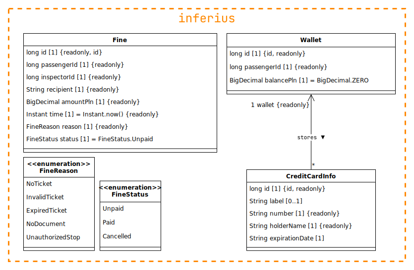

<b>Wyniki etapu II:   Definicja architektury systemu</b>

 

<b>System biletowy dla komunikacji miejskiej</b>

 

<b>Projektowanie systemów informatycznych</b>

Prowadzący: dr inż. Marcin Kawalerowicz

Skład zespołu:
<ul>
  <li>Przemysław Barcicki (260324)</li>
  <li>Tomasz Chojnacki (260365)</li>
  <li>Piotr Kot (259560)</li>
  <li>Jakub Zehner (260285)</li>
</ul>

TODO @everyone: zmienić czcionkę diagramów na JetBrains Mono

# Cel

Dokument przedstawia kluczowe decyzje projektowe oraz ich uzasadnienie w kontekście systemu informatycznego wspomagającego miejską komunikację publiczną. Jego celem jest szczegółowe opisanie architektury technicznej, w tym komponentów systemu, ich funkcji oraz interakcji, które umożliwiają realizację założeń określonych w [specyfikacji wymagań](../e1/README.md).

System jest projektowany z myślą o ułatwieniu zakupu biletów, przeglądania rozkładów jazdy oraz uzyskiwania informacji o awariach przez pasażerów. Jednocześnie ma wspierać pracę kierowców i bileterów, umożliwiając sprawdzanie ważności biletów oraz zgłaszanie problemów.

Kluczowe ograniczenia i decyzje projektowe zawarte w dokumencie wynikają z potrzeb optymalizacji czasu operacji systemu oraz zapewnienia wysokiej dostępności i niezawodności.

# Cele i ograniczenia architektoniczne

Wyróżnione zostały wśród wymagań z etapu 1 następujące cele, mające wpływ na architekturę systemu:

**Wymagania funkcjonalne:**

- `ACC/01` - Jako _gość_ chcę mieć możliwość rejestracji _konta_ _pasażera_.
- `ACC/02` - Jako _gość_ chcę mieć możliwość zalogowania się do _konta_ (_administratora_, _biletera_, _kierowcy_, _pasażera_).
- `ACC/03` - Jako _osoba zalogowana_ chcę mieć możliwość wylogowania się ze swojego _konta_.
- `TIC/09` - Jako _pasażer_ chcę mieć możliwość okazania _biletu_ do _sprawdzenia ważności biletu_.
- `TIC/12` - Jako _bileter_ chcę mieć możliwość _sprawdzenia ważności_ _biletu_ _pasażera_.
- `PAY/11` - Jako _pasażer_ chcę mieć możliwość zapłaty za _bilet_ za pomocą _BLIK_.
- `PAY/12` - Jako _pasażer_ chcę mieć możliwość zapłaty za _bilet_ za pomocą karty kredytowej.
- `PAY/14` - Jako _pasażer_ chcę mieć możliwość zapłaty za wystawiony _mandat_ za pomocą _BLIK_.
- `PAY/16` - Jako _pasażer_ chcę mieć możliwość zapłaty za wystawiony _mandat_ za pomocą _portfela_.

**Wymagania niefunkcjonalne:**

- `NF/SYS/01` - Strona internetowa powinna być możliwa do wyświetlenia na przeglądarkach internetowych "Evergreen Browser".
- `NF/SYS/02` - System umożliwia obsługę z użyciem ekranu dotykowego dla funkcjonalności _pasażera_, _kierowcy_, _biletera_.
- `NF/SYS/03` - System umożliwia obsługę z użyciem myszki i klawiatury dla funkcjonalności _administratora_.
- `NF/REL/01` - Klasa niezawodności systemu powinna wynosić co najmniej 99,9%.
- `NF/REL/02` - W przypadku awarii nieobejmującej sprzętu system powinien mieć możliwość powrotu do stanu sprzed awarii w czasie poniżej 1 godziny.
- `NF/REL/03` - System powinien wykonywać codzienną kopię zapasową danych.
- `NF/REL/04` - Dostęp do funkcjonalności pasażerów, bileterów, kierowców i administratorów powinien być możliwy tylko w sposób autoryzowany.
- `NF/REL/06` - Części systemów powinny komunikować się ze sobą w sposób uniemożliwiający ingerecję osób trzecich.
- `NF/REL/07` - System musi być zabezpieczony przed utratą zasilania oraz połączenia internetowego.
- `NF/REL/09` - System powinien przetworzyć wszystkie płatności i emaile niezależnie od dostępności usługi w momencie ich zlecenia.
- `NF/PRF/01` - System powinien obsługiwać zapytania użytkowników, zakładając brak problemów sieciowych:
  1. dotyczące biletów w czasie poniżej 1 sekundy dla co najmniej 90% przypadków.
  2. dotyczące kont w czasie poniżej 2 sekundy dla co najmniej 90% przypadków.
  3. dotyczące płatności w czasie poniżej 10 sekundy dla co najmniej 90% przypadków.
  4. dotyczące logistyki w czasie poniżej 1 sekundy dla co najmniej 90% przypadków.
- `NF/PRF/02` - System powinien działać bez zarzutu przy jednoczesnym korzystaniu przez 5000 użytkowników (zgodnie z danymi MPK Wrocław, dziennie korzysta z komunikacji miejskiej pół miliona pasażerów, co przy średnim szacowanym czasie korzystania z aplikacji wynoszącym 3 minuty daje średnio około 1000 użytkowników aplikacji w danym momencie).

# Decyzje i ich uzasadnienie

| **Cele (wymagania + poprzednie decyzje)**                  | **Mechanizmy (taktyki)**                                                              |
| ---------------------------------------------------------- | ------------------------------------------------------------------------------------- |
| `NF/REL/01`, `NF/PRF/01`, `NF/PRF/02`                      | [`M/01`: Architektura mikroserwisów](#m01-architektura-mikroserwisów)                 |
| `NF/REL/01`, `NF/REL/07`, `NF/PRF/01`, `NF/PRF/02`         | [`M/02`: Load balancing usług](#m02-load-balancing-usług)                             |
| `NF/REL/01`, `NF/REL/02`, `NF/REL/07`, `M/01`              | [`M/03`: Healthchecki dla serwisów](#m03-healthchecki-dla-serwisów)                   |
| `NF/REL/01`, `NF/REL/03`, `NF/REL/07`, `M/01`              | [`M/04`: Wdrożenie w chmurze AWS](#m04-wdrożenie-w-chmurze-aws)                       |
| `NF/REL/02`, `NF/REL/07`, `NF/REL/09`, `M/04`              | [`M/05`: Kolejki SQS dla płatności i emaili](#m05-kolejki-sqs-dla-płatności-i-emaili) |
| `NF/REL/04`, `NF/REL/06`, `M/01`, `M/04`                   | [`M/06`: Izolacja siecią wewnętrzną VPC](#m06-izolacja-siecią-wewnętrzną-vpc)         |
| `NF/REL/04`, `M/01`, `M/06`                                | [`M/07`: Wzorzec API Gateway](#m07-wzorzec-api-gateway)                               |
| `PAY/11`, `PAY/12`, `PAY/14`, `PAY/16`, `NF/REL/09`        | [`M/08`: Zewnętrzna bramka płatności](#m08-zewnętrzna-bramka-płatności)               |
| `NF/REL/01`, `NF/REL/07`, `M/01`                           | [`M/09`: Oddzielne bazy dla mikroserwisów](#m09-oddzielne-bazy-dla-mikroserwisów)     |
| `NF/REL/01`, `NF/REL/02`, `NF/REL/03`, `NF/REL/07`, `M/04` | [`M/10`: Relacyjne bazy danych ACID na RDS](#m10-relacyjne-bazy-danych-acid-na-rds)   |
| `ACC/01`, `ACC/02`, `ACC/03`, `NF/REL/04`                  | [`M/11`: Autoryzacja z użyciem JWT](#m11-autoryzacja-z-użyciem-jwt)                   |
| `NF/PRF/01`, `NF/PRF/02`, `M/11`                           | [`M/12`: Wzorzec sidecar dla autoryzacji](#m12-wzorzec-sidecar-dla-autoryzacji)       |
| `NF/SYS/01`, `NF/SYS/02`, `NF/SYS/03`                      | [`M/13`: Responsywna aplikacja webowa SPA](#m13-responsywna-aplikacja-webowa-spa)     |
| `TIC/09`, `TIC/12`, `M/13`                                 | [`M/14`: Kod QR dla biletów](#m14-kod-qr-dla-biletów)                                 |

# Mechanizmy architektoniczne

## `M/01`: Architektura mikroserwisów

**Problem:** Różne części systemu mają różne wymagania co do czasu odpowiedzi (`NF/PRF/01`), będą też miały różne obciążenia (częściej sprawdzamy rozkład niż kupujemy bilet, częściej kupujemy bilet niż zmieniamy ustawienia konta). Ponadto wymagana jest wysoka niezawodność (`NF/REL/01`), a także możliwość obsługi wielu użytkowników jednocześnie (`NF/PRF/02`). Różne części systemu będą też budowane przez różne zespoły, które mogą mieć swoje wymagania co do technologii, narzędzi i procesów.

**Rozwiązania:**

<table>
  <tr>
    <td></td>
    <th>Zalety</th>
    <th>Wady</th>
  </tr>
  <tr>
    <th>Monolit</th>
    <td>
      <ul>
        <li>Łatwość wdrożenia</li>
        <li>Jedna wspólna baza kodu</li>
        <li>Wydajność komunikacji między modułami</li>
        <li>Serwisy mogą być stanowe</li>
      </ul>
    </td>
    <td>
      <ul>
        <li>Niska skalowalność poszczególnych modułów</li>
        <li>Trudności w rozbudowie i utrzymaniu</li>
        <li>Pojedynczy punkt awarii</li>
      </ul>
    </td>
  </tr>
  <tr>
    <th>Architektura modułowa, heksagonalna, czysta</th>
    <td>
      <ul>
        <li>Łatwość wdrożenia</li>
        <li>Modułowość, możliwość podziału pracy</li>
        <li>Wydajność komunikacji między modułami</li>
        <li>Serwisy mogą być stanowe</li>
      </ul>
    </td>
    <td>
      <ul>
        <li>Niska skalowalność poszczególnych modułów</li>
        <li>Pojedynczy punkt awarii</li>
      </ul>
    </td>
  </tr>
  <tr>
    <th>Mikroserwisy</th>
    <td>
      <ul>
        <li>Modułowość, możliwość podziału pracy</li>
        <li>Łatwość skalowania poszczególnych modułów</li>
        <li>Awaria modułu nie wyłącza całego systemu</li>
        <li>Możliwość wyboru różnych technologii dla różnych modułów</li>
      </ul>
    </td>
    <td>
      <ul>
        <li>Potrzeba bezstanowości serwisów</li>
        <li>Opóźnienia w komunikacji między serwisami</li>
        <li>Trudniejsze wdrożenie</li>
        <li>Brak wspólnej bazy kodu</li>
      </ul>
    </td>
  </tr>
</table>

**Decyzja:** Z uwagi na wymienione wymagania, jako architekturę systemu wybrano **mikroserwisy**. 

**Opis:** Architektura mikroserwisów pozwoli to na łatwe skalowanie poszczególnych modułów, a także na podział pracy między zespołami. Każdy zespół może skupić się na swojej części dziedziny problemu. Może podejmować decyzje o wykorzystywanych w środku technologiach, co jest korzystne, gdy różne cześci systemu mają różne potrzeby. Istotne z perspektywy zespołu jest utrzymanie spójnych interfejsów dla innych serwisów, mogą one dowolnie edytować wnętrze serwisu tak długo, jak nie zmienia to jego publicznego API. Lokalność awarii pozwoli na utrzymanie wyższej niezawodności systemu niż w przypadku monolitu. Możliwe będzie też skalowanie poszczególnych modułów niezależnie, przenosząc siłę obliczeniową tam, gdzie jest ona najbardziej potrzebna. Wadą takiego rozwiązania jest konieczność bezstanowości serwisów oraz opóźnienia w komunikacji między nimi, jako że różne serwisy mogą być uruchamiane na różnych maszynach.

Wybór architektury mikroserwisów wpłynie znacząco na dalsze decyzje architektoniczne.

**Źródła:** [microservices.io - Microservices Architecture](https://microservices.io/patterns/microservices.html), [microservices.io - Monolithic Architecture](https://microservices.io/patterns/monolithic.html), Wykład 4: Style architektoniczne

## `M/02`: Load balancing usług

TODO @mlodybercik

**Problem:**

**Rozwiązania:**

<table>
  <tr>
    <td></td>
    <th>Zalety</th>
    <th>Wady</th>
  </tr>
  <tr>
    <th>Rozwiązanie 1</th>
    <td>
      <ul>
        <li>Zaleta 1</li>
      </ul>
    </td>
    <td>
      <ul>
        <li>Wada 1</li>
      </ul>
    </td>
  </tr>
  <tr>
    <th>Rozwiązanie 2</th>
    <td>
      <ul>
        <li>Zaleta 1</li>
      </ul>
    </td>
    <td>
      <ul>
        <li>Wada 1</li>
      </ul>
    </td>
  </tr>
</table>

**Decyzja:**

**Opis:**

**Źródła:**

## `M/03`: Healthchecki dla serwisów

TODO @jakubzehner

**Problem:**

**Rozwiązania:**

<table>
  <tr>
    <td></td>
    <th>Zalety</th>
    <th>Wady</th>
  </tr>
  <tr>
    <th>Rozwiązanie 1</th>
    <td>
      <ul>
        <li>Zaleta 1</li>
      </ul>
    </td>
    <td>
      <ul>
        <li>Wada 1</li>
      </ul>
    </td>
  </tr>
  <tr>
    <th>Rozwiązanie 2</th>
    <td>
      <ul>
        <li>Zaleta 1</li>
      </ul>
    </td>
    <td>
      <ul>
        <li>Wada 1</li>
      </ul>
    </td>
  </tr>
</table>

**Decyzja:**

**Opis:**

**Źródła:** [microservices.io - Health Check API](https://microservices.io/patterns/observability/health-check-api.html)

## `M/04`: Wdrożenie w chmurze AWS

TODO @mlodybercik: porównanie z on-premise i najlepiej innymi chmurami

**Problem:**

**Rozwiązania:**

<table>
  <tr>
    <td></td>
    <th>Zalety</th>
    <th>Wady</th>
  </tr>
  <tr>
    <th>Rozwiązanie 1</th>
    <td>
      <ul>
        <li>Zaleta 1</li>
      </ul>
    </td>
    <td>
      <ul>
        <li>Wada 1</li>
      </ul>
    </td>
  </tr>
  <tr>
    <th>Rozwiązanie 2</th>
    <td>
      <ul>
        <li>Zaleta 1</li>
      </ul>
    </td>
    <td>
      <ul>
        <li>Wada 1</li>
      </ul>
    </td>
  </tr>
</table>

**Decyzja:**

**Opis:**

**Źródła:**

## `M/05`: Kolejki SQS dla płatności i emaili

TODO @mlodybercik: dlaczego SQS, a nie SNS

**Problem:**

**Rozwiązania:**

<table>
  <tr>
    <td></td>
    <th>Zalety</th>
    <th>Wady</th>
  </tr>
  <tr>
    <th>Rozwiązanie 1</th>
    <td>
      <ul>
        <li>Zaleta 1</li>
      </ul>
    </td>
    <td>
      <ul>
        <li>Wada 1</li>
      </ul>
    </td>
  </tr>
  <tr>
    <th>Rozwiązanie 2</th>
    <td>
      <ul>
        <li>Zaleta 1</li>
      </ul>
    </td>
    <td>
      <ul>
        <li>Wada 1</li>
      </ul>
    </td>
  </tr>
</table>

**Decyzja:**

**Opis:**

**Źródła:**

## `M/06`: Izolacja siecią wewnętrzną VPC

TODO @mlodybercik

**Problem:**

**Rozwiązania:**

<table>
  <tr>
    <td></td>
    <th>Zalety</th>
    <th>Wady</th>
  </tr>
  <tr>
    <th>Rozwiązanie 1</th>
    <td>
      <ul>
        <li>Zaleta 1</li>
      </ul>
    </td>
    <td>
      <ul>
        <li>Wada 1</li>
      </ul>
    </td>
  </tr>
  <tr>
    <th>Rozwiązanie 2</th>
    <td>
      <ul>
        <li>Zaleta 1</li>
      </ul>
    </td>
    <td>
      <ul>
        <li>Wada 1</li>
      </ul>
    </td>
  </tr>
</table>

**Decyzja:**

**Opis:**

**Źródła:**

## `M/07`: Wzorzec API Gateway

TODO @piterek130

**Problem:**

**Rozwiązania:**

<table>
  <tr>
    <td></td>
    <th>Zalety</th>
    <th>Wady</th>
  </tr>
  <tr>
    <th>Rozwiązanie 1</th>
    <td>
      <ul>
        <li>Zaleta 1</li>
      </ul>
    </td>
    <td>
      <ul>
        <li>Wada 1</li>
      </ul>
    </td>
  </tr>
  <tr>
    <th>Rozwiązanie 2</th>
    <td>
      <ul>
        <li>Zaleta 1</li>
      </ul>
    </td>
    <td>
      <ul>
        <li>Wada 1</li>
      </ul>
    </td>
  </tr>
</table>

**Decyzja:**

**Opis:**

**Źródła:** [microservices.io - API Gateway](https://microservices.io/patterns/apigateway.html)

## `M/08`: Zewnętrzna bramka płatności

TODO @piterek130: porównanie z przetwarzaniem wewnętrznym

**Problem:**

**Rozwiązania:**

<table>
  <tr>
    <td></td>
    <th>Zalety</th>
    <th>Wady</th>
  </tr>
  <tr>
    <th>Rozwiązanie 1</th>
    <td>
      <ul>
        <li>Zaleta 1</li>
      </ul>
    </td>
    <td>
      <ul>
        <li>Wada 1</li>
      </ul>
    </td>
  </tr>
  <tr>
    <th>Rozwiązanie 2</th>
    <td>
      <ul>
        <li>Zaleta 1</li>
      </ul>
    </td>
    <td>
      <ul>
        <li>Wada 1</li>
      </ul>
    </td>
  </tr>
</table>

**Decyzja:**

**Opis:**

**Źródła:**

## `M/09`: Oddzielne bazy dla mikroserwisów

TODO @jakubzehner

**Problem:**

**Rozwiązania:**

<table>
  <tr>
    <td></td>
    <th>Zalety</th>
    <th>Wady</th>
  </tr>
  <tr>
    <th>Rozwiązanie 1</th>
    <td>
      <ul>
        <li>Zaleta 1</li>
      </ul>
    </td>
    <td>
      <ul>
        <li>Wada 1</li>
      </ul>
    </td>
  </tr>
  <tr>
    <th>Rozwiązanie 2</th>
    <td>
      <ul>
        <li>Zaleta 1</li>
      </ul>
    </td>
    <td>
      <ul>
        <li>Wada 1</li>
      </ul>
    </td>
  </tr>
</table>

**Decyzja:**

**Opis:**

**Źródła:** [microservices.io - Database per Service](https://microservices.io/patterns/data/database-per-service.html), [microservices.io - Shared Database](https://microservices.io/patterns/data/shared-database.html)

## `M/10`: Relacyjne bazy danych ACID na RDS

TODO @jakubzehner: porównanie z NoSQL

**Problem:**

**Rozwiązania:**

<table>
  <tr>
    <td></td>
    <th>Zalety</th>
    <th>Wady</th>
  </tr>
  <tr>
    <th>Rozwiązanie 1</th>
    <td>
      <ul>
        <li>Zaleta 1</li>
      </ul>
    </td>
    <td>
      <ul>
        <li>Wada 1</li>
      </ul>
    </td>
  </tr>
  <tr>
    <th>Rozwiązanie 2</th>
    <td>
      <ul>
        <li>Zaleta 1</li>
      </ul>
    </td>
    <td>
      <ul>
        <li>Wada 1</li>
      </ul>
    </td>
  </tr>
</table>

**Decyzja:**

**Opis:**

<!--
Głównymi modelami transakcji w bazach danych są podejścia ACID i BASE. Model ACID znany głównie z baz relacyjnych, skupia się na zapewnieniu spójności, poprzez właściwości atomowości, spójności, izolacji i trwałości. W podejściu BASE, stosowanym w bazach NoSQL, poświęcamy spójność na rzecz dostępności, gdzie spójność danych jest osiągana w pewnym czasie, a nie natychmiast[^acid-base].

W przypadku danych kont, bardziej pożądane właściwości ma **model ACID** - istotne jest natychmiastowe odzwierciedlenie zmian w bazie danych, np. dla zmiany hasła użytkownika. Istotna jest również spójność danych z regułami biznesowymi w każdym momencie, np. w przypadku unikalności adresu e-mail. W związku z tym, zdecydowano się na zastosowanie bazy relacyjnej **SQL**. Wadą takiego rozwiązania jest niższa skalowalność horyzontalna w porównaniu do baz NoSQL, jednakże nie powinno to stanowić problemu w serwisie odpowiedzialnym za konta użytkowników.
-->

**Źródła:**

## `M/11`: Autoryzacja z użyciem JWT

**Problem:** Użytkownicy muszą mieć dostęp do różnych części systemu w zależności od swojej roli. Istotne jest też, aby użytkownicy widzieli tylko swoje dane poufne. Wymagana jest również możliwość unieważnienia sesji użytkownika, np. w przypadku kradzieży tokena lub zmiany uprawnień. Autoryzacja musi być wydajna, aby nie wpływała na czas odpowiedzi systemu i musi działać dobrze w architekturze mikroserwisów.

**Rozwiązania:**

<table>
  <tr>
    <td></td>
    <th>Zalety</th>
    <th>Wady</th>
  </tr>
  <tr>
    <th>Ciasteczka sesji</th>
    <td>
      <ul>
        <li>Prostota i niezawodność</li>
        <li>Możliwość unieważnienia sesji</li>
        <li>Modyfikacja danych sesji bez konieczności zmiany tokena</li>
      </ul>
    </td>
    <td>
      <ul>
        <li>Stanowość systemu, potrzeba synchronizacji</li>
        <li>Opóźnienia wynikające z dostępu do bazy danych</li>
        <li>Zużywanie zasobów przez niepotrzebne sesje</li>
      </ul>
    </td>
  </tr>
  <tr>
    <th>JWT</th>
    <td>
      <ul>
        <li>Brak stanu trzymanego na serwerze (skalowalność)</li>
        <li>Możliwość weryfikacji tokenów bez bazy danych jak i na innych serwerach</li>
        <li>Możliwość przekazania dodatkowych informacji (np. rola użytkownika)</li>
        <li>Wbudowany mechanizm czasu ważności tokenów</li>
      </ul>
    </td>
    <td>
      <ul>
        <li>Bardziej skomplikowana implementacja</li>
        <li>Brak możliwości unieważnienia tokenu</li>
        <li>Możliwość podejrzenia danych w tokenie</li>
      </ul>
    </td>
  </tr>
</table>

**Decyzja:** Z uwagi na wymagania systemu, jako mechanizm autoryzacji wybrano **JWT**.

**Opis:** JWT będzie lepszym rozwiązaniem z uwagi na lepsze przystosowanie do architektury mikroserwisowej. Nie potrzebują one stanu i mogą być weryfikowane bez dostępu do bazy danych, a nawet na innym serwerze niż wystawione. W przypadku zastosowania sesji, potrzebna byłaby synchronizacja stanu między serwisami. Główną, a w zasadzie jedyną na potrzeby projektowanego systemu wadą JWT jest brak możliwości unieważnienia tokenu, bez zastosowania dodatkowych mechanizmów (np. blacklista tokenów).

Współczesne rozwiązania autoryzacji opierające się na JWT wykorzystują dwa tokeny:
- `access_token` - token o krótkim czasie ważności, służący do autoryzacji użytkownika przy każdym zapytaniu
- `refresh_token` - token o długim czasie ważności, służący do odświeżenia `access_token` po jego wygaśnięciu

Oba tokeny są uzyskiwane przez frontend przy zalogowaniu użytkownika. Token dostępu jest przesyłany w nagłówku przy każdym zapytaniu do serwera. Dowolny serwer mający klucz publiczny może zweryfikować token bez odpytywania bazy danych. W przypadku wygaśnięcia `access_token`, frontend może użyć `refresh_token` do uzyskania nowej pary (`access_token`, `refresh_token`) bez konieczności ponownego logowania. Dany token dostępu można wykorzystać przez cały okres ważności i nie można go unieważnić. Z racji na to zaleca się stosowanie krótkiego czasu ważności (5-15 minut) w połączeniu z długim czasem ważności tokenu odświeżającego (np. 7 dni). Tokeny odświeżające można unieważniać, np. poprzez przechowywanie ich czarnej listy w bazie danych. W przypadku systemu zdecydowano się na prostsze rozwiązanie, przechowujące datę ostatniego unieważnienia dla danego konta użytkownika. Przy zmianie hasła lub innych danych związanych z bezpieczeństwem konta, data zostaje zaktualizowana. Dochodzi do tego również przy jawnym wciśnięciu przycisku unieważnienia wszystkich sesji przez użytkownika. Wadą tego rozwiązania jest brak możliwości granularnego unieważnienia tokenów, przykładowo częste będzie wylogowywanie użytkownika z innych urządzeń, co jest jednak akceptowalne w kontekście systemu, ponieważ w zamyśle użytkownik będzie posługiwał się w większości przypadków pojedynczym smartfonem.

Często uwierzytelnianie i autoryzacja są delegowane do zewnętrznego dostawcy, np. Auth0, AWS Cognito, Firebase Auth. Pozwala to na uniknięcie implementacji, w której łatwo popełnić błąd związany z bezpieczeństwem. Jednakże ogranicza kontrolę naszego systemu nad danymi i procesem oraz bywa często kosztowne. Wiele przypadków użycia jest ściśle związanych z mechanizmami autoryzacji i może wymagać własnej logiki wybiegającej poza możliwości dostawcy. Ponadto, z uwagi na RODO, nałożone są ograniczenia dotyczące lokalizacji składowania danych. Podobnie, poprzednie modele uwzględniały przechowywanie danych lokalnie. Z uwagi na powyższe ograniczenia, zdecydowano się na własną implementację autoryzacji, jednakże jedynie z wykorzystaniem popularnych i sprawdzonych bibliotek do kluczowych operacji.

> [!NOTE]
> Wybór ten wynika też w dużym stopniu z potrzeb kursu, gdzie wykorzystanie zewnętrznego dostawcy zbytnio uprościłoby fazę implementacji. W rzeczywistym systemie należałoby dokładniej rozważyć możliwość wdrożenia rozwiązania zewnętrznego z uwagi na duże konsekwencje przy popełnieniu błędu w implementacji.

**Źródła:** [microservices.io - Access Token](https://microservices.io/patterns/security/access-token.html), [jwt.io - JSON Web Tokens](https://jwt.io), [Auth0 - What Are Refresh Tokens](https://auth0.com/blog/refresh-tokens-what-are-they-and-when-to-use-them/)

## `M/12`: Wzorzec sidecar dla autoryzacji

**Problem:** Odpytywanie serwisu kont przez API Gateway przy każdym zapytaniu obciąża ten serwis i spowalnia odpowiedź systemu. Jednocześnie wymagana jest autoryzacja użytkowników przy każdym zabezpieczonym zapytaniu. Przeniesienie odpowiedzialności za autoryzację do API Gateway narusza zasadę SRP (single responsibility principle) oraz dodatkowo obciąża i zwiększa złożoność tego komponentu.

**Rozwiązania:**

<table>
  <tr>
    <td></td>
    <th>Zalety</th>
    <th>Wady</th>
  </tr>
  <tr>
    <th>Autoryzacja na każdym z serwisów z API Gateway jako reverse-proxy</th>
    <td>
      <ul>
        <li>Zachowanie SRP</li>
        <li>Brak dociążenia API Gateway</li>
        <li>Możliwość zastosowania prostego <i>reverse-proxy</i></li>
      </ul>
    </td>
    <td>
      <ul>
        <li>Duże opóźnienie na zapytaniu</li>
        <li>Dociążenie Account Service</li>
        <li>Duże opóźnienie przy pobieraniu kluczy publicznych</li>
        <li>Powtarzalność kodu sprawdzania dostępu</li>
      </ul>
    </td>
  </tr>
  <tr>
    <th>Komunikacja API Gateway → Account Service przy każdym zapytaniu</th>
    <td>
      <ul>
        <li>Zachowanie SRP</li>
        <li>Brak dociążenia API Gateway</li>
        <li>Brak potrzeby dzielenia kluczy publicznych</li>
      </ul>
    </td>
    <td>
      <ul>
        <li>Duże opóźnienie na zapytaniu</li>
        <li>Dociążenie Account Service</li>
      </ul>
    </td>
  </tr>
  <tr>
    <th>Dodanie do API Gateway odpowiedzialności za sprawdzanie tokenów</th>
    <td>
      <ul>
        <li>Minimalne opóźnienie na zapytaniu</li>
        <li>Brak dociążenia Account Service</li>
      </ul>
    </td>
    <td>
      <ul>
        <li>Złamanie SRP</li>
        <li>Duże opóźnienie przy pobieraniu kluczy publicznych</li>
        <li>Dociążenie API Gateway</li>
      </ul>
    </td>
  </tr>
  <tr>
    <th>Utworzenie komponentu autoryzacji jako sidecar przy API Gateway</th>
    <td>
      <ul>
        <li>Zachowanie SRP</li>
        <li>Małe opóźnienie na zapytaniu</li>
        <li>Brak dociążenia API Gateway</li>
        <li>Brak dociążenia Account Service</li>
      </ul>
    </td>
    <td>
      <ul>
        <li>Duże opóźnienie przy pobieraniu kluczy publicznych</li>
        <li>Potrzeba budowy i utrzymania dodatkowego komponentu</li>
      </ul>
    </td>
  </tr>
</table>

**Decyzja:** Z uwagi na wymagania systemu, jako wybrano **wzorzec sidecar dla autoryzacji**.

**Opis:** Przy analizie zalet i wad zaproponowanych rozwiązań od razu odrzucono wariant oddzielnej autoryzacji każdego serwisu oraz wariant sprawdzania tokenów w API Gateway z uwagi na znaczną przewagę dwóch pozostałych rozwiązań. Przy wyborze między delegacją każdego zapytania do Account Service a implementacją dodatkowego komponentu jako sidecar container zdecydowano się na to drugie rozwiązanie, ponieważ wady pierwszego okazały się zbyt duże. Główną wadą wybranego rozwiązania jest potrzeba pobierania kluczy publicznych z głównego serwera autoryzacji, co jednak można załagodzić poprzez caching i rate limiting. Odpowiedzialność za nowy komponent przejmie zespół zajmujący się kontami.

Wzorzec sidecar (_bocznik_, _przyczepa_) stosowany jest głównie w architekturze mikrousług i jest to osobny proces lub kontener, uruchamiany jednak fizycznie blisko innego modułu, z którym współpracuje, aby ograniczyć opóźnienia w komunikacji. W przypadku proponowanej architektury, sidecar będzie uruchomiony jako drugi kontener, w tym samym podzie co API Gateway. Pozwoli to na usunięcie opóźnienia, które powstałoby przy każdorazowym odpytywaniu Account Service (komunikacja z drugim kontenerem na tej samej maszynie jest szybsza niż komunikacja przez sieć). Jednocześnie, w przeciwieństwie do dodania odpowiedzialności za autoryzację do API Gateway, zachowany zostaje podział komponentów według ich odpowiedzialności jak i podział kompetencji zespołów.

Zgodnie z mechanizmem [`M/11`](#m11-autoryzacja-z-użyciem-jwt), token JWT może walidować każda usługa, która ma dostęp do klucza publicznego z pary kluczy, którą podpisano token. W związku z tym, odpowiedzialność może przejąć sidecar, tak długo, jak będzie miał dostęp do kluczy publicznych z głównego serwera autoryzacji. Jako, że z powodów bezpieczeństwa klucze do podpisu JWT powinny być rotowane, jak i z powodu możliwości zastosowania różnych kluczy dla różnych instancji serwerów, powstaje potrzeba dzielenia się kluczami publicznymi. Popularnym mechanizmem rozwiązującym ten problem jest zastosowanie JWKS (JSON Web Key Sets), które jest standardem specyfikującym endpoint wystawiany przez serwer autoryzacji, z którego można pobrać listę wszystkich ważnych kluczy publicznych. Do ładunku JWT dodana jest informacja o ID klucza, którym podpisano token (`kid`), co pozwala na wybór odpowiedniego klucza do weryfikacji (musi to być oczywiście klucz wystawiony przez serwer autoryzacji). W związku z tym, zapytanie do głównego serwera autoryzacji odbywa się jednie przy pierwszym zapytaniu po uruchomieniu sidecar, a następnie klucze są cachowane lokalnie. W przypadku napotkania nieznanego `kid`, sidecar ponownie odpytuje serwer autoryzacji, z zastosowaniem rate limitingu, aby uniknąć ataków typu DoS powodowanych przez umyślne podawanie niepoprawnych `kid` przez klientów.

Z uwagi na logiczne powiązanie sidecar z Account Service, będą one przedstawiane wspólnie na diagramach sekwencji dotyczących realizacji przypadków użycia. W miejscu każdego zapytania z API Gateway do Account Service na diagramach można mentalnie wstawić poniższą sekwencję zdarzeń:

**Źródła:** [microservices.io - Sidecar](https://microservices.io/patterns/deployment/sidecar.html), [Auth0 - JSON Web Key Sets](https://auth0.com/docs/secure/tokens/json-web-tokens/json-web-key-sets), Wykład 4: Style architektoniczne

## `M/13`: Responsywna aplikacja webowa SPA

TODO @piterek130

**Problem:**

**Rozwiązania:**

<table>
  <tr>
    <td></td>
    <th>Zalety</th>
    <th>Wady</th>
  </tr>
  <tr>
    <th>Rozwiązanie 1</th>
    <td>
      <ul>
        <li>Zaleta 1</li>
      </ul>
    </td>
    <td>
      <ul>
        <li>Wada 1</li>
      </ul>
    </td>
  </tr>
  <tr>
    <th>Rozwiązanie 2</th>
    <td>
      <ul>
        <li>Zaleta 1</li>
      </ul>
    </td>
    <td>
      <ul>
        <li>Wada 1</li>
      </ul>
    </td>
  </tr>
</table>

**Decyzja:**

**Opis:**

**Źródła:**

## `M/14`: Kod QR dla biletów

TODO @jakubzehner

**Problem:**

**Rozwiązania:**

<table>
  <tr>
    <td></td>
    <th>Zalety</th>
    <th>Wady</th>
  </tr>
  <tr>
    <th>Rozwiązanie 1</th>
    <td>
      <ul>
        <li>Zaleta 1</li>
      </ul>
    </td>
    <td>
      <ul>
        <li>Wada 1</li>
      </ul>
    </td>
  </tr>
  <tr>
    <th>Rozwiązanie 2</th>
    <td>
      <ul>
        <li>Zaleta 1</li>
      </ul>
    </td>
    <td>
      <ul>
        <li>Wada 1</li>
      </ul>
    </td>
  </tr>
</table>

**Decyzja:**

**Opis:**

**Źródła:**

# Widoki architektoniczne

W dokumencie wykorzystano następujące widoki architektoniczne, wraz z ich odpowiednikami z modelu C4:

<table>
  <tr>
    <th>Widok</th>
    <th>Model C4</th>
    <th>Opis</th>
  </tr>
  <tr>
    <th colspan="3">Główne</th>
  </tr>
  <tr>
    <th><a href="#widok-kontekstowy">Widok kontekstowy</a></th>
    <td>L1: Diagram kontekstu</td>
    <td>Przedstawia otoczenie systemu, jego użytkowników, ich typowe interakcje, zewnętrzne systemy oraz ich interfejsy integracyjne.</td>
  </tr>
  <tr>
    <th><a href="#widok-funkcjonalny">Widok funkcjonalny</a></th>
    <td>L2 + L3: Diagramy kontenerów i komponentów</td>
    <td>Przedstawia podsystemy systemu, oraz części składowe tych podsystemów z perspektywy logicznej.</td>
  </tr>
  <tr>
    <th><a href="#widok-informacyjny">Widok informacyjny</a></th>
    <td>L4: Diagram kodu</td>
    <td>Przedstawia struktury danych oraz powiązania między nimi, w kodzie źródłowym oraz warstwie danych.</td>
  </tr>
  <tr>
    <th colspan="3">Pomocnicze</th>
  </tr>
  <tr>
    <th colspan="2"><a href="#widok-rozmieszczenia">Widok rozmieszczenia</a></th>
    <td>Przedstawia fizyczne rozmieszczenie komponentów systemu w środowisku produkcyjnym.</td>
  </tr>
  <tr>
    <th colspan="2"><a href="#widok-wytwarzania">Widok wytwarzania</a></th>
    <td>Przedstawia podział kodu na pakiety, architekturę serwisów oraz interfejsy API.</td>
  </tr>
</table>

# Widok kontekstowy

## Diagram kontekstowy

## Scenariusze interakcji

### Zalogowanie do systemu

TODO @tchojnacki

### Sprawdzenie rozkładu jazdy

TODO @mlodybercik

### Kupno biletu

TODO @jakubzehner + @piterek130

### Kontrola biletowa

TODO @jakubzehner + @piterek130: + wystawienie mandatu

### Zgłoszenie awarii

TODO @tchojnacki

## Interfejsy integracyjne

TODO @piterek130: uzupełnić tabelę

<table>
  <tr>
    <th colspan="3">System ↔ Payment Gateway</th>
  </tr>
  <tr>
    <th>Opis</th>
    <td colspan="2">Opcjonalny słowny opis interfejsu jeśli jest coś do dodania w stosunku do danych poniżej. W przypadku braku opisu należy wiersz należy usunąć.</td>
  </tr>
  <tr>
    <th>Status</th>
    <td colspan="2">Planowany/Istniejący/Modyfikowany/Zabroniony/Wycofany</td>
  </tr>
  <tr>
    <td></td>
    <th>Aplikacja źródłowa</th>
    <th>Aplikacja docelowa</th>
  </tr>
  <tr>
    <th>Nazwa aplikacji</th>
    <td>Aplikacja źródłowa (aplikacja, która inicjuje integrację na poziomie logicznym, czyli w większości przypadków aplikacja będąca przy końcu strzałki bez grotu)</td>
    <td>Aplikacja docelowa (aplikacja przy końcu strzałki z grotem)</td>
  </tr>
  <tr>
    <th>Technika integracji</th>
    <td>FTP/SSH/JDBC/ODBC/Oracle DBLink/SAP JCo/SAP RFC/ SOAP/HTTP / SOAP/HTTPS /Własny/...</td>
    <td>FTP/SSH/JDBC/ODBC/Oracle DBLink/SAP JCo/SAP RFC/ SOAP/HTTP / SOAP/HTTPS /Własny/...</td>
  </tr>
  <tr>
    <th>Mechanizm autentykacji</th>
    <td>Brak - niezalecane/HTTP Basic/WS-Security/Kerberos/Oracle Username and Password/...</td>
    <td>Brak - niezalecane/HTTP Basic/WS-Security/Kerberos/Oracle Username and Password/...</td>
  </tr>
  <tr>
    <th>Kontrakt danych</th>
    <td colspan="2">Lista wymienianych obiektów biznesowych (np. Partner Handlowy, Konto Umowy itp.)</td>
  </tr>
  <tr>
    <th>Czy interfejs manipuluje na danych wrażliwych (RODO)?</th>
    <td colspan="2">Tak/Nie + jakie dane objęte RODO</td>
  </tr>
  <tr>
    <th>Wykorzystywane oprogramowanie pośredniczące (middleware)</th>
    <td colspan="2">Brak/SAP PI/ESB/ODS/ESB i ODS/...</td>
  </tr>
  <tr>
    <th>Strona inicjująca</th>
    <td colspan="2">Aplikacja inicjująca połączenie na poziomie technicznym</td>
  </tr>
  <tr>
    <th>Model komunikacji</th>
    <td colspan="2">Synchroniczny na żądanie użytkownika/Asynchroniczny sterowany harmonogramem/Asynchroniczny wyzwalany zdarzeniem/...</td>
  </tr>
  <tr>
    <th>Wydajność</th>
    <td colspan="2">Jak często jest wywoływany interfejs, należy przedstawić największe wymaganie wydajnościowe w jednostce czasu dla której wymaganie musi być spełnione, np. 1000 / godz. Im krótsza jednostka czasu tym wymaganie ściślejsze.</td>
  </tr>
  <tr>
    <th>Wolumetria</th>
    <td colspan="2">Szacowana liczba wywołań w jednostce czasu znacząco dłuższej niż w określeniu wydajności. Potrzebne do oszacowania np. przestrzeni dyskowej niezbędnej do obsługi interfejsu.</td>
  </tr>
  <tr>
    <th>Wymagana dostępność</th>
    <td colspan="2">Np. 99,9%</td>
  </tr>
</table>

# Widok funkcjonalny

Powszechne w wielkich systemach jest zastosowanie abstrakcyjnych nazw dla poszczególnych części systemu. Z tego typu rozwiązań korzysta między innymi Airbnb, Twitter, Spotify czy Zalando[^naming-microservices]. Rozwiązanie to ma swoje wady i zalety. Abstrakcyjne nazwy są trudniejsze do zrozumienia dla osób spoza projektu. Z drugiej strony, nazwy opisowe są trudne do utrzymania i w przypadku ciągłych zmian w projekcie mogą stać się nieaktualne i mylące[^names-cute-descriptive]. W projekcie podjęto decyzję o zastosowaniu abstrakcyjnych nazw bazujących na stworzeniach ze świata Harry'ego Pottera. Tam gdzie to możliwe, zastosowano obie nazwy, tj. abstrakcyjną i opisową.

Przypisanie nazw częściom systemu opisuje poniższa tabela:

| **Nazwa podsystemu**                                                     | **Część systemu**       | **Główny kontrybutor**           | **Posiadane encje**                                                                                                         |
| ------------------------------------------------------------------------ | ----------------------- | -------------------------------- | --------------------------------------------------------------------------------------------------------------------------- |
|  **Jobberknoll** | Konto (_account_)       | **Tomasz Chojnacki** (260365)    | `Account`, `Admin`, `Driver`, `Inspector`, `Passenger`                                                                      |
|  **Clabbert**    | Bilet (_ticket_)        | **Jakub Zehner** (260285)        | `LongTermOffer`, `SingleFareOffer`, `Ticket`, `TicketKind`, `TimeLimitedOffer`, `TicketOffer`, `TicketStatus`, `Validation` |
|  **Inferius**    | Płatność (_payment_)    | **Piotr Kot** (259560)           | `CreditCardInfo`, `Fine`, `FineReason`, `FineStatus`, `Wallet`                                                              |
|  **Leprechaun**  | Logistyka (_logistics_) | **Przemysław Barcicki** (260324) | `Accident`, `Line`, `Route`, `Stop`, `Vehicle`                                                                              |
|  **Phoenix**     | API Gateway             | **Piotr Kot** (259560)           | —                                                                                                                           |
|  **Hogwart**     | Frontend                | —                                | —                                                                                                                           |

## Konto

W podsystemie odpowiedzialnym za konta pojawia się nowy akronim - **feather** odpowiedzialny za pomocniczy komponent _Account Sidecar_, który został dogłębniej opisany w [`M/12`](#m12-wzorzec-sidecar-dla-autoryzacji). W widoku rozmieszczenia, element ten stanowi [sidecar container](https://kubernetes.io/docs/concepts/workloads/pods/sidecar-containers) dla _API Gateway_, jednakże logicznie związany jest bezpośrednio z serwisem _Account Service_ i odpowiedzialność za niego ponosi zespół odpowiedzialny za ten serwis.

## Bilet

## Płatność

## Logistyka

# Widok rozmieszczenia

## Diagram rozmieszczenia

Poniżej przedstawiono diagram rozmieszczenia UML, opisujący fizyczne rozmieszczenie komponentów systemu w środowisku produkcyjnym. Z uwagi na powszechne wykorzystanie usług chmurowych, w których trudne jest wskazanie konkretnych węzłów fizycznych (kilka maszyn wirtualnych może być uruchomionych na jednym serwerze fizycznym bez wiedzy klienta usług), zdecydowano się na przedstawienie jedynie węzłów środowisk wykonawczych oraz artefaktów. W przypadku liczności wykorzystano jedynie oznaczenia `1` (pojedyncza instancja) oraz `*` (wiele instancji), pomijając minimalną i maksymalną liczbę instancji węzła wynikającą z aproksymacji obciążenia systemu. Informacje te są dostępne w sekcji [Opis węzłów](#opis-węzłów). Tam gdzie to możliwe, zastosowano odwołania do komponentów z widoku funkcjonalnego, stereotypem [`<<manifest>>`](https://www.uml-diagrams.org/deployment-diagrams.html#manifestation).

TODO @tchojnacki + @mlodybercik: zmienić języki programowania

## Opis węzłów

TODO @mlodybercik: zmienić layout poniższej tabelki, tak żeby pokazywał to, na co mamy wpływ

<table>
  <tr>
    <th colspan="2">Ogólne informacje</th>
  </tr>
  <tr>
    <th>Nazwa</th>
    <th>Hostname</th>
  </tr>
  <tr>
    <th>Węzeł wirtualny?</th>
    <td>Tak/nie</td>
  </tr>
  <tr>
    <th>Centrum danych?</th>
    <td>Nie/PDC/BDC</td>
  </tr>
  <tr>
    <th>OS</th>
    <td>System operacyjny wraz z wersją</td>
  </tr>
  <tr>
    <th>Opis</th>
    <td></td>
  </tr>
  <tr>
    <th colspan="2">Konfiguracja sprzętowa</th>
  </tr>
  <tr>
    <th>Dostawca</th>
    <td>Nazwa sprzętu producenta</td>
  </tr>
  <tr>
    <th>Procesor</th>
    <td>Liczba i rodzaj procesorów</td>
  </tr>
  <tr>
    <th>RAM</th>
    <td>...</td>
  </tr>
  <tr>
    <th>HDD</th>
    <td>Wielkość i liczba dysków</td>
  </tr>
  <tr>  
    <th>RAID i HDD netto</th>
    <td>Rodzaj konfiguracji RAID i wielkość netto HDD.</td>
  </tr>
  <tr>
    <th>RAID?</th>
    <td>Brak/Do jakiej macierzy podłączony</td>
  </tr>
  <tr>
    <th>NIC bonding</th>
    <td>Nie/Tak</td>
  </tr>
  <tr>
    <th colspan="2">Konfiguracja oprogramowania</th>
  </tr>
  <tr>
    <th>Użytkownicy i grupy użytkowników</th>
    <td>Lista użytkowników do założenia na OSie.</td>
  </tr>
  <tr>
    <th>Poziom pracy systemu, czy jest wymagane środowisko graficzne</th>
    <td>...</td>
  </tr>
  <tr>
    <th>Dodatkowe pakiety z dystrybucji systemu</th>
    <td>...</td>
  </tr>
  <tr>
    <th>Dodatkowe pakiety spoza dystrybucji systemu</th>
    <td>...</td>
  </tr>
</table>

# Widok informacyjny

Słownik pojęć dla jest w [dokumencie z wymaganiami](../e1/README.md#słownik-pojęć).

## Model informacyjny

Względem poprzedniej wersji, wszystkie identyfikatory zmieniono z liczb całkowitych na UUID. Takie rozwiązanie ma swoje wady i zalety, UUID zajmują w bazie danych więcej miejsca względem liczby całkowitej 64-bitowej (8 → 16 bajtów), mogą być wolniejsze przy wykorzystaniu jako klucz główny bazy danych. Jednakże pozwalają uniknąć wyciekom informacji na temat liczby encji w systemie. Przy zastosowaniu klucza całkowitoliczbowego, tworząc dwa konta w przedziale czasowym, atakujący może bez żadnego wysiłku dowiedzieć się ile proponowany system ma klientów oraz jaki jest przyrost ich liczby. Podobny problem występuje z liczbą biletów, awarii i mandatów. Są to informacje, które z perspektywy biznesu lepiej ukrywać. Ponadto zastosowanie UUID potrafi przeciwdziałać złym praktykom implementacyjnym, np. częstemu wykorzystywaniu ID 1, 2, itd. jako placeholdery w testach czy zakładanie, że ID nowej encji będzie równe długości pobranej listy encji (gdzie w międzyczasie inny serwis mógł tę liczbę zwiększyć). Dodatkowo, zastosowanie UUID ułatwi migrację na inny typ bazy danych oraz partycjonowanie baz, w przypadku gdy narodzi się taka potrzeba. Zdecydowano się konkretnie na wersję v7 UUID, która jest uporządkowana chronologicznie, przez co minimalizuje się wady wybrania UUID jako klucza głównego tabeli relacyjnej.

Ponadto na każdym diagramie zastosowano typy z języka odpowiadającego językowi implementacji konkretnego podsystemu.

### Konto

Względem modelu ze specyfikacji wymagań, dodano pole `lastModified`, które przechowuje czas ostatniej modyfikacji konta. Będzie ono wykorzystywane do realizacji wymagań dotyczących bezpieczeństwa, tj. aby zapewnić, że po zmianie danych logowania, bądź jawnym żądaniu zakończenia wszystkich sesji użytkownika, odświeżenie tokenu dostępowego będzie wymagało ponownego zalogowania.

### Bilet

W porównaniu do modelu opisanego w specyfikacji wymagań, dodano enumerator `TicketStatus` oraz odpowiadające mu pole status w klasie `Ticket`. Enumerator ten przechowuje informacje o statusie biletu, co stało się konieczne ze względu na asynchroniczny charakter komunikacji z serwisem odpowiedzialnym za płatności. W pierwotnym założeniu status ten nie był potrzebny, ponieważ bilet był generowany natychmiast po pobraniu środków z portfela, a proces doładowania portfela funkcjonował jako oddzielna operacja. Jednak decyzja o przejściu na architekturę mikroserwisową zmieniła ten kontekst. Z punktu widzenia serwisu zarządzającego biletami, serwis płatności działa jako "czarna skrzynka", a asynchroniczna komunikacja wymagała wprowadzenia mechanizmu do reprezentacji statusu biletu.
Ponadto, dzięki zastososowaniu UUID jako identyfikatora usunięto pole `code` z klasy `Ticket`, które po tej zmianie było zbędne i redundantne, UUID jest unikalny i wystarczający do identyfikacji biletu.

### Płatność

TODO @piterek130: opis zmian

### Logistyka

TODO @mlodybercik: opis zmian

## Projekt bazy danych

Zgodnie z mechanizmem [`M/10`](#m10-relacyjne-bazy-danych-acid-na-rds), wszystkie bazy danych w systemie będą relacyjne.

Zdecydowano się na wykorzystanie silnika **PostgreSQL** do wszystkich relacyjnych baz systemu, ze względu na jego popularność, znajomość w zespole, wsparcie na AWS RDS oraz licencję open-source. Wykorzystano najnowszą stabilną wersję **17.2**, która zapewnia najnowsze funkcje i poprawki bezpieczeństwa. PostgreSQL nie oferuje wersji LTS, natomiast każda wersja jest wspierana przez co najmniej 5 lat[^postgres-version].

W przypadku klas instancji AWS RDS, wybrano najnowszą dostępną generację modeli ogólnego przeznaczenia **`db.t4g.*`**, polecaną przez AWS jako dobry domyślny wybór. Oferowane w zakresie generacji klasy różnią się głównie liczbą vCPU oraz dostępną pamięcią RAM[^rds-instance-types]:

| **Model**            | **vCPU** | **Pamięć (GiB)** |
| -------------------- | -------- | ---------------- |
| **`db.t4g.micro`**   | 2        | 1                |
| **`db.t4g.small`**   | 2        | 2                |
| **`db.t4g.medium`**  | 2        | 4                |
| **`db.t4g.large`**   | 2        | 8                |
| **`db.t4g.xlarge`**  | 4        | 16               |
| **`db.t4g.2xlarge`** | 8        | 32               |

Jako model składowania dla wszystkich RDS wybrano **`gp3`**, który jest najnowszym i rekomendowanym przez AWS typem generalnego przeznaczenia.

W przedstawionych poniżej diagramach bazodanowych zastosowano następującą notację:
- `PK` w lewej kolumnie - klucz główny,
- `FK` w lewej kolumnie - klucz obcy,
- `*` w lewej kolumnie - pole wymagane (brak gwiazdki oznacza pole opcjonalne),
- podkreślenie nazwy kolumny - pole unikalne,
- liczności powiązań oznaczone poprzez notację [crow's foot](https://vertabelo.com/blog/crow-s-foot-notation/).

### Konto

Model informacyjny podsystemu składa się z jednej hierarchii dziedziczenia, bez żadnych dodatkowych klas. Klasa `Account` zawiera dane wspólne dla wszystkich typów kont, natomiast klasy `Admin`, `Driver`, `Inspector` i `Passenger` dziedziczą po niej, przy czym jedynie `Passenger` dodaje dodatkowe informacje w formie pola `phoneNumber`. Jednocześnie, najczęściej zapytania będą dotyczyły wszystkich kont, a nie jedynie jednego typu. W związku z tym, zdecydowano się na zamodelowanie kont **w postaci jednej tabeli** z dodatkową kolumną określającą typ konta (_table-per-hierarchy_). Alternatywami dla tego podejścia są _table-per-type_ (tabela dla każdej klasy dziedziczącej, łączona z tabelą dla klasy bazowej) oraz _table-per-concrete-class_ (tabela dla każdej klasy dziedziczącej, z powielonymi danymi z klasy bazowej). Podejścia te przeznaczone są jednak raczej dla sytuacji, w których klasy nie mają wielu danych wspólnych oraz gdy zapytania dotyczą konkretnych klas dziedziczących[^ef-inheritance]. Jako wartość rozróżniającą zastosowano kolumnę `account_type` z wartościami `A` (_admin_), `D` (_driver_), `I` (_inspector_) i `P` (_passenger_). Kolumna `phoneNumber` musi być pusta dla kont innych niż `Passenger`.

<table>
  <tr>
    <th colspan="3">Indeksy</th>
  </tr>
  <tr>
    <th>Kolumna</th>
    <th>Typ</th>
    <th>Opis</th>
  </tr>
  <tr>
    <td><code>account.id</code></td>
    <td>b-tree (unikalny)</td>
    <td>Indeks tworzony automatycznie przez bazę danych.</td>
  </tr>
  <tr>
    <td><code>account.account_type</code></td>
    <td>bitmap</td>
    <td>Indeks wspierający wyszukiwanie kont według typu.</td>
  </tr>
  <tr>
    <td><code>account.email</code></td>
    <td>b-tree (unikalny)</td>
    <td>Indeks wspierający utrzymanie unikalności adresów e-mail oraz ich wyszukiwanie.</td>
  </tr>
  <tr>
    <th colspan="3">Ograniczenia</th>
  </tr>
  <tr>
    <td colspan="3"><code>account.account_type IN ('A', 'D', 'I', 'P')</code></td>
  </tr>
  <tr>
    <td colspan="3"><code>account.full_name <> ''</code></td>
  </tr>
  <tr>
    <td colspan="3"><code>account.email <> ''</code></td>
  </tr>
  <tr>
    <td colspan="3"><code>account.phone_number IS NULL OR account.account_type = 'P'</code></td>
  </tr>
</table>

Z uwagi na średnie obciążenie serwisu, jako klasę instancji wybrano **`db.t4g.medium`**. Wersja `medium` oferuje 2 vCPU oraz 4 GiB RAM. Baza przechowuje istotne i wrażliwe dane, zatem kluczowe jest włączenie szyfrowania.

Jako górną estymację fizycznego rozmiaru wiersza bazy danych przyjęto sumę maksymalnych rozmiarów wszystkich kolumn z pominięciem dodatkowej pamięci wykorzystywanej przez bazę danych do reprezentacji struktur danych, daje to: 16 + 255 + 255 + 60 + 1 + 8 + 16 = 611 bajtów. Oprócz tego, stosowane są dwa indeksy dodatkowe, o estymacjach 4 + 4 / 8 = 5 bajtów oraz 255 + 4 = 259 bajtów. Sumarycznie, rząd tabeli wynosi 611 + 5 + 259 = 875 bajtów, czyli w zaokrągleniu w górę **1 KB na użytkownika**. Zakładając, że we Wrocławiu mieszka 825 tys. osób[^ludnosc-wroclawia] oraz odwiedza go 1.2 mln turystów rocznie[^turysci-wroclawia], górna granica wynosi **2 mln unikalnych użytkowników** (2 GB) w pierwszym roku działania systemu oraz **wzrost o maksymalnie 1.2 mln kont rocznie** (1.2 GB). Ponieważ minimalny rozmiar bazy danych na RDS wynoszący **20 GB** i tak przerasta potrzeby systemu, został on wybrany jako początkowy rozmiar bazy z pomniejszeniem przyrostu do **1 GB rocznie**, biorąc pod uwagę to, że każda aproksymacja zawyżała wynik oraz istnieje nadwyżka miejsca początkowego.

Model danych serwisu jest na tyle prosty, a jednocześnie serwis tak uniwersalnie wykorzystywany, że błędy w przechowywanych danych powinny być proste do zauważenia. Dodatkowo, dane dotyczące kont są wrażliwe i podlegają regulacjom. W związku z tym, zdecydowano się na czas retencji kopii zapasowych wynoszący **7 dni**, co powinno dać wystarczająco dużo czasu na zauważenie i naprawienie błędów, a jednocześnie nie przechowuje danych zbyt długo.

<table>
  <tr>
    <th>Atrybut</th>
    <th>Terraform</th>
    <th>Wartość</th>
  </tr>
  <tr>
    <th colspan="3">Informacje ogólne</th>
  </tr>
  <tr>
    <th>Identyfikator</th>
    <td><code>identifier</code></td>
    <td><code>rds-jobberknoll</code></td>
  </tr>
  <tr>
    <th>Silnik i wersja</th>
    <td><code>engine</code>, <code>engine_version</code></td>
    <td>PostgreSQL 17.2</td>
  </tr>
  <tr>
    <th>Klasa instancji</th>
    <td><code>instance_class</code></td>
    <td><code>db.t4g.medium</code></td>
  </tr>
  <tr>
    <th colspan="3">Połączenie</th>
  </tr>
  <tr>
    <th>Nazwa bazy</th>
    <td><code>db_name</code></td>
    <td><code>jobberknoll</code></td>
  </tr>
  <tr>
    <th>Użytkownik</th>
    <td><code>username</code></td>
    <td><code>postgres</code></td>
  </tr>
  <tr>
    <th>Port</th>
    <td><code>port</code></td>
    <td><code>5432</code></td>
  </tr>
  <tr>
    <th colspan="3">Składowanie</th>
  </tr>
  <tr>
    <th>Typ składowania</th>
    <td><code>storage_type</code></td>
    <td><code>gp3</code></td>
  </tr>
  <tr>
    <th>Szyfrowanie bazy</th>
    <td><code>storage_encrypted</code></td>
    <td>TAK</td>
  </tr>
  <tr>
    <th>Początkowa pojemność (GB)</th>
    <td><code>allocated_storage</code></td>
    <td>20</td>
  </tr>
  <tr>
    <th>Przyrost pojemności (GB/rok)</th>
    <td>—</td>
    <td>1</td>
  </tr>
  <tr>
    <th>Backup (retencja w dniach)</th>
    <td><code>backup_retention_period</code></td>
    <td>7</td>
  </tr>
</table>

### Bilet

Model informacyjny podsystemu `clabbert` składa się z sześciu klas i dwóch enumeratorów. Cztery spośród tych klas tworzą hierarchię dziedziczenia oferty biletowej. Abstrakcyjna klasa `TicketOffer`  zawiera wspólne elementy dla każdego z typów oferty biletowej, natomiast klasy `TimeLimitedOffer`, `SingleFareOffer` oraz `LongTermOffer` reprezentują dostępne rodzaje oferty biletowej i za wyjątkiem `SingleFareOffer` wprowadzają nowe dane. Oddzielny sposób reprezentacji klientowi informacji o różnych ofertach oraz wymagane w implementacji mechanizmy unikalne dla danego rodzaju oferty spowodowały, że zdecydowano się na zamodelowanie bazy danych w postaci podejścia _table-per-type_, czyli tabeli dla każdej z klas dziedziczących, łączonych z tabelą dla abstrakcyjnej klasy bazowej. Dodatkowo zdecydowana się na reprezentację enumeratorów w postaci tekstu, konkretniej `varchar(32)`, ze względu na większą czytelność danych kolumny w tabeli i braku ewentualnych problemów podczas dodania kolejnej wartości enumeratora na miejscu innym niż ostatnim. Podejście te jednak poświęca odrobinę wydajności, względem drugiego najpopularniejszego rozwiązania, czyli zastosowania liczby porządkowej odpowiadającej wartości enumeratora.

<table>
  <tr>
    <th colspan="3">Indeksy</th>
  </tr>
  <tr>
    <th>Kolumna</th>
    <th>Typ</th>
    <th>Opis</th>
  </tr>
  <tr>
    <td><code>time_limited_offer.id</code></td>
    <td>b-tree (unikalny)</td>
    <td>Indeks tworzony automatycznie przez bazę danych.</td>
  </tr>
  <tr>
    <td><code>time_limited_offer.ticket_offer_id</code</td>
    <td>b-tree (unikalny)</td>
    <td>Indeks tworzony automatycznie przez bazę danych.</td>
  </tr>
  <tr>
    <td><code>single_fare_offer.id</code></td>
    <td>b-tree (unikalny)</td>
    <td>Indeks tworzony automatycznie przez bazę danych.</td>
  </tr>
  <tr>
    <td><code>single_fare_offer.ticket_offer_id</code</td>
    <td>b-tree (unikalny)</td>
    <td>Indeks tworzony automatycznie przez bazę danych.</td>
  </tr>
  <tr>
    <td><code>long_term_offer.id</code></td>
    <td>b-tree (unikalny)</td>
    <td>Indeks tworzony automatycznie przez bazę danych.</td>
  </tr>
  <tr>
    <td><code>long_term_offer.ticket_offer_id</code</td>
    <td>b-tree (unikalny)</td>
    <td>Indeks tworzony automatycznie przez bazę danych.</td>
  </tr>
  <tr>
    <td><code>ticket_offer.id</code></td>
    <td>b-tree (unikalny)</td>
    <td>Indeks tworzony automatycznie przez bazę danych.</td>
  </tr>
  <tr>
    <td><code>ticket_offer.is_active</code></td>
    <td>bitmap</td>
    <td>Indeks wspierający wyszukiwanie aktywnych ofert.</td>
  <tr>
    <td><code>ticket.id</code></td>
    <td>b-tree (unikalny)</td>
    <td>Indeks tworzony automatycznie przez bazę danych.</td>
  </tr>
  <tr>
    <td><code>ticket.passenger_id</code></td>
    <td>b-tree</td>
    <td>Indeks wspierający wyszukiwanie biletów pasażera.</td>
  </tr>
  <tr>
    <td><code>validation.id</code></td>
    <td>b-tree (unikalny)</td>
    <td>Indeks tworzony automatycznie przez bazę danych.</td>
  </tr>
  <tr>
    <td><code>validation.ticket_id</code></td>
    <td>b-tree (unikalny)</td>
    <td>Indeks tworzony automatycznie przez bazę danych.</td>
  </tr>
    
  <tr>
    <th colspan="3">Ograniczenia</th>
  </tr>
  <tr>
    <td colspan="3"><code>time_limited_offer.duration > 0</code></td>
  </tr>
  <tr>
    <td colspan="3"><code>long_term_offer.interval_in_days > 0</code></td>
  </tr>
  <tr>
    <td colspan="3"><code>ticket.display_name_en <> ''</code></td>
  </tr>
  <tr>
    <td colspan="3"><code>ticket.display_name_pl <> ''</code></td>
  </tr>
  <tr>
    <td colspan="3"><code>ticket.price_pln > 0</code></td>
  </tr>
  <tr>
    <td colspan="3"><code>ticket.purchase_time <= NOW()</code></td>
  </tr>
  <tr>
    <td colspan="3"><code>validation.time <= NOW()</code></td>
  </tr>
</table>

TODO: wybór

Jako górną estymację fizycznego rozmiaru wiersza bazy danych przyjęto sumę maksymalnych rozmiarów wszystkich kolumn z pominięciem dodatkowej pamięci wykorzystywanej przez bazę danych do reprezentacji struktur danych, daje to następujące rozmiary wierszy dla tabel:
- `time_limited_offer`: 16 + 16 + 16 = 48 bajtów,
- `single_fare_offer`: 16 + 16 = 32 bajty,
- `long_term_offer`: 16 + 16 + 4 = 36 bajtów,
- `ticket_offer`: 16 + 255 + 255 + 32 + 3 + 1 = 562 bajty,
- `ticket`: 16 + 16 + 16 + 8 + 32 = 88 bajtów,
- `validation`: 16 + 16 + 16 + 8 = 56 bajtów.

Dodatkowo indeksy na tabeli mają następujące estymowane rozmiary na każdy wiersz:
- `time_limited_offer`: 28 + 28 = 56 bajtów,
- `single_fare_offer`: 28 + 28 = 56 bajtów,
- `long_term_offer`: 28 + 28 = 56 bajtów,
- `ticket_offer`: 28 + 1 = 29 bajtów,
- `ticket`: 28 + 28 = 56 bajtów,
- `validation`: 28 + 28 = 56 bajtów.

Liczba wierszów w tabelach związanych z ofertami biletowymi będzie niewielka, estymując około 1000 ofert w ciągu roku, co daje łączny rozmiar na poziomie poniżej 1MB. Natomiast liczba wierszów w tabelach `ticket` i `validation` jest zależna od liczby nabywanych biletów przez pasażerów, zakładając że połowa pasażerów musi kupić bilet na przejazd, to przy 500 tysiącach pasażerów korzystających dziennie z komunikacji miejskiej [^nf-prf-2] w tabelach tych znajdzie się około 250 tysięcy rekordów każdego dnia, czyli około 91 milionów każdego roku. Co oznacza łączny roczny przyrost danych na poziomie około 24GB.

<table>
  <tr>
    <th>Atrybut</th>
    <th>Terraform</th>
    <th>Wartość</th>
  </tr>
  <tr>
    <th colspan="3">Informacje ogólne</th>
  </tr>
  <tr>
    <th>Identyfikator</th>
    <td><code>identifier</code></td>
    <td><code>rds-clabbert</code></td>
  </tr>
  <tr>
    <th>Silnik i wersja</th>
    <td><code>engine</code>, <code>engine_version</code></td>
    <td>PostgreSQL 17.2</td>
  </tr>
  <tr>
    <th>Klasa instancji</th>
    <td><code>instance_class</code></td>
    <td><code>TODO</code></td>
  </tr>
  <tr>
    <th colspan="3">Połączenie</th>
  </tr>
  <tr>
    <th>Nazwa bazy</th>
    <td><code>db_name</code></td>
    <td><code>clabbert</code></td>
  </tr>
  <tr>
    <th>Użytkownik</th>
    <td><code>username</code></td>
    <td><code>postgres</code></td>
  </tr>
  <tr>
    <th>Port</th>
    <td><code>port</code></td>
    <td><code>5432</code></td>
  </tr>
  <tr>
    <th colspan="3">Składowanie</th>
  </tr>
  <tr>
    <th>Typ składowania</th>
    <td><code>storage_type</code></td>
    <td><code>gp3</code></td>
  </tr>
  <tr>
    <th>Szyfrowanie bazy</th>
    <td><code>storage_encrypted</code></td>
    <td>TAK</td>
  </tr>
  <tr>
    <th>Początkowa pojemność (GB)</th>
    <td><code>allocated_storage</code></td>
    <td>TODO</td>
  </tr>
  <tr>
    <th>Przyrost pojemności (GB/rok)</th>
    <td>—</td>
    <td>24</td>
  </tr>
  <tr>
    <th>Backup (retencja w dniach)</th>
    <td><code>backup_retention_period</code></td>
    <td>7</td>
  </tr>
</table>

### Płatność

TODO @piterek130: Dodać diagram bazodanowy do Inferius, dodać uzasadnienia dla decyzji i uzupełnić tabelę.

<table>
  <tr>
    <th>Atrybut</th>
    <th>Terraform</th>
    <th>Wartość</th>
  </tr>
  <tr>
    <th colspan="3">Informacje ogólne</th>
  </tr>
  <tr>
    <th>Identyfikator</th>
    <td><code>identifier</code></td>
    <td>np. <code>unikalny-identyfikator-rds</code></td>
  </tr>
  <tr>
    <th>Silnik i wersja</th>
    <td><code>engine</code>, <code>engine_version</code></td>
    <td>np. PostgreSQL 14.14-R1</td>
  </tr>
  <tr>
    <th>Klasa instancji</th>
    <td><code>instance_class</code></td>
    <td>np. <code>db.t3.micro</code></td>
  </tr>
  <tr>
    <th colspan="3">Połączenie</th>
  </tr>
  <tr>
    <th>Nazwa bazy</th>
    <td><code>db_name</code></td>
    <td>np. <code>moja_baza</code></td>
  </tr>
  <tr>
    <th>Użytkownik</th>
    <td><code>username</code></td>
    <td>np. <code>moj_uzytkownik</code></td>
  </tr>
  <tr>
    <th>Port</th>
    <td><code>port</code></td>
    <td>np. <code>5432</code></td>
  </tr>
  <tr>
    <th colspan="3">Składowanie</th>
  </tr>
  <tr>
    <th>Typ składowania</th>
    <td><code>storage_type</code></td>
    <td>np. <code>gp2</code></td>
  </tr>
  <tr>
    <th>Szyfrowanie bazy</th>
    <td><code>storage_encrypted</code></td>
    <td>TAK/NIE</td>
  </tr>
  <tr>
    <th>Początkowa pojemność (GB)</th>
    <td><code>allocated_storage</code></td>
    <td>np. 20</td>
  </tr>
  <tr>
    <th>Przyrost pojemności (GB/rok)</th>
    <td>—</td>
    <td>np. 5</td>
  </tr>
  <tr>
    <th>Backup (retencja w dniach)</th>
    <td><code>backup_retention_period</code></td>
    <td>np. 7</td>
  </tr>
</table>

### Logistyka

TODO @mlodybercik: Dodać diagram bazodanowy do Leprechaun, dodać uzasadnienia dla decyzji i uzupełnić tabelę.

<table>
  <tr>
    <th>Atrybut</th>
    <th>Terraform</th>
    <th>Wartość</th>
  </tr>
  <tr>
    <th colspan="3">Informacje ogólne</th>
  </tr>
  <tr>
    <th>Identyfikator</th>
    <td><code>identifier</code></td>
    <td>np. <code>unikalny-identyfikator-rds</code></td>
  </tr>
  <tr>
    <th>Silnik i wersja</th>
    <td><code>engine</code>, <code>engine_version</code></td>
    <td>np. PostgreSQL 14.14-R1</td>
  </tr>
  <tr>
    <th>Klasa instancji</th>
    <td><code>instance_class</code></td>
    <td>np. <code>db.t3.micro</code></td>
  </tr>
  <tr>
    <th colspan="3">Połączenie</th>
  </tr>
  <tr>
    <th>Nazwa bazy</th>
    <td><code>db_name</code></td>
    <td>np. <code>moja_baza</code></td>
  </tr>
  <tr>
    <th>Użytkownik</th>
    <td><code>username</code></td>
    <td>np. <code>moj_uzytkownik</code></td>
  </tr>
  <tr>
    <th>Port</th>
    <td><code>port</code></td>
    <td>np. <code>5432</code></td>
  </tr>
  <tr>
    <th colspan="3">Składowanie</th>
  </tr>
  <tr>
    <th>Typ składowania</th>
    <td><code>storage_type</code></td>
    <td>np. <code>gp2</code></td>
  </tr>
  <tr>
    <th>Szyfrowanie bazy</th>
    <td><code>storage_encrypted</code></td>
    <td>TAK/NIE</td>
  </tr>
  <tr>
    <th>Początkowa pojemność (GB)</th>
    <td><code>allocated_storage</code></td>
    <td>np. 20</td>
  </tr>
  <tr>
    <th>Przyrost pojemności (GB/rok)</th>
    <td>—</td>
    <td>np. 5</td>
  </tr>
  <tr>
    <th>Backup (retencja w dniach)</th>
    <td><code>backup_retention_period</code></td>
    <td>np. 7</td>
  </tr>
</table>

# Widok wytwarzania

Zespoły realizujące poszczególne serwisy miały dowolność dotyczącą wyboru języka programowania o ile spełniał on dwa wymagania:
- dostępność AWS SDK (C++, .NET, Go, JS/TS, Java/Kotlin, PHP, Python, Ruby, Rust, Swift),
- znajomość języka przez co najmniej jedną osobę spoza serwisu (na cele code review).

## Frontend

TODO @everyone

## Konto

TODO @tchojnacki: Dodać diagram pakietów, opis architektury.

### API

| **Rola**    | **Metoda** | **Endpoint**            | **Wymagania**                            | **Opis**                                  |
| ----------- | ---------- | ----------------------- | ---------------------------------------- | ----------------------------------------- |
| `guest`     | `POST`     | `/ext/v1/register`      | `ACC/01`, `NF/REL/05`                    | Rejestracja nowego konta pasażera.        |
| `guest`     | `POST`     | `/ext/v1/login`         | `ACC/02`, `NF/REL/04`, `NF/REL/05`       | Logowanie do konta (dowolnego typu).      |
| `member`    | `POST`     | `/ext/v1/refresh`       | [`M/11`](#m11-autoryzacja-z-użyciem-jwt) | Odświeżenie tokenu dostępu.               |
| `member`    | `POST`     | `/ext/v1/revoke`        | [`M/11`](#m11-autoryzacja-z-użyciem-jwt) | Zakończenie wszystkich sesji użytkownika. |
| `member`    | `GET`      | `/ext/v1/self`          | `ACC/04`                                 | Pobranie informacji swoim koncie.         |
| `member`    | `PUT`      | `/ext/v1/self/name`     | `ACC/05`                                 | Zmiana imienia i nazwiska swojego konta.  |
| `member`    | `PUT`      | `/ext/v1/self/password` | `ACC/06`                                 | Zmiana hasła swojego konta.               |
| `passenger` | `PUT`      | `/ext/v1/self/phone`    | `ACC/16`                                 | Zmiana numeru telefonu swojego konta.     |
| `member`    | `DELETE`   | `/ext/v1/self`          | `ACC/10`, `NF/REL/08`                    | Dezaktywacja swojego konta.               |
| `admin`     | `POST`     | `/ext/v1/accounts`      | `ACC/11`, `ACC/12`                       | Utworzenie nowego cudzego konta.          |
| `admin`     | `GET`      | `/ext/v1/accounts`      | `ACC/13`                                 | Pobranie listy cudzych kont.              |
| `admin`     | `GET`      | `/ext/v1/accounts/:id`  | `ACC/14`                                 | Pobranie informacji o cudzym koncie.      |
| `admin`     | `DELETE`   | `/ext/v1/accounts/:id`  | `ACC/15`, `NF/REL/08`                    | Dezaktywacja cudzego konta.               |

| **Metoda** | **Endpoint**           | **Producent** | **Konsument** | **Opis**                                                                       |
| ---------- | ---------------------- | ------------- | ------------- | ------------------------------------------------------------------------------ |
| `GET`      | `/int/v1/health`       | jobberknoll   | —             | Sprawdzenie stanu głównego serwisu ([`M/03`](#m03-healthchecki-dla-serwisów)). |
| `GET`      | `/int/v1/accounts/:id` | jobberknoll   | inferius      | Pobranie informacji o koncie.                                                  |
| `GET`      | `/int/v1/jwks`         | jobberknoll   | feather       | Pobranie kluczy publicznych ([`M/12`](#m12-wzorzec-sidecar-dla-autoryzacji)).  |
| `GET`      | `/int/v1/health`       | feather       | —             | Sprawdzenie stanu sidecar ([`M/03`](#m03-healthchecki-dla-serwisów)).          |
| `POST`     | `/int/v1/validate`     | feather       | phoenix       | Walidacja tokenu dostępu ([`M/12`](#m12-wzorzec-sidecar-dla-autoryzacji)).     |

## Bilet

TODO @jakubzehner: Dodać diagram pakietów, opis architektury i endpointy.

## Płatność

TODO @piterek130: Dodać diagram pakietów, opis architektury i endpointy.

## Logistyka

TODO @mlodybercik: Dodać diagram pakietów, opis architektury i endpointy.

# Realizacja przypadków użycia

## PU `ACC/??`

TODO @tchojnacki

## PU `ACC/??`

TODO @tchojnacki

## PU `TIC/??`

TODO @jakubzehner

## PU `TIC/??`

TODO @jakubzehner

## PU `PAY/??`

TODO @piterek130

## PU `PAY/??`

TODO @piterek130

## PU `LOG/??`

TODO @mlodybercik

## PU `LOG/??`

TODO @mlodybercik

[^naming-microservices]: [SRCco.de - Naming Applications and Microservices](https://srcco.de/posts/naming-applications-components-microservices.html)
[^names-cute-descriptive]: [Names should be cute, not descriptive](https://ntietz.com/blog/name-your-projects-cutesy-things)
[^acid-base]: [AWS - ACID vs BASE Databases](https://aws.amazon.com/compare/the-difference-between-acid-and-base-database)
[^ef-inheritance]: [EF Core - Inheritance](https://learn.microsoft.com/en-us/ef/core/modeling/inheritance)
[^postgres-version]: [PostgreSQL - Versioning Policy](https://www.postgresql.org/support/versioning)
[^rds-instance-types]: [AWS - Amazon RDS Instance Types](https://aws.amazon.com/rds/instance-types/)
[^ludnosc-wroclawia]: [Gazeta Wrocławska - Ilu jest wrocławian?](https://gazetawroclawska.pl/ilu-jest-wroclawian-oficjalne-statystki-sa-nizsze-o-kilkaset-tysiecy/ar/c1-14815154)
[^turysci-wroclawia]: [wroclaw.pl - Turystyka Wrocławia w 2023 roku](https://www.wroclaw.pl/dla-mieszkanca/turystyka-w-2023-r-wroclaw-odwiedzilo-znacznie-wiecej-turystow-niz-w-roku-2022)
[^nf-prf-2]: Zgodnie z danymi MPK Wrocław, dziennie korzysta z komunikacji miejskiej pół miliona pasażerów, co przy średnim szacowanym czasie korzystania z aplikacji wynoszącym 3 minuty daje średnio około 1000 użytkowników aplikacji w danym momencie.
