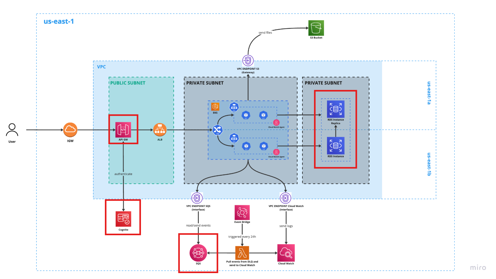
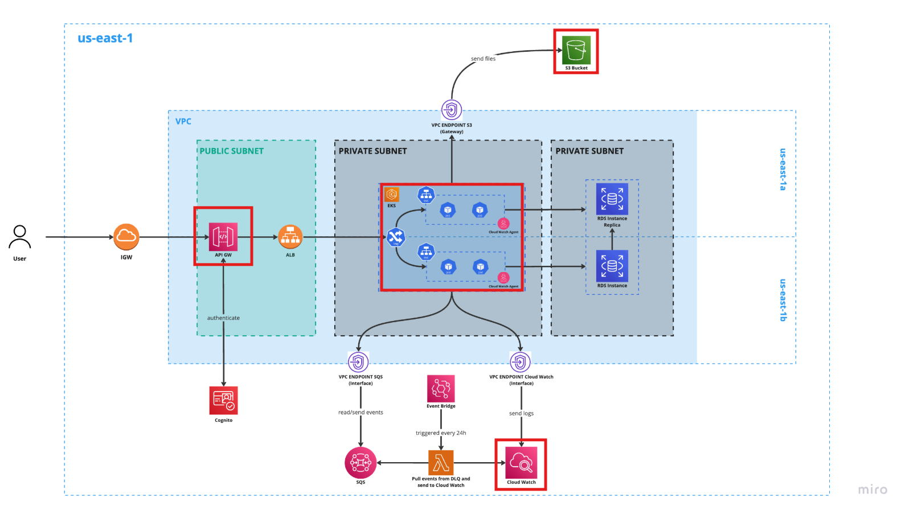

<b>Wyniki etapu IIb:   Ocena architektury systemu</b>

 

<b>System biletowy dla komunikacji miejskiej</b>

 

<b>Projektowanie systemów informatycznych</b>

Prowadzący: dr inż. Marcin Kawalerowicz

Skład zespołu <b>analizującego</b>:
<ul>
  <li>Przemysław Barcicki (260324)</li>
  <li>Tomasz Chojnacki (260365)</li>
  <li>Piotr Kot (259560)</li>
  <li>Jakub Zehner (260285)</li>
</ul>

---

**Analizowany system:** [Deskly - system do zarządzania współdzielonymi przestrzeniami biurowymi](https://github.com/wrzchwc/software-system-design/tree/e874aa639524634d0ef89c67c0eda114bc6945f6) (stan na 11.01.2025 - commit `e874aa6`).

# Lista kontrola kompletności opisu architektury

> [!NOTE]
> Zgodnie z [Architecture Review Checklist - System Engineering / Overall Architecture](http://www.opengroup.org/public/arch/p4/comp/clists/syseng.htm) - wykład 7, slajd 15.

**Legenda:**

- 🟩 - element listy opisany w pełni,
- 🟨 - element listy opisany częściowo,
- 🟥 - element listy nieopisany,
- 🟫 - nie dotyczy.

<table>
  <tr>
    <th>Element opisu</th>
    <th>Status</th>
  </tr>
  <tr>
    <th colspan="2">General</th>
  </tr>
  <tr>
    <td>🟫</td>
    <td>1. What other applications and/or systems require integration with yours?</td>
  </tr>
  <tr>
    <td>🟫</td>
    <td>2. Describe the integration level and strategy with each.</td>
  </tr>
  <tr>
    <td>🟥</td>
    <td>3. How geographically distributed is the user base?</td>
  </tr>
  <tr>
    <td>🟥</td>
    <td>4. What is the strategic importance of this system to other user communities inside or outside the enterprise?</td>
  </tr>
  <tr>
    <td>🟥</td>
    <td>5. What computing resources are needed to provide system service to users inside the enterprise? Outside the enterprise and using enterprise computing assets? Outside the enterprise and using their own assets?</td>
  </tr>
  <tr>
    <td>🟩</td>
    <td>6. How can users outside the native delivery environment access your applications and data?</td>
  </tr>
  <tr>
    <td>🟥</td>
    <td>7. What is the life expectancy of this application?</td>
  </tr>
  <tr>
    <td>🟥</td>
    <td>8. Describe the design that accommodates changes in the user base, stored data, and delivery system technology.</td>
  </tr>
  <tr>
    <td>🟨</td>
    <td>9. What is the size of the user base and their expected performance level?</td>
  </tr>
  <tr>
    <td>🟥</td>
    <td>10. What performance and stress test techniques do you use?</td>
  </tr>
  <tr>
    <td>🟩</td>
    <td>11. What is the overall organization of the software and data components?</td>
  </tr>
  <tr>
    <td>🟩</td>
    <td>12. What is the overall service and system configuration?</td>
  </tr>
  <tr>
    <td>🟫</td>
    <td>13. How are software and data configured mapped to the service and system configuration?</td>
  </tr>
  <tr>
    <td>🟫</td>
    <td>14. What proprietary technology (hardware and software) is needed for this system?</td>
  </tr>
  <tr>
    <td>🟨</td>
    <td>15. Describe how each and every version of the software can be reproduced and re-deployed over time.</td>
  </tr>
  <tr>
    <td>🟨</td>
    <td>16. Describe the current user base and how that base is expected to change over the next 3 to 5 years.</td>
  </tr>
  <tr>
    <td>🟥</td>
    <td>17. Describe the current geographic distribution of the user base and how that base is expected to change over the next 3 to 5 years.</td>
  </tr>
  <tr>
    <td>🟫</td>
    <td>18. Describe the how many current or future users need to use the application in a mobile capacity or who need to work off-line.</td>
  </tr>
  <tr>
    <td>🟩</td>
    <td>19. Describe what the application generally does, the major components of the application and the major data flows.</td>
  </tr>
  <tr>
    <td>🟨</td>
    <td>20. Describe the instrumentation included in the application that allows for the health and performance of the application to be monitored.</td>
  </tr>
  <tr>
    <td>🟩</td>
    <td>21. Describe the business justification for the system.</td>
  </tr>
  <tr>
    <td>🟥</td>
    <td>22. Describe the rationale for picking the system development language over other options in terms of initial development cost versus long term maintenance cost.</td>
  </tr>
  <tr>
    <td>🟥</td>
    <td>23. Describe the systems analysis process that was used to come up with the system architecture and product selection phase of the system architecture.</td>
  </tr>
  <tr>
    <td>🟥</td>
    <td>24. Who besides the original customer might have a use for or benefit from using this system?</td>
  </tr>
  <tr>
    <td>🟫</td>
    <td>25. What percentage of the users use the system in browse mode versus update mode?</td>
  </tr>
  <tr>
    <td>🟨</td>
    <td>26. What is the typical length of requests that are transactional?</td>
  </tr>
  <tr>
    <td>🟩</td>
    <td>27. Do you need guaranteed data delivery or update, or the system tolerate failure?</td>
  </tr>
  <tr>
    <td>🟩</td>
    <td>28. What are the up-time requirements of the system?</td>
  </tr>
  <tr>
    <td>🟫</td>
    <td>29. Describe where the system architecture adheres or does not adhere to standards.</td>
  </tr>
  <tr>
    <td>🟥</td>
    <td>30. Describe the project planning and analysis approach used on the project.</td>
  </tr>
  <tr>
    <th colspan="2">Processors/Servers/Clients</th>
  </tr>
  <tr>
    <td>🟨</td>
    <td>1. Describe the Client/Server application architecture.</td>
  </tr>
  <tr>
    <td>🟩</td>
    <td>2. Annotate the pictorial to illustrate where application functionality is executed.</td>
  </tr>
  <tr>
    <th colspan="2">Client</th>
  </tr>
  <tr>
    <td>🟥</td>
    <td>1. Are functions other than presentation performed on the user device?</td>
  </tr>
  <tr>
    <td>🟫</td>
    <td>2. Describe the data and process help facility being provided.</td>
  </tr>
  <tr>
    <td>🟨</td>
    <td>3. Describe the screen to screen navigation technique.</td>
  </tr>
  <tr>
    <td>🟫</td>
    <td>4. Describe how the user navigates between this and other applications.</td>
  </tr>
  <tr>
    <td>🟫</td>
    <td>5. How is this and other applications launched from the user device?</td>
  </tr>
  <tr>
    <td>🟩</td>
    <td>6. Are there any inter-application data and process sharing capabilities? If so, describe what is being shared and by what technique / technology.</td>
  </tr>
  <tr>
    <td>🟨</td>
    <td>7. Describe data volumes being transferred to the client.</td>
  </tr>
  <tr>
    <td>🟫</td>
    <td>8. What are the additional requirements for local data storage to support the application?</td>
  </tr>
  <tr>
    <td>🟫</td>
    <td>9. What are the additional requirements for local software storage/memory to support the application?</td>
  </tr>
  <tr>
    <td>🟫</td>
    <td>10. Are there any known hardware / software conflicts or capacity limitations caused by other application requirements or situations, which would affect the application users?</td>
  </tr>
  <tr>
    <td>🟥</td>
    <td>11. Describe how the look and feel of your presentation layer compares to the look and feel of the other existing applications.</td>
  </tr>
  <tr>
    <td>🟨</td>
    <td>12. Describe to what extent the client needs to support asynchronous and / or synchronous communication.</td>
  </tr>
  <tr>
    <td>🟨</td>
    <td>13. Describe how the presentation layer of the system is separated from other computational or data transfer layers of the system.</td>
  </tr>
  <tr>
    <th colspan="2">Application Server</th>
  </tr>
  <tr>
    <td>🟫</td>
    <td>1. Can/does the presentation layer and application layers run on separate processors?</td>
  </tr>
  <tr>
    <td>🟫</td>
    <td>2. Can/does the application layer and data access layer run on separate processors?</td>
  </tr>
  <tr>
    <td>🟥</td>
    <td>3. Can this application be placed on an application server independent of all other applications? If not, explain the dependencies.</td>
  </tr>
  <tr>
    <td>🟩</td>
    <td>4. Can additional parallel application servers be easily added? If so, what is the load balancing mechanism?</td>
  </tr>
  <tr>
    <td>🟨</td>
    <td>5. Has the resource demand generated by the application been measured and what is the value? If so, has the capacity of the planned server been confirmed at the application and aggregate levels?</td>
  </tr>
  <tr>
    <th colspan="2">Data Server</th>
  </tr>
  <tr>
    <td>🟫</td>
    <td>1. Are there other applications, which must share the data server? If so, please identify them and describe the data and data access requirements.</td>
  </tr>
  <tr>
    <td>🟨</td>
    <td>2. Has the resource demand generated by the application been measured and what is the value? If so, has the capacity of the planned server been confirmed at the application and aggregate levels?</td>
  </tr>
</table>
 
# Przegląd podejść architektonicznych

> [!NOTE]
> Zgodnie z [ATAM: Method for Architecture Evaluation](https://insights.sei.cmu.edu/documents/629/2000_005_001_13706.pdf), strona 7, na tym etapie nie dokonuje się analizy ani opisu poszczególnych podejść - _Architectural approaches are identified by the architect, but are not analyzed._

- architektura mikroserwisów
- AWS
- AWS SQS
- AWS Cognito
- AWS S3
- AWS RDS
- AWS CloudWatch
- AWS Lambda
- AWS EKS
- API Gateway
- wzorzec fasady
- brak cachingu
- leniwe ładowanie modułów frontend
- asynchroniczna komunikacja między serwisami
- automatyczne skalowanie
- JWT
- Application Load Balancer
- Kubernetes
- PostgreSQL
- Spring Boot
- Angular

# Drzewo użyteczności

> [!NOTE]
> Lista wykorzystanych charakterystyk jakościowych jest zgodna z normą ISO/IEC 25010.

**Legenda dla priorytetów:** `(<business-gain>, <difficulty>)`, gdzie:

- `<business-gain>`: korzyść biznesowa wg klienta: `H` (high), `M` (medium) lub `L` (low),
- `<difficulty>`: trudność implementacji wg architekta: `H` (high), `M` (medium) lub `L` (low).

<table>
  <tr>
    <th>Charakterystyka jakościowa</th>
    <th>Perspektywa oceny</th>
    <th>Scenariusz</th>
  </tr>
  <tr>
    <th rowspan="3">wydajność (<i>performance</i>)</th>
    <th rowspan="2">wydajność czasowa (<i>time behaviour</i>)</th>
    <td>Użytkownik wysyła zapytanie związane z rezerwacjami i dostępem do zasobów w ramach normalnej pracy systemu, czas odpowiedzi nie przekracza 2 sekund. <b>(H, M)</b></td>
  </tr>
  <tr>
    <td>Użytkownik wysyła prośbę o generację raportu w ramach normalnej pracy systemu, czas odpowiedzi nie przekracza 3 sekund. <b>(M, M)</b></td>
  </tr>
  <tr>
    <th>przepustowość (<i>capacity</i>)</th>
    <td>Użytkownicy w liczbie 10000 otwierają system w ramach normalnej pracy systemu, transakcje są obsługiwane bez błędów. <b>(H, H)</b></td>
  </tr>
  <tr>
    <th rowspan="2">niezawodność (<i>reliability</i>)</th>
    <th>dostępność (<i>availability</i>)</th>
    <td>Użytkownik próbuje skorzystać z systemu, niezależnie od stanu środowiska, system jest dostępny przez 99% czasu. <b>(H, L)</b></td>
  </tr>
  <tr>
    <th>odzyskiwalność (<i>recoverability</i>)</th>
    <td>Gdy w systemie wydarzy się awaria, system można przywrócić do działania w ciągu maksymalnie 1h. <b>(H, M)</b></td>
  </tr>
  <tr>
    <th rowspan="3">bezpieczeństwo (<i>security</i>)</th>
    <th rowspan="2">poufność (<i>confidentiality</i>)</th>
    <td>Użytkownik dokonuje dowolną czynność, niezależnie od stanu środowiska, dane użytkownika są przetwarzane i przechowywane zgodnie z wytycznymi RODO. <b>(H, M)</b></td>
  </tr>
  <tr>
    <td>Użytkownik dokonuje dowolną czynność, niezależnie od stanu środowiska, dane związane z rezerwacjami powinny być szyfrowane w bazie danych oraz podczas przesyłania. <b>(M, L)</b></td>
  </tr>
  <tr>
    <th>odpowiedzialność (<i>accountability</i>)</th>
    <td>Użytkownik negocjuje umowy lub edytuje rezerwacje, niezależnie od stanu środowiska, system prowadzi logi audytowe. <b>(L, L)</b></td>
  </tr>
</table>

W analizowanym projekcie nie wskazano wymagań, na podstawie których możnaby ułożyć scenariusze dotyczące charakterystyk: **compatibility**, **usability**, **maintainability**, **portability**.

# Analiza wybranych scenariuszy

<table>
  <tr>
    <th>Scenariusz <code>SC1</code> TODO @tchojnacki</th>
    <td colspan="4">Użytkownik wysyła zapytanie związane z rezerwacjami i dostępem do zasobów w ramach normalnej pracy systemu, czas odpowiedzi nie przekracza 2 sekund.</td>
  </tr>
  <tr>
    <th>Atrybut(y)</th>
    <td colspan="4">Atrybuty jakościowe, których dotyczy ten scenariusz</td>
  </tr>
  <tr>
    <th>Środowisko</th>
    <td colspan="4">Odpowiednie założenia dotyczące środowiska, w którym znajduje się </td>
  </tr>
  <tr>
    <th>Bodziec</th>
    <td colspan="4">Precyzyjne określenie bodźca atrybutu jakościowego (np. wywołana funkcja, awaria, zagrożenie, modyfikacja) związanego ze scenariuszem</td>
  </tr>
  <tr>
    <th>Odpowiedź</th>
    <td colspan="4">Precyzyjne określenie odpowiedzi atrybutu jakościowego (np. czas odpowiedzi, miara trudności wprowadzenia modyfikacji)</td>
  </tr>
  <tr>
    <th>Decyzje architektoniczne</th>
    <th>Wrażliwość</th>
    <th>Kompromis</th>
    <th>Ryzyko</th>
    <th>Nie-ryzyko</th>
  </tr>
  <tr>
    <td>Decyzja architektoniczna, związana z tym scenariuszem, która ma wpływ na odpowiedź atrybutu jakościowego</td>
    <td><code>SC1.S1</code>, <code>SC1.S2</code></td>
    <td><code>SC1.T1</code>, <code>SC1.T2</code></td>
    <td><code>SC1.R1</code>, <code>SC1.R2</code></td>
    <td><code>SC1.N1</code>, <code>SC1.N2</code></td>
  </tr>
  <tr>
    <th>Analiza</th>
    <td colspan="4">Jakościowe i/lub ilościowe racjonalne wyjaśnienie tego, dlaczego posiadana lista decyzji architektoniczych przyczynia się do spełnienia wymagań każdego atrybutu jakościowego podanego w scenariuszu</td>
  </tr>
  <tr>
    <th>Diagram architektoniczny</th>
    <td colspan="4">Diagram lub diagramy perspektyw architektonicznych opatrzone informacjami na temat architektury, których celem jest wsparcie podanych wyżej uzasadnień, wraz z tekstem wyjaśnienia tam, gdzie jest to konieczne</td>
  </tr>
</table>

- **`SC1.S1`:** ...
- **`SC1.S2`:** ...
- **`SC1.T1`:** ...
- **`SC1.T2`:** ...
- **`SC1.R1`:** ...
- **`SC1.R2`:** ...
- **`SC1.N1`:** ...
- **`SC1.N2`:** ...

<table>
  <tr>
    <th>Scenariusz <code>SC2</code> TODO @tchojnacki</th>
    <td colspan="4">Użytkownik wysyła prośbę o generację raportu w ramach normalnej pracy systemu, czas odpowiedzi nie przekracza 3 sekund.</td>
  </tr>
  <tr>
    <th>Atrybut(y)</th>
    <td colspan="4">Atrybuty jakościowe, których dotyczy ten scenariusz</td>
  </tr>
  <tr>
    <th>Środowisko</th>
    <td colspan="4">Odpowiednie założenia dotyczące środowiska, w którym znajduje się </td>
  </tr>
  <tr>
    <th>Bodziec</th>
    <td colspan="4">Precyzyjne określenie bodźca atrybutu jakościowego (np. wywołana funkcja, awaria, zagrożenie, modyfikacja) związanego ze scenariuszem</td>
  </tr>
  <tr>
    <th>Odpowiedź</th>
    <td colspan="4">Precyzyjne określenie odpowiedzi atrybutu jakościowego (np. czas odpowiedzi, miara trudności wprowadzenia modyfikacji)</td>
  </tr>
  <tr>
    <th>Decyzje architektoniczne</th>
    <th>Wrażliwość</th>
    <th>Kompromis</th>
    <th>Ryzyko</th>
    <th>Nie-ryzyko</th>
  </tr>
  <tr>
    <td>Decyzja architektoniczna, związana z tym scenariuszem, która ma wpływ na odpowiedź atrybutu jakościowego</td>
    <td><code>SC1.S1</code>, <code>SC1.S2</code></td>
    <td><code>SC1.T1</code>, <code>SC1.T2</code></td>
    <td><code>SC1.R1</code>, <code>SC1.R2</code></td>
    <td><code>SC1.N1</code>, <code>SC1.N2</code></td>
  </tr>
  <tr>
    <th>Analiza</th>
    <td colspan="4">Jakościowe i/lub ilościowe racjonalne wyjaśnienie tego, dlaczego posiadana lista decyzji architektoniczych przyczynia się do spełnienia wymagań każdego atrybutu jakościowego podanego w scenariuszu</td>
  </tr>
  <tr>
    <th>Diagram architektoniczny</th>
    <td colspan="4">Diagram lub diagramy perspektyw architektonicznych opatrzone informacjami na temat architektury, których celem jest wsparcie podanych wyżej uzasadnień, wraz z tekstem wyjaśnienia tam, gdzie jest to konieczne</td>
  </tr>
</table>

- **`SC1.S1`:** ...
- **`SC1.S2`:** ...
- **`SC1.T1`:** ...
- **`SC1.T2`:** ...
- **`SC1.R1`:** ...
- **`SC1.R2`:** ...
- **`SC1.N1`:** ...
- **`SC1.N2`:** ...

<table>
  <tr>
    <th>Scenariusz <code>SC3</code> TODO @piterek130</th>
    <td colspan="4">Użytkownicy w liczbie 10000 otwierają system w ramach normalnej pracy systemu, transakcje są obsługiwane bez błędów.</td>
  </tr>
  <tr>
    <th>Atrybut(y)</th>
    <td colspan="4">Atrybuty jakościowe, których dotyczy ten scenariusz</td>
  </tr>
  <tr>
    <th>Środowisko</th>
    <td colspan="4">Odpowiednie założenia dotyczące środowiska, w którym znajduje się </td>
  </tr>
  <tr>
    <th>Bodziec</th>
    <td colspan="4">Precyzyjne określenie bodźca atrybutu jakościowego (np. wywołana funkcja, awaria, zagrożenie, modyfikacja) związanego ze scenariuszem</td>
  </tr>
  <tr>
    <th>Odpowiedź</th>
    <td colspan="4">Precyzyjne określenie odpowiedzi atrybutu jakościowego (np. czas odpowiedzi, miara trudności wprowadzenia modyfikacji)</td>
  </tr>
  <tr>
    <th>Decyzje architektoniczne</th>
    <th>Wrażliwość</th>
    <th>Kompromis</th>
    <th>Ryzyko</th>
    <th>Nie-ryzyko</th>
  </tr>
  <tr>
    <td>Decyzja architektoniczna, związana z tym scenariuszem, która ma wpływ na odpowiedź atrybutu jakościowego</td>
    <td><code>SC1.S1</code>, <code>SC1.S2</code></td>
    <td><code>SC1.T1</code>, <code>SC1.T2</code></td>
    <td><code>SC1.R1</code>, <code>SC1.R2</code></td>
    <td><code>SC1.N1</code>, <code>SC1.N2</code></td>
  </tr>
  <tr>
    <th>Analiza</th>
    <td colspan="4">Jakościowe i/lub ilościowe racjonalne wyjaśnienie tego, dlaczego posiadana lista decyzji architektoniczych przyczynia się do spełnienia wymagań każdego atrybutu jakościowego podanego w scenariuszu</td>
  </tr>
  <tr>
    <th>Diagram architektoniczny</th>
    <td colspan="4">Diagram lub diagramy perspektyw architektonicznych opatrzone informacjami na temat architektury, których celem jest wsparcie podanych wyżej uzasadnień, wraz z tekstem wyjaśnienia tam, gdzie jest to konieczne</td>
  </tr>
</table>

- **`SC1.S1`:** ...
- **`SC1.S2`:** ...
- **`SC1.T1`:** ...
- **`SC1.T2`:** ...
- **`SC1.R1`:** ...
- **`SC1.R2`:** ...
- **`SC1.N1`:** ...
- **`SC1.N2`:** ...

<table>
  <tr>
    <th>Scenariusz <code>SC4</code> TODO @piterek130</th>
    <td colspan="4">Użytkownik próbuje skorzystać z systemu, niezależnie od stanu środowiska, system jest dostępny przez 99% czasu.</td>
  </tr>
  <tr>
    <th>Atrybut(y)</th>
    <td colspan="4">Atrybuty jakościowe, których dotyczy ten scenariusz</td>
  </tr>
  <tr>
    <th>Środowisko</th>
    <td colspan="4">Odpowiednie założenia dotyczące środowiska, w którym znajduje się </td>
  </tr>
  <tr>
    <th>Bodziec</th>
    <td colspan="4">Precyzyjne określenie bodźca atrybutu jakościowego (np. wywołana funkcja, awaria, zagrożenie, modyfikacja) związanego ze scenariuszem</td>
  </tr>
  <tr>
    <th>Odpowiedź</th>
    <td colspan="4">Precyzyjne określenie odpowiedzi atrybutu jakościowego (np. czas odpowiedzi, miara trudności wprowadzenia modyfikacji)</td>
  </tr>
  <tr>
    <th>Decyzje architektoniczne</th>
    <th>Wrażliwość</th>
    <th>Kompromis</th>
    <th>Ryzyko</th>
    <th>Nie-ryzyko</th>
  </tr>
  <tr>
    <td>Decyzja architektoniczna, związana z tym scenariuszem, która ma wpływ na odpowiedź atrybutu jakościowego</td>
    <td><code>SC1.S1</code>, <code>SC1.S2</code></td>
    <td><code>SC1.T1</code>, <code>SC1.T2</code></td>
    <td><code>SC1.R1</code>, <code>SC1.R2</code></td>
    <td><code>SC1.N1</code>, <code>SC1.N2</code></td>
  </tr>
  <tr>
    <th>Analiza</th>
    <td colspan="4">Jakościowe i/lub ilościowe racjonalne wyjaśnienie tego, dlaczego posiadana lista decyzji architektoniczych przyczynia się do spełnienia wymagań każdego atrybutu jakościowego podanego w scenariuszu</td>
  </tr>
  <tr>
    <th>Diagram architektoniczny</th>
    <td colspan="4">Diagram lub diagramy perspektyw architektonicznych opatrzone informacjami na temat architektury, których celem jest wsparcie podanych wyżej uzasadnień, wraz z tekstem wyjaśnienia tam, gdzie jest to konieczne</td>
  </tr>
</table>

- **`SC1.S1`:** ...
- **`SC1.S2`:** ...
- **`SC1.T1`:** ...
- **`SC1.T2`:** ...
- **`SC1.R1`:** ...
- **`SC1.R2`:** ...
- **`SC1.N1`:** ...
- **`SC1.N2`:** ...

<table>
  <tr>
    <th>Scenariusz <code>SC5</code> TODO @mlodybercik</th>
    <td colspan="4">Gdy w systemie wydarzy się awaria, system można przywrócić do działania w ciągu maksymalnie 1h.</td>
  </tr>
  <tr>
    <th>Atrybut(y)</th>
    <td colspan="4">Atrybuty jakościowe, których dotyczy ten scenariusz</td>
  </tr>
  <tr>
    <th>Środowisko</th>
    <td colspan="4">Odpowiednie założenia dotyczące środowiska, w którym znajduje się </td>
  </tr>
  <tr>
    <th>Bodziec</th>
    <td colspan="4">Precyzyjne określenie bodźca atrybutu jakościowego (np. wywołana funkcja, awaria, zagrożenie, modyfikacja) związanego ze scenariuszem</td>
  </tr>
  <tr>
    <th>Odpowiedź</th>
    <td colspan="4">Precyzyjne określenie odpowiedzi atrybutu jakościowego (np. czas odpowiedzi, miara trudności wprowadzenia modyfikacji)</td>
  </tr>
  <tr>
    <th>Decyzje architektoniczne</th>
    <th>Wrażliwość</th>
    <th>Kompromis</th>
    <th>Ryzyko</th>
    <th>Nie-ryzyko</th>
  </tr>
  <tr>
    <td>Decyzja architektoniczna, związana z tym scenariuszem, która ma wpływ na odpowiedź atrybutu jakościowego</td>
    <td><code>SC1.S1</code>, <code>SC1.S2</code></td>
    <td><code>SC1.T1</code>, <code>SC1.T2</code></td>
    <td><code>SC1.R1</code>, <code>SC1.R2</code></td>
    <td><code>SC1.N1</code>, <code>SC1.N2</code></td>
  </tr>
  <tr>
    <th>Analiza</th>
    <td colspan="4">Jakościowe i/lub ilościowe racjonalne wyjaśnienie tego, dlaczego posiadana lista decyzji architektoniczych przyczynia się do spełnienia wymagań każdego atrybutu jakościowego podanego w scenariuszu</td>
  </tr>
  <tr>
    <th>Diagram architektoniczny</th>
    <td colspan="4">Diagram lub diagramy perspektyw architektonicznych opatrzone informacjami na temat architektury, których celem jest wsparcie podanych wyżej uzasadnień, wraz z tekstem wyjaśnienia tam, gdzie jest to konieczne</td>
  </tr>
</table>

- **`SC1.S1`:** ...
- **`SC1.S2`:** ...
- **`SC1.T1`:** ...
- **`SC1.T2`:** ...
- **`SC1.R1`:** ...
- **`SC1.R2`:** ...
- **`SC1.N1`:** ...
- **`SC1.N2`:** ...

<table>
  <tr>
    <th>Scenariusz <code>SC6</code> TODO @mlodybercik</th>
    <td colspan="4">Użytkownik dokonuje dowolną czynność, niezależnie od stanu środowiska, dane użytkownika są przetwarzane i przechowywane zgodnie z wytycznymi RODO.</td>
  </tr>
  <tr>
    <th>Atrybut(y)</th>
    <td colspan="4">Atrybuty jakościowe, których dotyczy ten scenariusz</td>
  </tr>
  <tr>
    <th>Środowisko</th>
    <td colspan="4">Odpowiednie założenia dotyczące środowiska, w którym znajduje się </td>
  </tr>
  <tr>
    <th>Bodziec</th>
    <td colspan="4">Precyzyjne określenie bodźca atrybutu jakościowego (np. wywołana funkcja, awaria, zagrożenie, modyfikacja) związanego ze scenariuszem</td>
  </tr>
  <tr>
    <th>Odpowiedź</th>
    <td colspan="4">Precyzyjne określenie odpowiedzi atrybutu jakościowego (np. czas odpowiedzi, miara trudności wprowadzenia modyfikacji)</td>
  </tr>
  <tr>
    <th>Decyzje architektoniczne</th>
    <th>Wrażliwość</th>
    <th>Kompromis</th>
    <th>Ryzyko</th>
    <th>Nie-ryzyko</th>
  </tr>
  <tr>
    <td>Decyzja architektoniczna, związana z tym scenariuszem, która ma wpływ na odpowiedź atrybutu jakościowego</td>
    <td><code>SC1.S1</code>, <code>SC1.S2</code></td>
    <td><code>SC1.T1</code>, <code>SC1.T2</code></td>
    <td><code>SC1.R1</code>, <code>SC1.R2</code></td>
    <td><code>SC1.N1</code>, <code>SC1.N2</code></td>
  </tr>
  <tr>
    <th>Analiza</th>
    <td colspan="4">Jakościowe i/lub ilościowe racjonalne wyjaśnienie tego, dlaczego posiadana lista decyzji architektoniczych przyczynia się do spełnienia wymagań każdego atrybutu jakościowego podanego w scenariuszu</td>
  </tr>
  <tr>
    <th>Diagram architektoniczny</th>
    <td colspan="4">Diagram lub diagramy perspektyw architektonicznych opatrzone informacjami na temat architektury, których celem jest wsparcie podanych wyżej uzasadnień, wraz z tekstem wyjaśnienia tam, gdzie jest to konieczne</td>
  </tr>
</table>

- **`SC1.S1`:** ...
- **`SC1.S2`:** ...
- **`SC1.T1`:** ...
- **`SC1.T2`:** ...
- **`SC1.R1`:** ...
- **`SC1.R2`:** ...
- **`SC1.N1`:** ...
- **`SC1.N2`:** ...

<table>
  <tr>
    <th>Scenariusz <code>SC7</code></th>
    <td colspan="4">Użytkownik dokonuje dowolną czynność, niezależnie od stanu środowiska, dane związane z rezerwacjami powinny być szyfrowane w bazie danych oraz podczas przesyłania.</td>
  </tr>
  <tr>
    <th>Atrybut(y)</th>
    <td colspan="4">poufność (<i>confidentiality</i>)</td>
  </tr>
  <tr>
    <th>Środowisko</th>
    <td colspan="4">Niezależnie od stanu środowiska</td>
  </tr>
  <tr>
    <th>Bodziec</th>
    <td colspan="4">Dowolna czynność wykonywana przez użytkownika</td>
  </tr>
  <tr>
    <th>Odpowiedź</th>
    <td colspan="4">Zaszyfrowanie danych rezerwacji w bazie danych i podczas przesyłania</td>
  </tr>
  <tr>
    <th>Decyzje architektoniczne</th>
    <th>Wrażliwość</th>
    <th>Kompromis</th>
    <th>Ryzyko</th>
    <th>Nie-ryzyko</th>
  </tr>
  <tr>
    <td><b>PostgreSQL</b> z szyfrowaniem danych w spoczynku</td>
    <td><code>SC7.S1</code></td>
    <td><code>SC7.T1</code></td>
    <td><code>SC7.R1</code></td>
    <td><code>SC7.N1</code></td>
  </tr>
  <tr>
    <td><b>AWS RDS</b> z aktywnym szyfrowaniem połączeń</td>
    <td><code>SC7.S2</code></td>
    <td><code>SC7.T2</code></td>
    <td><code>SC7.R2</code></td>
    <td><code>SC7.N2</code></td>
  </tr>
  <tr>
    <td><b>JWT</b></td>
    <td><code>SC7.S3</code></td>
    <td><code>SC7.T3</code></td>
    <td><code>SC7.R3</code></td>
    <td><code>SC7.N3</code></td>
  </tr>
  <tr>
    <td><b>AWS Cognito</b></td>
    <td><code>SC7.S4</code></td>
    <td><code>SC7.T4</code></td>
    <td><code>SC7.R4</code></td>
    <td><code>SC7.N4</code></td>
  </tr>
  <tr>
    <td><b>API Gateway</b> z aktywnym szyfrowaniem TLS</td>
    <td><code>SC7.S5</code></td>
    <td><code>SC7.T5</code></td>
    <td><code>SC7.R5</code></td>
    <td><code>SC7.N5</code></td>
  </tr>
  <tr>
    <td><b>AWS SQS</b></td>
    <td><code>SC7.S6</code></td>
    <td><code>SC7.T6</code></td>
    <td><code>SC7.R6</code></td>
    <td><code>SC7.N6</code></td>
  </tr>
  <tr>
    <th>Analiza</th>
    <td colspan="4">Lista decyzji architektonicznych jest ściśle związana z atrybutem poufności (confidentiality) w scenariuszu. Każda decyzja jest podporządkowana celowi szyfrowania danych w spoczynku i w trakcie przesyłania, co zapewnia ochronę wrażliwych informacji.
    <ul>
      <li> PostgreSQL z szyfrowaniem danych w spoczynku - kluczowy komponent bazy danych, która obsługuje rezerwacje, wykorzystuje szyfrowanie TDE, zapewniając, że dane są chronione nawet w przypadku naruszenia zabezpieczeń dysku lub backupu. </li>
      <li> Szyfrowanie połączeń TLS (AWS RDS i API Gateway) - bezpieczeństwo przesyłania danych zapewniane jest przez wymuszenie szyfrowania TLS, co jest standardem w transmisji wrażliwych informacji. </li>
      <li> Zastosowanie AWS Cognito i JWT - AWS Cognito zapewnia odpowiednie mechanizmy autoryzacji, podczas gdy JWT umożliwia zarządzanie sesjami w sposób bezpieczny i wydajny dzięki szyfrowaniu. </li>
      <li> Asynchroniczna komunikacja (AWS SQS) - Kolejki SQS są szyfrowane przy użyciu AWS KMS, co chroni dane nawet podczas wymiany komunikatów między mikroserwisami.</li>
    </ul></td>
  </tr>
  <tr>
    <th>Diagram architektoniczny</th>
    <td colspan="4">  </td>
  </tr>
</table>

- **`SC7.S1`:** Długość klucza szyfrowania - krótkie klucze zmniejszają bezpieczeństwo, a zbyt długie klucze mogą obniżyć wydajność odczytu/zapisu.
- **`SC7.T1`:** Szyfrowanie zwiększa bezpieczeństwo, ale obniża wydajność zapytań przy dużym obciążeniu.
- **`SC7.R1`:** Nieodpowiednia konfiguracja algorytmu szyfrowania może spowodować trudności w odzyskaniu danych.
- **`SC7.N1`:** PostgreSQL natywnie wspiera TDE, co zmniejsza ryzyko błędów konfiguracji i zapewnia spójność szyfrowania danych.
- **`SC7.S2`:** Konfiguracja TLS - nieaktualne ustawienia TLS mogą uniemożliwić bezpieczne połączenie z bazą danych.
- **`SC7.T2`:** TLS zapewnia poufność, ale wydłuża czas negocjacji połączenia.
- **`SC7.R2`:** Nieprawidłowa konfiguracja certyfikatów TLS może prowadzić do odrzucania połączeń przez klientów bazy danych.
- **`SC7.N2`:** AWS RDS automatycznie zarządza szyfrowaniem połączeń TLS, co redukuje ryzyko błędów konfiguracyjnych.
- **`SC7.S3`:** Zarządzanie cyklem życia kluczy - brak rotacji kluczy może narazić aplikację na przejęcie tokenów.
- **`SC7.T3`:** JWT zwiększa bezpieczeństwo sesji, ale wymaga większych zasobów obliczeniowych na podpis i weryfikację.
- **`SC7.R3`:** Brak możliwości wygaszania tokenów może prowadzić do naruszenia poufności danych.
- **`SC7.N3`:** Algorytmy RSA i AES-256 gwarantują wysoki poziom zabezpieczenia tokenów.
- **`SC7.S4`:** Polityki bezpieczeństwa haseł - zbyt słabe polityki mogą narazić użytkowników na nieautoryzowany dostęp.
- **`SC7.T4`:** Cognito zapewnia łatwe zarządzanie uwierzytelnianiem, ale zwiększa zależność od infrastruktury AWS.
- **`SC7.R4`:** Problemy z integracją Cognito z aplikacją mogą opóźnić wdrożenie lub spowodować luki w uwierzytelnianiu.
- **`SC7.N4`:** Cognito obsługuje zaawansowane funkcje, takie jak MFA (Multi-factor authentication), co dodatkowo wzmacnia bezpieczeństwo użytkowników.
- **`SC7.S5`:** Aktualność certyfikatów SSL/TLS - nieaktualne certyfikaty mogą uniemożliwić połączenia między klientem a API.
- **`SC7.T5`:** Szyfrowanie TLS poprawia poufność danych, ale zwiększa narzut na zasoby serwera.
- **`SC7.R5`:** Źle skonfigurowane certyfikaty mogą prowadzić do odrzucenia żądań przez klientów.
- **`SC7.N5`:** AWS Certificate Manager automatycznie odnawia certyfikaty, zapewniając spójność i minimalizując ryzyko nieaktualności.
- **`SC7.S6`:** Szyfrowanie wiadomości - brak szyfrowania w SQS może prowadzić do wycieku danych przesyłanych między mikroserwisami.
- **`SC7.T6`:** Szyfrowanie w SQS zapewnia bezpieczeństwo, ale może zwiększyć opóźnienia w komunikacji.
- **`SC7.R6`:** Niepoprawne użycie AWS KMS może powodować przesyłanie niezaszyfrowanych danych.
- **`SC7.N6`:** AWS SQS wspiera szyfrowanie wiadomości za pomocą AWS KMS, co minimalizuje ryzyko nieautoryzowanego dostępu.

<table>
  <tr>
    <th>Scenariusz <code>SC8</code></th>
    <td colspan="4">Użytkownik negocjuje umowy lub edytuje rezerwacje, niezależnie od stanu środowiska, system prowadzi logi audytowe.</td>
  </tr>
  <tr>
    <th>Atrybut(y)</th>
    <td colspan="4">odpowiedzialność (<i>accountability</i>)</td>
  </tr>
  <tr>
    <th>Środowisko</th>
    <td colspan="4">Niezależnie od stanu środowiska</td>
  </tr>
  <tr>
    <th>Bodziec</th>
    <td colspan="4">Użytkownik negocjuje umowy lub użytkownik edytuje rezerwacje</td>
  </tr>
  <tr>
    <th>Odpowiedź</th>
    <td colspan="4">System prowadzi logi audytowe</td>
  </tr>
  <tr>
    <th>Decyzje architektoniczne</th>
    <th>Wrażliwość</th>
    <th>Kompromis</th>
    <th>Ryzyko</th>
    <th>Nie-ryzyko</th>
  </tr>
  <tr>
    <td><b>AWS CloudWatch</b> dla logów audytowych</td>
    <td><code>SC8.S1</code></td>
    <td><code>SC8.T1</code></td>
    <td><code>SC8.R1</code></td>
    <td><code>SC8.N1</code></td>
  </tr>
  <tr>
    <td><b>API Gateway</b> z rejestrowaniem żądań</td>
    <td><code>SC8.S2</code></td>
    <td><code>SC8.T2</code></td>
    <td><code>SC8.R2</code></td>
    <td><code>SC8.N2</code></td>
  </tr>
  <tr>
    <td><b>AWS S3</b> do przechowywania logów audytowych</td>
    <td><code>SC8.S3</code></td>
    <td><code>SC8.T3</code></td>
    <td><code>SC8.R3</code></td>
    <td><code>SC8.N3</code></td>
  </tr>
  <tr>
    <td><b>Spring Boot</b> z filtrem audytowym</td>
    <td><code>SC8.S4</code></td>
    <td><code>SC8.T4</code></td>
    <td><code>SC8.R4</code></td>
    <td><code>SC8.N4</code></td>
  </tr>
  <tr>
    <th>Analiza</th>
    <td colspan="4">Lista decyzji architektonicznych została tak dobrana, aby wspierać spełnienie wymagań odpowiedzialności określonych w scenariuszu.
    <ul>
      <li> AWS CloudWatch dla logów audytowych - CloudWatch umożliwia centralne gromadzenie logów, co ułatwia monitorowanie działań użytkowników oraz identyfikację potencjalnych naruszeń. Funkcja alarmów i automatycznego raportowania pozwala szybko reagować na incydenty. Zwiększa to odpowiedzialność, zapewniając pełną widoczność w systemie. </li>
      <li> API Gateway z rejestrowaniem żądań - rejestrowanie żądań przy pomocy API Gateway pozwala na szczegółową analizę interakcji użytkownika z systemem. Pozwala to na łatwe mapowanie działań użytkowników w logach audytowych, co jest kluczowe dla spełnienia atrybutu accountability. </li>
      <li> AWS S3 do przechowywania logów audytowych - dane audytowe są przechowywane w AWS S3 z polityką szyfrowania i wersjonowania, co zapewnia integralność i bezpieczeństwo logów. Możliwość stosowania polityk dostępu ułatwia zarządzanie dostępem do krytycznych danych. </li>
      <li> Spring Boot z filtrem audytowym - wbudowane mechanizmy audytowe w Spring Boot ułatwiają rejestrowanie działań użytkownika na poziomie aplikacji. Filtr pozwala na selektywne logowanie ważnych informacji bez potrzeby ręcznej implementacji, co zmniejsza ryzyko błędów. </li>
    </ul></td>
  </tr>
  <tr>
    <th>Diagram architektoniczny</th>
    <td colspan="4">  </td>
  </tr>
</table>

- **`SC8.S1`:** Granularność logowania - zbyt szczegółowe logi mogą zwiększyć koszty przechowywania i przetwarzania danych.
- **`SC8.T1`:** Szczegółowe logi zwiększają odpowiedzialność, ale mogą prowadzić do wyższych kosztów operacyjnych w AWS.
- **`SC8.R1`:** Niewystarczające logowanie może uniemożliwić identyfikację naruszeń bezpieczeństwa lub błędów operacyjnych.
- **`SC8.N1`:** AWS CloudWatch zapewnia automatyczne zbieranie logów w ustrukturyzowany sposób, minimalizując ryzyko utraty danych audytowych.
- **`SC8.S2`:** Włączone logowanie żądań - brak rejestrowania żądań w API Gateway może uniemożliwić śledzenie działań użytkowników.
- **`SC8.T2`:** Logowanie żądań zwiększa odpowiedzialność, ale może obniżyć wydajność przetwarzania API przy dużym ruchu.
- **`SC8.R2`:** Przeciążenie API Gateway w wyniku nadmiarowego logowania może skutkować błędami w obsłudze ruchu.
- **`SC8.N2`:** API Gateway integruje się bezpośrednio z AWS CloudWatch, co ułatwia analizę audytową i zarządzanie danymi logów.
- **`SC8.S3`:** Polityka przechowywania danych - zbyt długie przechowywanie logów może generować niepotrzebne koszty.
- **`SC8.T3`:** Przechowywanie logów w S3 jest tanie, ale wymaga skonfigurowania polityk dostępu i archiwizacji, co zwiększa złożoność.
- **`SC8.R3`:** Brak zabezpieczenia logów audytowych w S3 może prowadzić do ich nieautoryzowanego dostępu lub modyfikacji.
- **`SC8.N3`:** AWS S3 obsługuje szyfrowanie danych w spoczynku i wersjonowanie, co gwarantuje ich integralność i bezpieczeństwo.
- **`SC8.S4`:** Konfiguracja audytu w Spring Boot - niewłaściwe wdrożenie mechanizmu filtrowania może pomijać kluczowe dane logów.
- **`SC8.T4`:** Wbudowany filtr audytowy w Spring Boot ułatwia centralizację logowania, ale zwiększa złożoność konfiguracji aplikacji.
- **`SC8.R4`:** Nieprawidłowa implementacja filtrów audytowych może powodować brak zgodności z wymaganiami dotyczącymi odpowiedzialności.
- **`SC8.N4`:** Wykorzystanie gotowych bibliotek w Spring Boot minimalizuje ryzyko błędów implementacyjnych przy logowaniu działań użytkownika.

# Wyniki

Poniżej znajdują się zagregowane punkty wrażliwości (_sensitivity points_), kompromisy (_trade-offs_), ryzyka (_risks_) i nie-ryzyka (_non-risks_) dla analizowanych scenariuszy.

## Punkty wrażliwości

> [!NOTE]
> Wszystkie punkty wrażliwości są kandydatami na ryzyka. Na końcu wszystkie muszą być skategoryzowane albo jako ryzyka albo jako nie-ryzyka - wykład 7, slajd 42.

TODO @everyone: zebrać wszystkie po skończeniu scenariuszy

- **`SC7.S1`:** Długość klucza szyfrowania - krótkie klucze zmniejszają bezpieczeństwo, a zbyt długie klucze mogą obniżyć wydajność odczytu/zapisu - **ryzyko**.
- **`SC7.S2`:** Konfiguracja TLS - nieaktualne ustawienia TLS mogą uniemożliwić bezpieczne połączenie z bazą danych - **nie-ryzyko**.
- **`SC7.S3`:** Zarządzanie cyklem życia kluczy - brak rotacji kluczy może narazić aplikację na przejęcie tokenów - **ryzyko**.
- **`SC7.S4`:** Polityki bezpieczeństwa haseł - zbyt słabe polityki mogą narazić użytkowników na nieautoryzowany dostęp - **ryzyko**.
- **`SC7.S5`:** Aktualność certyfikatów SSL/TLS - nieaktualne certyfikaty mogą uniemożliwić połączenia między klientem a API - **nie-ryzyko**.
- **`SC7.S6`:** Szyfrowanie wiadomości - brak szyfrowania w SQS może prowadzić do wycieku danych przesyłanych między mikroserwisami - **ryzyko**.
- **`SC8.S1`:** Granularność logowania - zbyt szczegółowe logi mogą zwiększyć koszty przechowywania i przetwarzania danych - **ryzyko**.
- **`SC8.S2`:** Włączone logowanie żądań - brak rejestrowania żądań w API Gateway może uniemożliwić śledzenie działań użytkowników - **ryzyko**.
- **`SC8.S3`:** Polityka przechowywania danych - zbyt długie przechowywanie logów może generować niepotrzebne koszty - **ryzyko**.
- **`SC8.S4`:** Konfiguracja audytu w Spring Boot - niewłaściwe wdrożenie mechanizmu filtrowania może pomijać kluczowe dane logów - **ryzyko**.

## Kompromisy

TODO @everyone: zebrać wszystkie po skończeniu scenariuszy

- **`SC7.T1`:** Szyfrowanie zwiększa bezpieczeństwo, ale obniża wydajność zapytań przy dużym obciążeniu.
- **`SC7.T2`:** TLS zapewnia poufność, ale wydłuża czas negocjacji połączenia.
- **`SC7.T3`:** JWT zwiększa bezpieczeństwo sesji, ale wymaga większych zasobów obliczeniowych na podpis i weryfikację.
- **`SC7.T4`:** Cognito zapewnia łatwe zarządzanie uwierzytelnianiem, ale zwiększa zależność od infrastruktury AWS.
- **`SC7.T5`:** Szyfrowanie TLS poprawia poufność danych, ale zwiększa narzut na zasoby serwera.
- **`SC7.T6`:** Szyfrowanie w SQS zapewnia bezpieczeństwo, ale może zwiększyć opóźnienia w komunikacji.
- **`SC8.T1`:** Szczegółowe logi zwiększają odpowiedzialność, ale mogą prowadzić do wyższych kosztów operacyjnych w AWS.
- **`SC8.T2`:** Logowanie żądań zwiększa odpowiedzialność, ale może obniżyć wydajność przetwarzania API przy dużym ruchu.
- **`SC8.T3`:** Przechowywanie logów w S3 jest tanie, ale wymaga skonfigurowania polityk dostępu i archiwizacji, co zwiększa złożoność.
- **`SC8.T4`:** Wbudowany filtr audytowy w Spring Boot ułatwia centralizację logowania, ale zwiększa złożoność konfiguracji aplikacji.

## Ryzyka

TODO @everyone: zebrać wszystkie po skończeniu scenariuszy

- **`SC7.R1`:** Nieodpowiednia konfiguracja algorytmu szyfrowania może spowodować trudności w odzyskaniu danych.
- **`SC7.R2`:** Nieprawidłowa konfiguracja certyfikatów TLS może prowadzić do odrzucania połączeń przez klientów bazy danych.
- **`SC7.R3`:** Brak możliwości wygaszania tokenów może prowadzić do naruszenia poufności danych.
- **`SC7.R4`:** Problemy z integracją Cognito z aplikacją mogą opóźnić wdrożenie lub spowodować luki w uwierzytelnianiu.
- **`SC7.R5`:** Źle skonfigurowane certyfikaty mogą prowadzić do odrzucenia żądań przez klientów.
- **`SC7.R6`:** Niepoprawne użycie AWS KMS może powodować przesyłanie niezaszyfrowanych danych.
- **`SC8.R1`:** Niewystarczające logowanie może uniemożliwić identyfikację naruszeń bezpieczeństwa lub błędów operacyjnych.
- **`SC8.R2`:** Przeciążenie API Gateway w wyniku nadmiarowego logowania może skutkować błędami w obsłudze ruchu.
- **`SC8.R3`:** Brak zabezpieczenia logów audytowych w S3 może prowadzić do ich nieautoryzowanego dostępu lub modyfikacji.
- **`SC8.R4`:** Nieprawidłowa implementacja filtrów audytowych może powodować brak zgodności z wymaganiami dotyczącymi odpowiedzialności.

## Nie-ryzyka

TODO @everyone: zebrać wszystkie po skończeniu scenariuszy

- **`SC7.N1`:** PostgreSQL natywnie wspiera TDE, co zmniejsza ryzyko błędów konfiguracji i zapewnia spójność szyfrowania danych.
- **`SC7.N2`:** AWS RDS automatycznie zarządza szyfrowaniem połączeń TLS, co redukuje ryzyko błędów konfiguracyjnych.
- **`SC7.N3`:** Algorytmy RSA i AES-256 gwarantują wysoki poziom zabezpieczenia tokenów.
- **`SC7.N4`:** Cognito obsługuje zaawansowane funkcje, takie jak MFA (Multi-factor authentication), co dodatkowo wzmacnia bezpieczeństwo użytkowników.
- **`SC7.N5`:** AWS Certificate Manager automatycznie odnawia certyfikaty, zapewniając spójność i minimalizując ryzyko nieaktualności.
- **`SC7.N6`:** AWS SQS wspiera szyfrowanie wiadomości za pomocą AWS KMS, co minimalizuje ryzyko nieautoryzowanego dostępu.
- **`SC8.N1`:** AWS CloudWatch zapewnia automatyczne zbieranie logów w ustrukturyzowany sposób, minimalizując ryzyko utraty danych audytowych.
- **`SC8.N2`:** API Gateway integruje się bezpośrednio z AWS CloudWatch, co ułatwia analizę audytową i zarządzanie danymi logów.
- **`SC8.N3`:** AWS S3 obsługuje szyfrowanie danych w spoczynku i wersjonowanie, co gwarantuje ich integralność i bezpieczeństwo.
- **`SC8.N4`:** Wykorzystanie gotowych bibliotek w Spring Boot minimalizuje ryzyko błędów implementacyjnych przy logowaniu działań użytkownika.

# Inne problemy

- Liczne literówki.
- Definicja wymagań niefunkcjonalnych - brak wymagań dotyczących użyteczności (_usability_).
- Cele architektoniczne - wartość dostępności jest niespójna z poprzednim etapem (99.9% w E1, 99% w E2).
- Widok kontekstowy - AWS SQS, AWS Cognito i AWS S3 są wskazane jako systemy zewnętrzne, a w rzeczywistości stanowią część systemu Deskly.
- Interfejsy integracyjne - powinny opisywać zależności z zewnętrznymi systemami, a nie między wewnętrznymi.
- Interfejsy integracyjne - brak uzasadnienia dobranych wartości wydajności i wolumetrii.
- Widok rozmieszczenia - wszystkie kolejki SQS są przedstawione jako wspólny węzeł, przez co nie widać które serwisy korzystają z których kolejek.
- Widok rozmieszczenia - nie przedstawiono na diagramie frontendu.
- Widok informacyjny - brak nazw asocjacji oraz pól klas.
- Projekt bazy danych - nie zaznaczono w żaden sposób połączeń ani kluczy obcych między tabelami.
- Widok wytwarzania - brak diagramu dla backendu.
- Realizacja przypadku użycia - przykładowe zapytanie używa `GET` zamiast `POST`.
- Realizacja przypadku użycia - Deskly Location komunikuje się z AWS Cognito, natomiast zgodnie z wyższymi diagramami robi to API Gateway.

# Wnioski

TODO
