<div align="center">
<p><b>Wyniki etapu III: <br/> Implementacja</b></p>
<br/>
<p><b>System biletowy dla komunikacji miejskiej</b></p>
<br/>
<p><b>Projektowanie systemów informatycznych</b></p>
</div>
<div align="right">Prowadzący:<br/>dr inż. Marcin Kawalerowicz</div>
<div>
Skład zespołu:
<ul>
  <li>Przemysław Barcicki (260324)</li>
  <li>Tomasz Chojnacki (260365)</li>
  <li>Piotr Kot (259560)</li>
  <li>Jakub Zehner (260285)</li>
</ul>
</div>

# Linki do utworzonych artefaktów

- **Dokumentacja:**
  - [`system-parts.md` - podział systemu ](../../system-parts.md)
  - [`contracts.md` - kontrakty obowiązujące między serwisami](../../contracts.md)
    - Healthchecks
    - Error schema
    - Pagination
    - Endpoints route
    - Headers
    - Environment variables
  - **ADR** - opisy wszystkich niezgodności z poprzednimi etapami wraz z uzasadnieniem:
    - [ADR-001: Vertical partitioning of the Jobberknoll API package structure](../../adrs/001-jobberknoll-api-structure.md)
    - [ADR-002: Domain model and database schema changes for Jobberknoll](../../adrs/002-jobberknoll-domain-model.md)
    - [ADR-003: Password hashing and storage requirements for Jobberknoll](../../adrs/003-password-hashing.md)
- **Implementacja:**
  - [Kod serwisu biletów Clabbert (Java)](../../../implementation/clabbert/)
  - [Kod serwisu autoryzacji Feather (TypeScript)](../../../implementation/feather/)
  - [Kod serwisu płatności Inferius (Java)](../../../implementation/inferius/)
  - [Kod serwisu kont Jobberknoll (TypeScript)](../../../implementation/jobberknoll/)
  - [Kod serwisu logistyki Leprechaun (TypeScript)](../../../implementation/leprechaun/)
  - [Kod serwisu bramy Phoenix (Java)](../../../implementation/phoenix/)
- **Infrastruktura:**
  - [Kod CI/CD (GitHub Actions)](../../../.github/workflows/)
  - [Definicja usług AWS (Terraform) i konfiguracja Kubernetes](../../../infrastructure/)

# Postęp realizacji projektu

## Serwisy

**Legenda:**

- 🟩 - zaimplementowane w pełni,
- 🟨 - zaimplementowane częściowo,
- 🟥 - pominięte.

<table>
  <tr>
    <th>Serwis</th>
    <th colspan="2">Procent ukończenia</th>
  </tr>
  <tr>
    <th rowspan="3">Clabbert <br/> (bilety)</th>
    <th>Wymagania</th>
    <td>🟩🟩🟩🟩🟩🟩🟩🟩🟩🟩🟩🟩🟩🟩🟩🟩</td>
  </tr>
  <tr>
    <th>Endpointy</th>
    <td>🟩🟩🟩🟩🟩🟩🟩🟩🟩🟩🟩🟩🟩</td>
  </tr>
  <tr>
    <th>Infrastruktura</th>
    <td>🟩🟩🟩🟥🟨</td>
  </tr>
  <tr>
    <th rowspan="2">Feather <br/> (autoryzacja)</th>
    <th>Endpointy</th>
    <td>🟩🟩</td>
  </tr>
  <tr>
    <th>Infrastruktura</th>
    <td>🟩🟩</td>
  </tr>
  <tr>
    <th rowspan="3">Inferius <br/> (płatności)</th>
    <th>Wymagania</th>
    <td>🟩🟩🟥🟩🟩🟥🟥🟥🟥🟩🟩🟩🟩🟩🟩🟩</td>
  </tr>
  <tr>
    <th>Endpointy</th>
    <td>🟩🟩🟩🟩🟥🟩🟩🟥🟩🟩🟥🟩🟩🟩🟩🟥</td>
  </tr>
  <tr>
    <th>Infrastruktura</th>
    <td>🟩🟥</td>
  </tr>
  <tr>
    <th rowspan="3">Jobberknoll <br/> (konta)</th>
    <th>Wymagania</th>
    <td>🟩🟩🟩🟩🟩🟩🟩🟩🟥🟩🟩🟩</td>
  </tr>
  <tr>
    <th>Endpointy</th>
    <td>🟩🟩🟩🟩🟩🟩🟩🟩🟩🟩🟥🟩🟩🟩🟩🟩🟩</td>
  </tr>
  <tr>
    <th>Infrastruktura</th>
    <td>🟩🟥🟩</td>
  </tr>
  <tr>
    <th rowspan="2">Leprechaun <br/> (logistyka)</th>
    <th>Wymagania</th>
    <td>🟩🟩🟩🟩🟩🟩🟩🟩🟩🟩🟩🟩🟩🟩🟩🟩🟩🟩🟩🟩🟩🟩🟩🟩🟩🟩🟩</td>
  </tr>
  <tr>
    <th>Endpointy</th>
    <td>🟩🟩🟩🟩🟩🟩🟩🟩🟩🟩🟩🟩🟩🟩🟩🟩🟩🟩🟩🟩🟩🟩🟩🟩🟨🟩🟩</td>
  </tr>
</table>

> [!NOTE]
> Zgodnie z wytycznymi Pani Dziekan Hnatkowskiej obowiązywała implementacja jednego wymagania na członka zespołu.

## API

Każdy serwis wspiera OpenAPI specification, a dodatkowo wspiera Swagger UI stanowiący interaktywną dokumentację API.

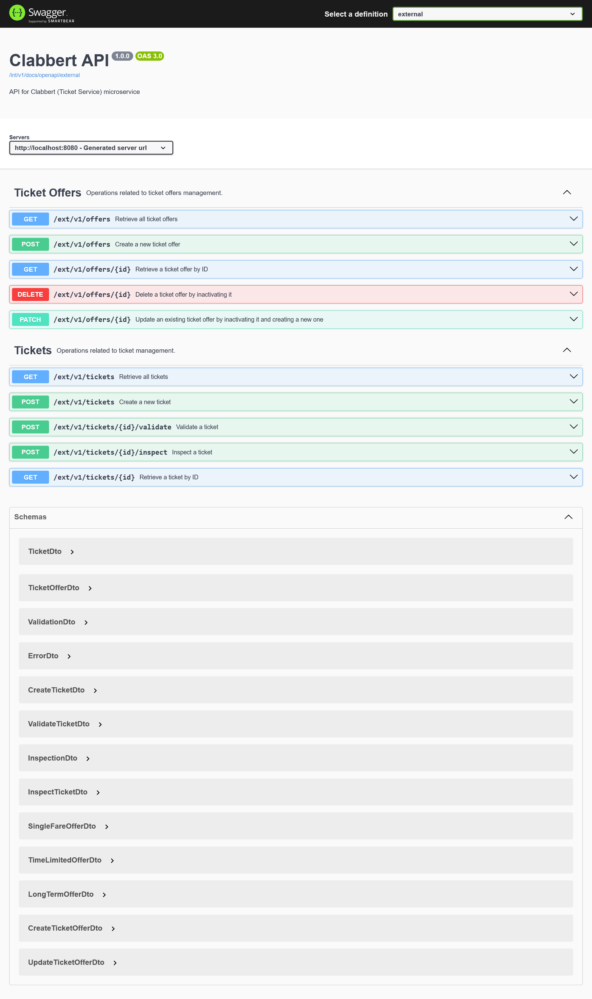
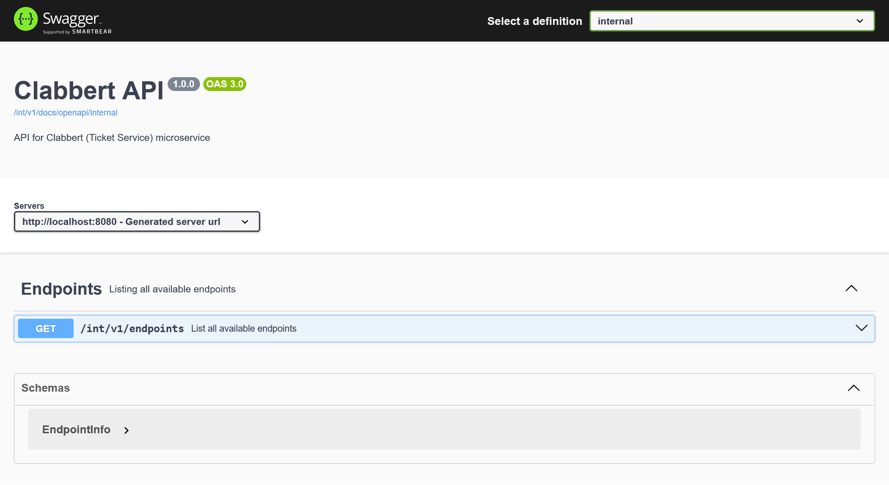
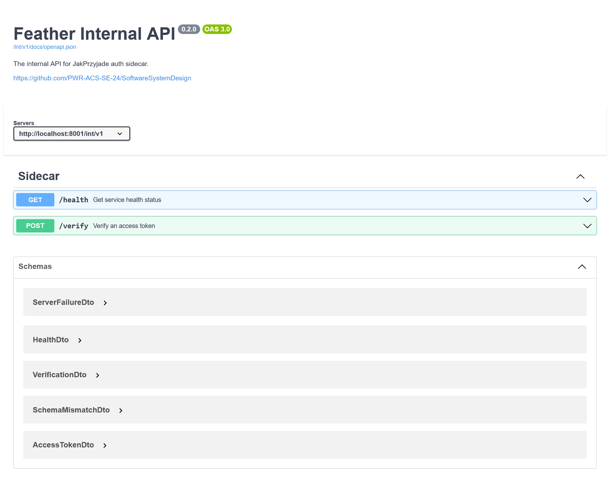
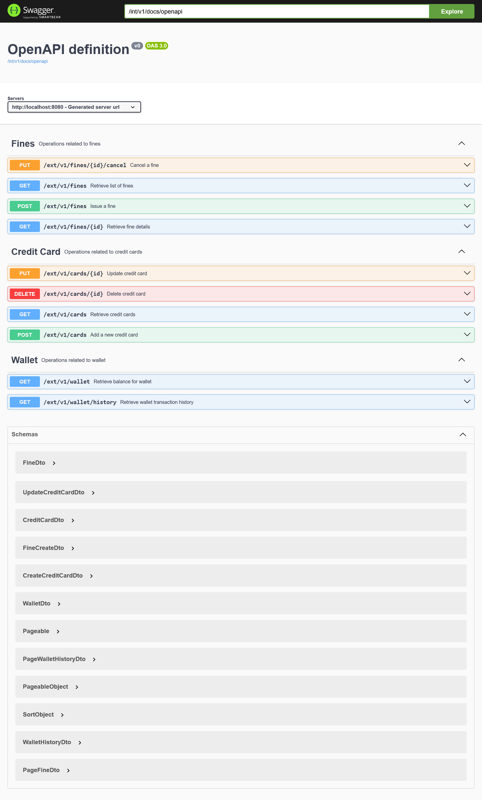
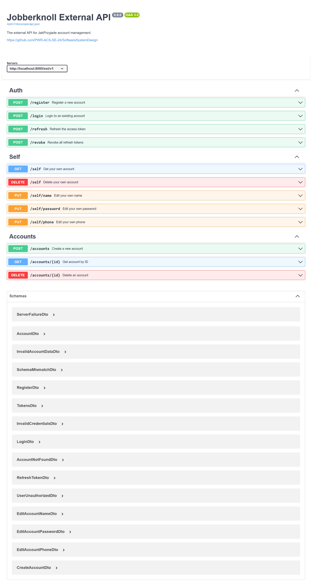
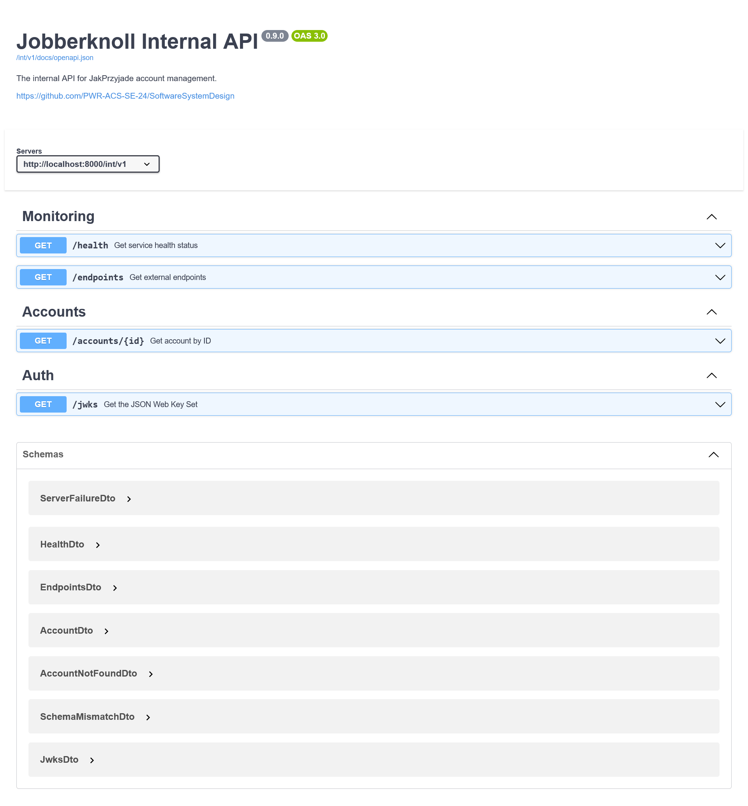
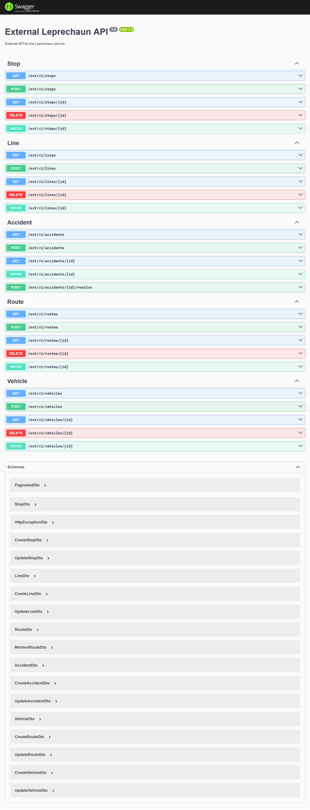
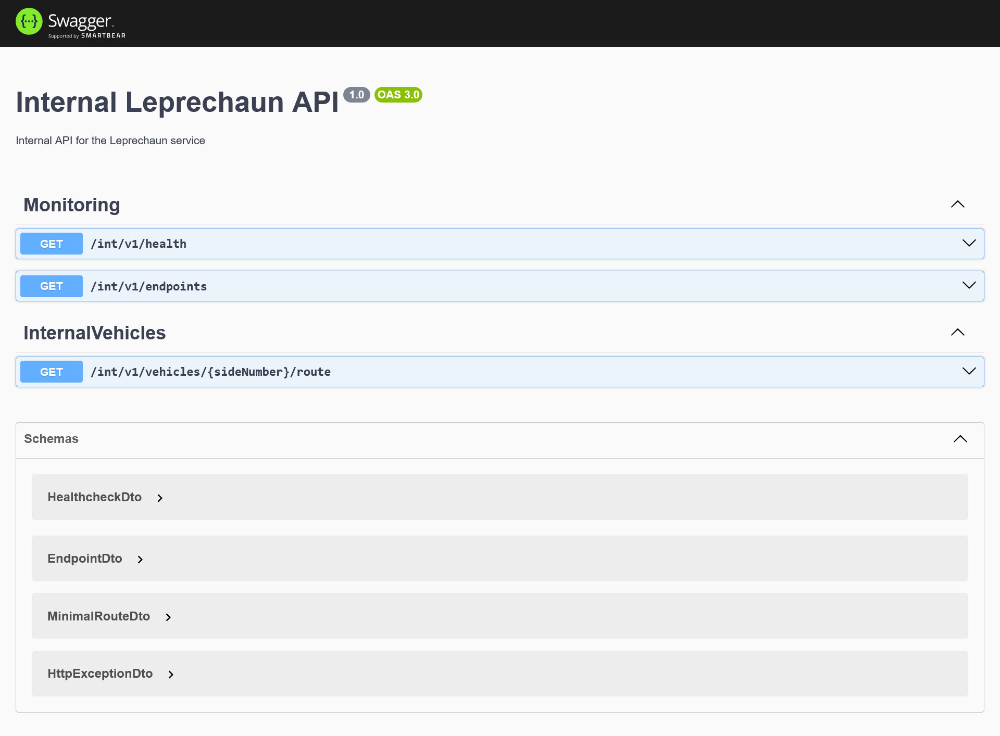

## CI/CD

Każdy serwis posiada zdefiniowany proces CI/CD w GitHub Actions, który automatycznie buduje i testuje zmiany.

- [`clabbert-ci`](https://github.com/PWR-ACS-SE-24/SoftwareSystemDesign/actions/workflows/clabbert.yml)
- [`feather-ci`](https://github.com/PWR-ACS-SE-24/SoftwareSystemDesign/actions/workflows/feather.yml)
- [`inferius-ci`](https://github.com/PWR-ACS-SE-24/SoftwareSystemDesign/actions/workflows/inferius.yml)
- [`jobberknoll-ci`](https://github.com/PWR-ACS-SE-24/SoftwareSystemDesign/actions/workflows/jobberknoll.yml)
- [`leprechaun-ci`](https://github.com/PWR-ACS-SE-24/SoftwareSystemDesign/actions/workflows/leprechaun.yml)

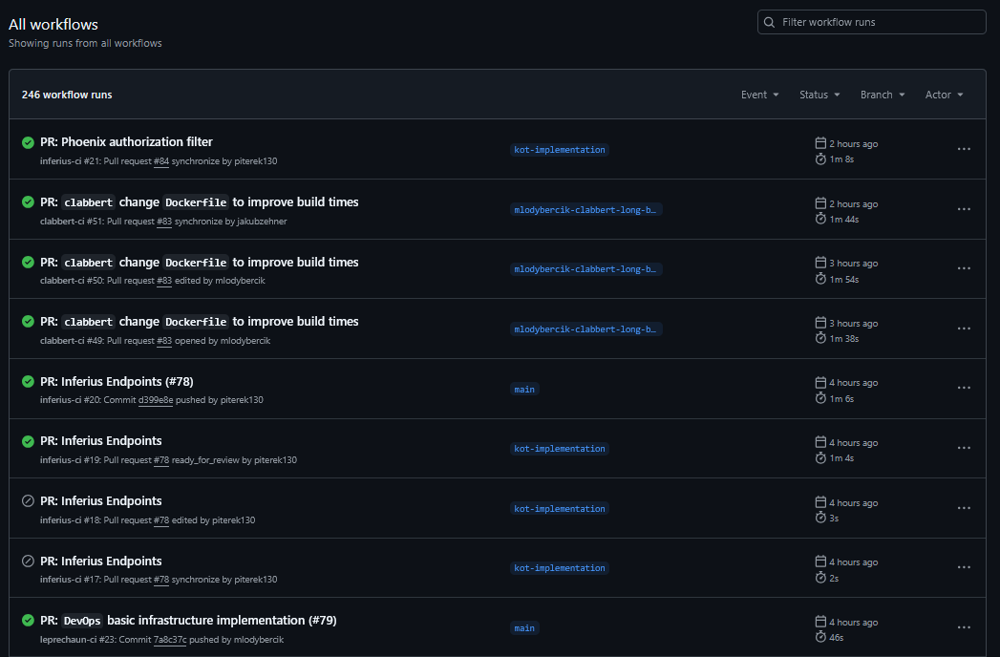

## Infrastruktura

TODO @mlodybercik

# Wkład pracy

```
───────────────────────────────────────────────────────────────────────────────
Language                 Files     Lines   Blanks  Comments     Code Complexity
───────────────────────────────────────────────────────────────────────────────
TypeScript                 249     11165     1740       333     9092        415
Java                       158      5642      815       275     4552        121
JSON                        19       244        2         0      242          0
YAML                        10      6188     1318         1     4869          0
Dockerfile                   7       127       42         2       83          5
Properties File              6        58        1        32       25          0
gitignore                    6       170       22        25      123          0
Markdown                     4       211       32         0      179          0
Batch                        3       392       51         0      341         49
Shell                        3       770       56       199      515         81
Gradle                       2       123       23         0      100          0
XML                          2       213        6         0      207          0
Python                       1        23        9         0       14          1
───────────────────────────────────────────────────────────────────────────────
Total                      470     25326     4117       867    20342        672
───────────────────────────────────────────────────────────────────────────────
Estimated Cost to Develop (organic) $638,864
Estimated Schedule Effort (organic) 11.60 months
Estimated People Required (organic) 4.89
───────────────────────────────────────────────────────────────────────────────
```

Powyższy diagram pokazuje wolumen wytworzonego przez nas kodu. Zgodnie z estymatami zapewnionymi przez narzędzie, nasz system kosztowałby ponad pół miliona dolarów i wymagałby ponad 11 miesięcy pracy około 5 osób. Dominującymi językami są bez wątpienia TypeScript i Java, które są naczelnymi technologiami w naszych serwisach.

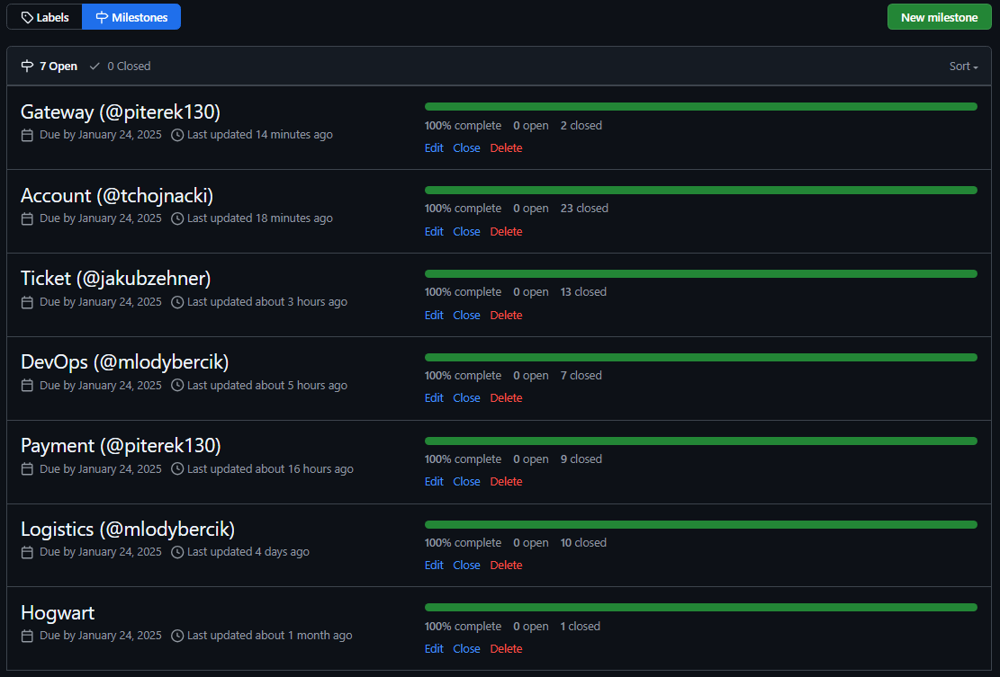

# Testy

## Testy funkcjonalne

**Clabbert:**
TODO @jakubzehner

**Inferius:**
TODO @piterek130

**Jobberknoll:**

```
ok | 260 passed | 0 failed | 3 ignored (11s)
```

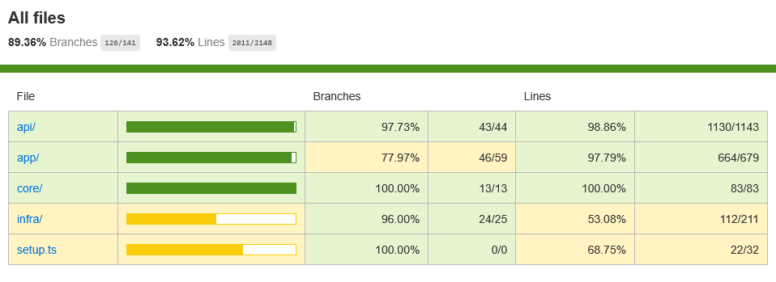

**Leprechaun:**

```
Test Suites: 16 passed, 16 total
Tests:       126 passed, 126 total
Snapshots:   0 total
Time:        12.896 s
Ran all test suites.
```

## Testy bezpieczeństwa

Uruchomiliśmy narzędzie OWASP ZAP na naszych serwisach, aby sprawdzić, czy nie ma w nich luk bezpieczeństwa.

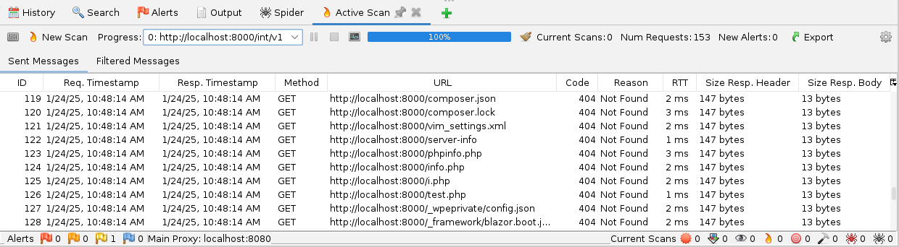

## Testy obciążeniowe

TODO @tchojnacki: jakby mi się udało to testy obciążeniowe
