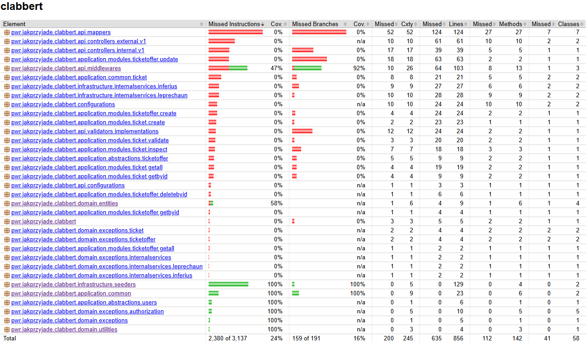
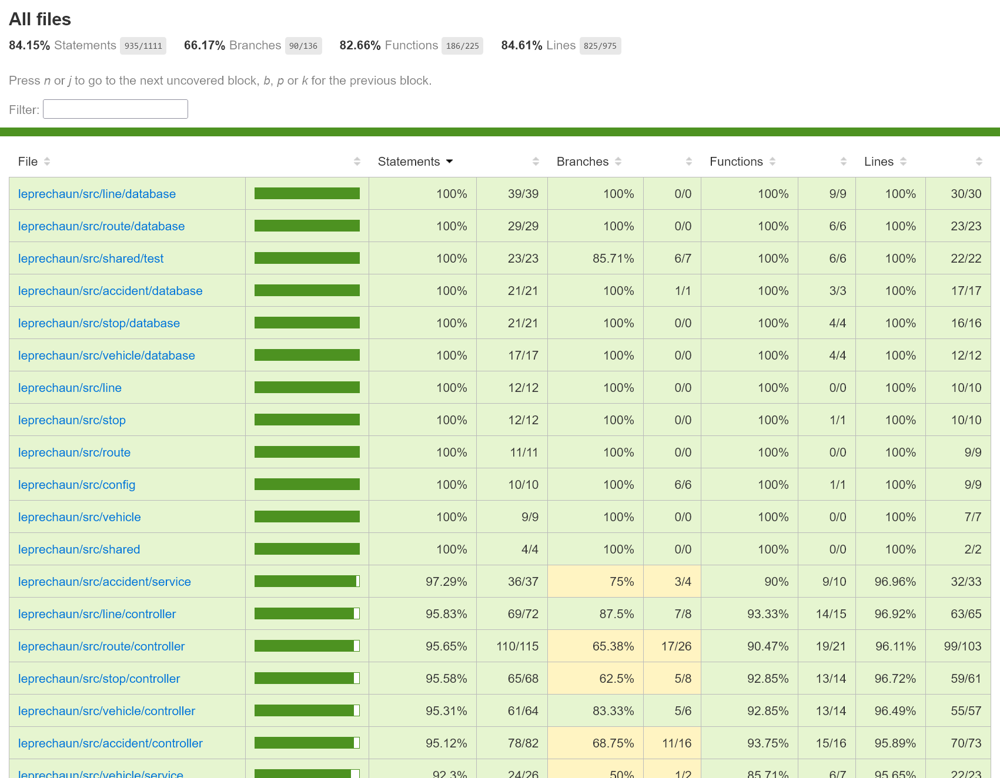
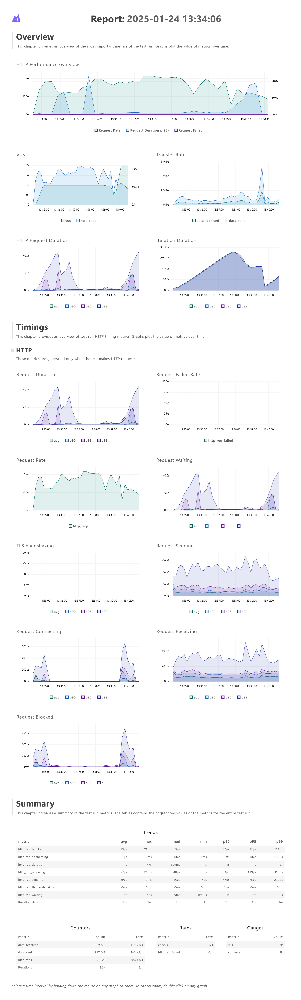

<div align="center">
<p><b>Wyniki etapu III: <br/> Implementacja</b></p>
<br/>
<p><b>System biletowy dla komunikacji miejskiej</b></p>
<br/>
<p><b>Projektowanie systemów informatycznych</b></p>
</div>
<div align="right">Prowadzący:<br/>dr inż. Marcin Kawalerowicz</div>
<div>
Skład zespołu:
<ul>
  <li>Przemysław Barcicki (260324)</li>
  <li>Tomasz Chojnacki (260365)</li>
  <li>Piotr Kot (259560)</li>
  <li>Jakub Zehner (260285)</li>
</ul>
</div>

# Linki do utworzonych artefaktów

- **Dokumentacja:**
  - [`system-parts.md` - podział systemu ](../../system-parts.md)
  - [`contracts.md` - kontrakty obowiązujące między serwisami](../../contracts.md)
    - Healthchecks
    - Error schema
    - Pagination
    - Endpoints route
    - Headers
    - Environment variables
  - **ADR** - opisy wszystkich niezgodności z poprzednimi etapami wraz z uzasadnieniem:
    - [ADR-001: Vertical partitioning of the Jobberknoll API package structure](../../adrs/001-jobberknoll-api-structure.md)
    - [ADR-002: Domain model and database schema changes for Jobberknoll](../../adrs/002-jobberknoll-domain-model.md)
    - [ADR-003: Password hashing and storage requirements for Jobberknoll](../../adrs/003-password-hashing.md)
    - [ADR-004: Adding vehicle side number to Validation table for single fare ticket verification in Clabbert](../../adrs/004-clabbert-sidenumber-in-validation-table.md)
- **Implementacja:**
  - [Kod serwisu biletów Clabbert (Java)](../../../implementation/clabbert/)
  - [Kod serwisu autoryzacji Feather (TypeScript)](../../../implementation/feather/)
  - [Kod serwisu płatności Inferius (Java)](../../../implementation/inferius/)
  - [Kod serwisu kont Jobberknoll (TypeScript)](../../../implementation/jobberknoll/)
  - [Kod serwisu logistyki Leprechaun (TypeScript)](../../../implementation/leprechaun/)
  - [Kod serwisu bramy Phoenix (Java)](../../../implementation/phoenix/)
- **Infrastruktura:**
  - [Kod CI/CD (GitHub Actions)](../../../.github/workflows/)
  - [Definicja usług AWS (Terraform) i konfiguracja Kubernetes](../../../infrastructure/)

# Postęp realizacji projektu

## Serwisy

**Legenda:**

- 🟩 - zaimplementowane w pełni,
- 🟨 - zaimplementowane częściowo,
- 🟥 - pominięte.

<table>
  <tr>
    <th>Serwis</th>
    <th colspan="2">Procent ukończenia</th>
  </tr>
  <tr>
    <th rowspan="3">Clabbert <br/> (bilety)</th>
    <th>Wymagania</th>
    <td>🟩🟩🟩🟩🟩🟩🟩🟩🟩🟩🟩🟩🟩🟩🟩🟩</td>
  </tr>
  <tr>
    <th>Endpointy</th>
    <td>🟩🟩🟩🟩🟩🟩🟩🟩🟩🟩🟩🟩🟩</td>
  </tr>
  <tr>
    <th>Infrastruktura</th>
    <td>🟩🟩🟩🟥🟨</td>
  </tr>
  <tr>
    <th rowspan="2">Feather <br/> (autoryzacja)</th>
    <th>Endpointy</th>
    <td>🟩🟩</td>
  </tr>
  <tr>
    <th>Infrastruktura</th>
    <td>🟩🟩</td>
  </tr>
  <tr>
    <th rowspan="3">Inferius <br/> (płatności)</th>
    <th>Wymagania</th>
    <td>🟩🟩🟥🟩🟩🟥🟥🟥🟥🟩🟩🟩🟩🟩🟩🟩</td>
  </tr>
  <tr>
    <th>Endpointy</th>
    <td>🟩🟩🟩🟩🟥🟩🟩🟥🟩🟩🟥🟩🟩🟩🟩🟥</td>
  </tr>
  <tr>
    <th>Infrastruktura</th>
    <td>🟩🟥</td>
  </tr>
  <tr>
    <th rowspan="3">Jobberknoll <br/> (konta)</th>
    <th>Wymagania</th>
    <td>🟩🟩🟩🟩🟩🟩🟩🟩🟥🟩🟩🟩</td>
  </tr>
  <tr>
    <th>Endpointy</th>
    <td>🟩🟩🟩🟩🟩🟩🟩🟩🟩🟩🟥🟩🟩🟩🟩🟩🟩</td>
  </tr>
  <tr>
    <th>Infrastruktura</th>
    <td>🟩🟥🟩</td>
  </tr>
  <tr>
    <th rowspan="2">Leprechaun <br/> (logistyka)</th>
    <th>Wymagania</th>
    <td>🟩🟩🟩🟩🟩🟩🟩🟩🟩🟩🟩🟩🟩🟩🟩🟩🟩🟩🟩🟩🟩🟩🟩🟩🟩🟩🟩</td>
  </tr>
  <tr>
    <th>Endpointy</th>
    <td>🟩🟩🟩🟩🟩🟩🟩🟩🟩🟩🟩🟩🟩🟩🟩🟩🟩🟩🟩🟩🟩🟩🟩🟩🟨🟩🟩</td>
  </tr>
</table>

> [!NOTE]
> Zgodnie z wytycznymi Pani Dziekan Hnatkowskiej obowiązywała implementacja jednego wymagania na członka zespołu.

## API

Każdy serwis wspiera OpenAPI specification, a dodatkowo wspiera Swagger UI stanowiący interaktywną dokumentację API.


## CI/CD

Każdy serwis posiada zdefiniowany proces CI/CD w GitHub Actions, który automatycznie buduje i testuje zmiany.

- [`clabbert-ci`](https://github.com/PWR-ACS-SE-24/SoftwareSystemDesign/actions/workflows/clabbert.yml)
- [`feather-ci`](https://github.com/PWR-ACS-SE-24/SoftwareSystemDesign/actions/workflows/feather.yml)
- [`inferius-ci`](https://github.com/PWR-ACS-SE-24/SoftwareSystemDesign/actions/workflows/inferius.yml)
- [`jobberknoll-ci`](https://github.com/PWR-ACS-SE-24/SoftwareSystemDesign/actions/workflows/jobberknoll.yml)
- [`leprechaun-ci`](https://github.com/PWR-ACS-SE-24/SoftwareSystemDesign/actions/workflows/leprechaun.yml)


## Infrastruktura


> [!NOTE]
> Ze względu na wysokie ograniczenia infrastruktury narzucone na nas przez studenckie konta AWS, nie jesteśmy w stanie dostarczyć pełnej infrastruktury zgodnie z założeniami z [Etapu II](../e2/README.md#diagram-rozmieszczenia). Stworzone pliki konfiguracyjne wystarczą na uruchomienie wszystkich serwisów, jednak nie będą one w pełni zgodne z założeniami z poprzedniego etapu.

# Wkład pracy

```
───────────────────────────────────────────────────────────────────────────────
Language                 Files     Lines   Blanks  Comments     Code Complexity
───────────────────────────────────────────────────────────────────────────────
TypeScript                 249     11165     1740       333     9092        415
Java                       158      5642      815       275     4552        121
JSON                        19       244        2         0      242          0
YAML                        10      6188     1318         1     4869          0
Dockerfile                   7       127       42         2       83          5
Properties File              6        58        1        32       25          0
gitignore                    6       170       22        25      123          0
Markdown                     4       211       32         0      179          0
Batch                        3       392       51         0      341         49
Shell                        3       770       56       199      515         81
Gradle                       2       123       23         0      100          0
XML                          2       213        6         0      207          0
Python                       1        23        9         0       14          1
───────────────────────────────────────────────────────────────────────────────
Total                      470     25326     4117       867    20342        672
───────────────────────────────────────────────────────────────────────────────
Estimated Cost to Develop (organic) $638,864
Estimated Schedule Effort (organic) 11.60 months
Estimated People Required (organic) 4.89
───────────────────────────────────────────────────────────────────────────────
```

Powyższy diagram pokazuje wolumen wytworzonego przez nas kodu. Zgodnie z estymatami zapewnionymi przez narzędzie, nasz system kosztowałby ponad pół miliona dolarów i wymagałby ponad 11 miesięcy pracy około 5 osób. Dominującymi językami są bez wątpienia TypeScript i Java, które są naczelnymi technologiami w naszych serwisach.


# Testy

## Testy funkcjonalne

**Clabbert:**

```
Unit tests:
  Tests:        26
  Failures:     0
  Ignored:      0
  Duration:     3.400s

  Successfull:  100%


Integration tests:
  Tests:        1
  Failures:     0
  Ignored:      0
  Duration:     0.512s

  Successfull:  100%
```



**Inferius:**
TODO @piterek130

**Jobberknoll:**

```

ok | 260 passed | 0 failed | 3 ignored (11s)

```


**Leprechaun:**

```

Test Suites: 16 passed, 16 total
Tests: 126 passed, 126 total
Snapshots: 0 total
Time: 12.896 s
Ran all test suites.

```



## Testy bezpieczeństwa

Uruchomiliśmy narzędzie OWASP ZAP na naszych serwisach, aby sprawdzić, czy nie ma w nich luk bezpieczeństwa.


## Testy obciążeniowe

Wykonano testy obciążeniowe dla serwisu kont. Uwzględniono trzy scenariusze:

- `smoke` - test dymny, sprawdzający poprawność działania serwisu,
- `average_load` - test sprawdzający zachowanie serwisu pod standardowym obciążeniem,
- `spike` - test sprawdzający zachowanie serwisu pod nagłym wzrostem obciążenia.

Sprawdzają one realizację wymagań dotyczących wydajności:

- `NF/PRF/01` - System powinien obsługiwać zapytania użytkowników, zakładając brak problemów sieciowych:
  1. dotyczące biletów w czasie poniżej 1 sekundy dla co najmniej 90% przypadków.
  2. dotyczące kont w czasie poniżej 2 sekundy dla co najmniej 90% przypadków.
  3. dotyczące płatności w czasie poniżej 10 sekundy dla co najmniej 90% przypadków.
  4. dotyczące logistyki w czasie poniżej 1 sekundy dla co najmniej 90% przypadków.
- `NF/PRF/02` - System powinien działać bez zarzutu przy jednoczesnym korzystaniu przez 5000 użytkowników.

Pojedyncza instancja serwisu obsługuje 1/5 obciążenia (tj. 1000 użytkowników). W trakcie działania testów, serwis jest obciążony przez średnio 784 zapytań na sekundę. Łącznie 0% zapytań kończy się niepowodzeniem, a `p(90)` dla czasu odpowiedzi wynosi 1s (wymagania dopuszczają 2s). Poniżej znajduje się pełny raport z testów:

```
         /\      Grafana   /‾‾/
    /\  /  \     |\  __   /  /
   /  \/    \    | |/ /  /   ‾‾\
  /          \   |   (  |  (‾)  |
 / __________ \  |_|\_\  \_____/

     execution: local
        script: accounts.k6.ts
 web dashboard: http://127.0.0.1:5665
        output: -

     scenarios: (100.00%) 3 scenarios, 2001 max VUs, 10m10s max duration (incl. graceful stop):
              * smoke: 1 iterations shared among 1 VUs (maxDuration: 10m0s, gracefulStop: 10s)
              * average_load: Up to 1000 looping VUs for 5m0s over 3 stages (gracefulRampDown: 30s, startTime: 10s, gracefulStop: 10s)
              * spike: Up to 2000 looping VUs for 1m0s over 2 stages (gracefulRampDown: 30s, startTime: 5m20s, gracefulStop: 10s)


     ✓ Jobberknoll healthy
     ✓ Feather healthy
     ✓ account registered
     ✓ account logged in
     ✓ account verified
     ✓ user-id correct
     ✓ user-role correct

     checks.........................: 100.00% 884403 out of 884403
     data_received..................: 67 MB   172 kB/s
     data_sent......................: 187 MB  480 kB/s
     http_req_blocked...............: avg=15.89µs min=1.57µs   med=5.36µs   max=78.5ms  p(90)=10.61µs p(95)=12.73µs
     http_req_connecting............: avg=7.15µs  min=0s       med=0s       max=78.43ms p(90)=0s      p(95)=0s
   ✓ http_req_duration..............: avg=1.05s   min=1.32ms   med=809.25ms max=47.57s  p(90)=1.11s   p(95)=1.45s
       { expected_response:true }...: avg=1.05s   min=1.32ms   med=809.25ms max=47.57s  p(90)=1.11s   p(95)=1.45s
   ✓ http_req_failed................: 0.00%   0 out of 306157
     http_req_receiving.............: avg=57.38µs min=9.8µs    med=40.85µs  max=26.15ms p(90)=94.62µs p(95)=119.39µs
     http_req_sending...............: avg=29.84µs min=4.32µs   med=16.76µs  max=9.41ms  p(90)=47.11µs p(95)=75.92µs
     http_req_tls_handshaking.......: avg=0s      min=0s       med=0s       max=0s      p(90)=0s      p(95)=0s
     http_req_waiting...............: avg=1.05s   min=893.59µs med=809.16ms max=47.57s  p(90)=1.11s   p(95)=1.45s
     http_reqs......................: 306157  784.602413/s
     iteration_duration.............: avg=1m42s   min=9.63s    med=1m50s    max=2m57s   p(90)=2m50s   p(95)=2m55s
     iterations.....................: 2341    5.999387/s
     vus............................: 1283    min=0                max=2000
     vus_max........................: 2001    min=2001             max=2001


running (06m30.2s), 0000/2001 VUs, 2341 complete and 2785 interrupted iterations
smoke        ✓ [======================================] 1 VUs          00m09.6s/10m0s  1/1 shared iters
average_load ✓ [======================================] 0638/1000 VUs  5m0s
spike        ✓ [======================================] 1265/2000 VUs  1m0s
```



> _© 2025 JakPrzyjade Team (Przemysław Barcicki, Tomasz Chojnacki, Piotr Kot, Jakub Zehner)_
