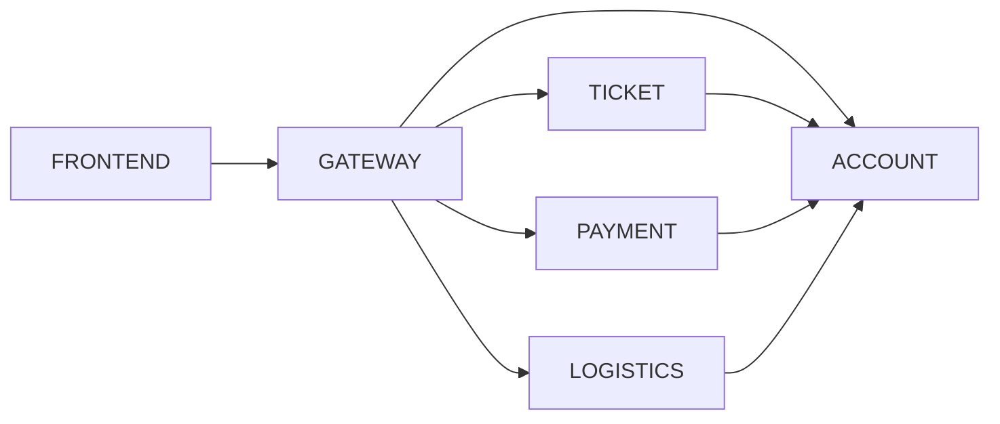

# Parts of the system divided between team members

| Team Member                                                                 | System Part           |
| --------------------------------------------------------------------------- | --------------------- |
| Tomasz Chojnacki (260365) [@tchojnacki](https://github.com/tchojnacki)      | `ACCOUNT` & `FRONTEND`             |
| Jakub Zehner (260285) [@jakubzehner](https://github.com/jakubzehner)        | `TICKET` & `FRONTEND`              |
| Piotr Kot (259560) [@piterek130](https://github.com/piterek130)             | `PAYMENT` & `GATEWAY` & `FRONTEND` |
| Przemysław Barcicki (260324) [@mlodybercik](https://github.com/mlodybercik) | `LOGISTICS` & `FRONTEND` & DevOps  |
