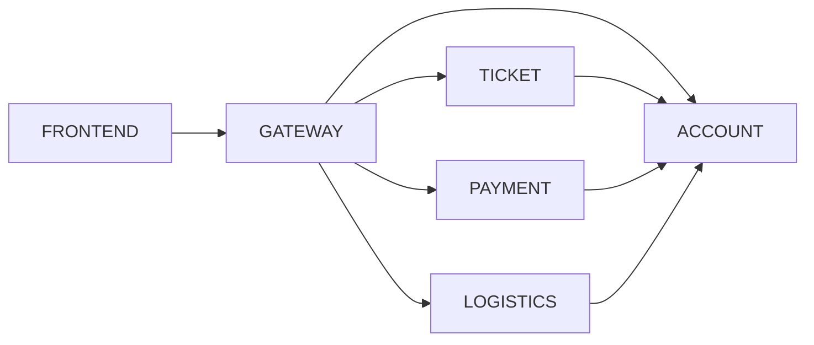

# Parts of the system divided between team members

```mermaid
flowchart LR
  FRONTEND
  GATEWAY
  TICKET
  PAYMENT
  ACCOUNT
  LOGISTICS

  FRONTEND --> GATEWAY
  GATEWAY --> TICKET
  GATEWAY --> PAYMENT
  GATEWAY --> ACCOUNT
  GATEWAY --> LOGISTICS
  TICKET --> ACCOUNT
  PAYMENT --> ACCOUNT
  LOGISTICS --> ACCOUNT
```

- Member 1 (TODO) - `ACCOUNT`
- Member 2 (TODO) - `TICKET`
- Member 3 (TODO) - `PAYMENT` & `GATEWAY`
- Member 4 (TODO) - `LOGISTICS` & DevOps
